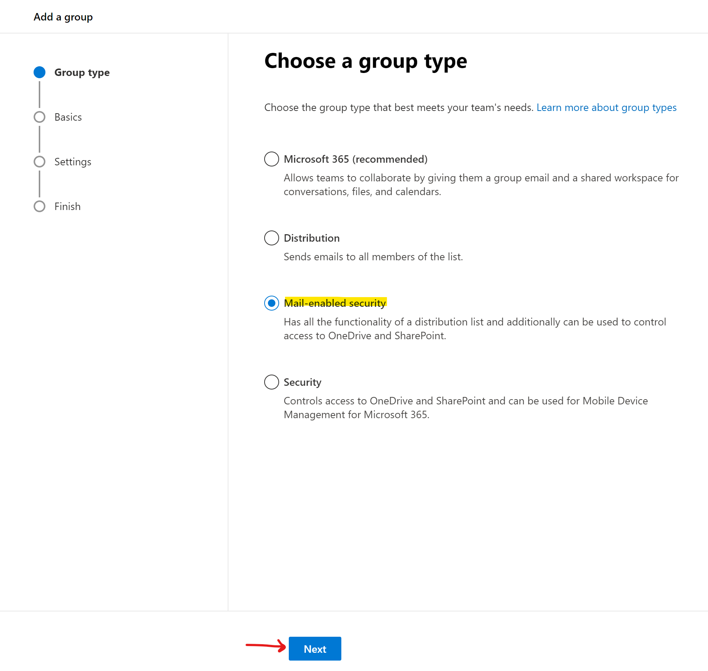
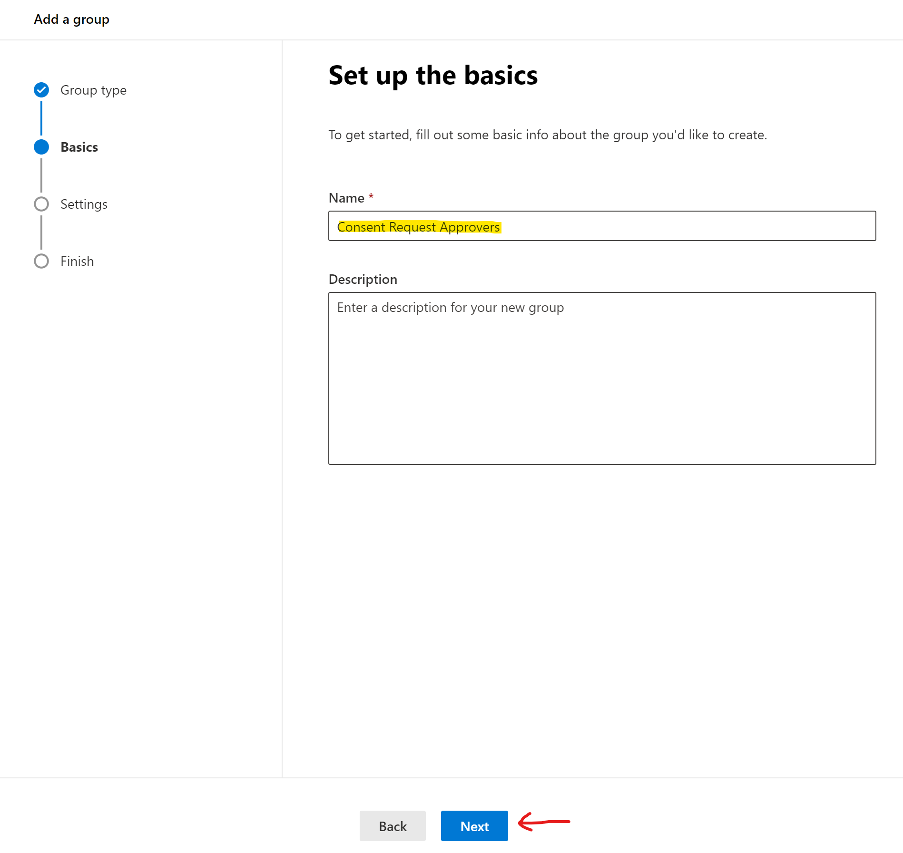
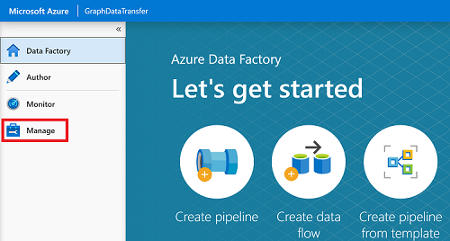
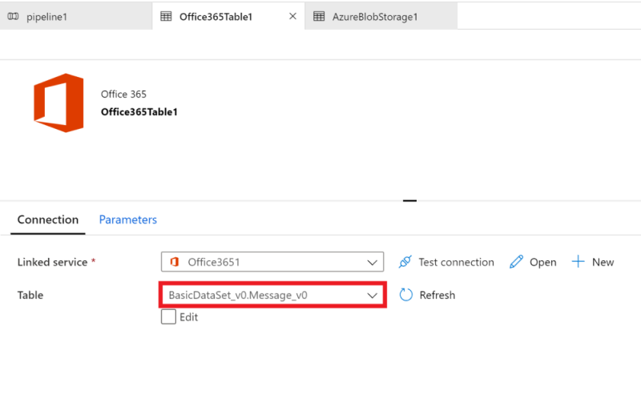
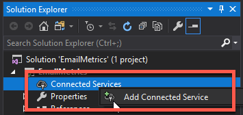

# Using Microsoft Graph data connect to analyze emails to find subject matter experts

In this lab, you will use Microsoft Graph data connect to analyze emails from an organization in Office 365 to find subject matter experts on specific topics.

## In this lab

- [Setup tenant & get data out of Office 365 with Graph Data Connect and Data Factory](#exercise1)
- [Extract Office 365 data with Graph Data Connect](#exercise2)
- [Process the Exported Data](#exercise3)

## Prerequisites

To complete this lab, you need the following:

- Microsoft Azure subscription
  - If you do not have one, you can obtain one (for free) here: [https://azure.microsoft.com/free](https://azure.microsoft.com/free/)
  - The account used to signin must have the **global administrator** role granted to it.
  - The Azure subscription must be in the same tenant as the Office 365 tenant as Graph Data Connect will only export data to an Azure subscription in the same tenant, not across tenants.
- Office 365 tenancy
  - If you do not have one, you obtain one (for free) by signing up to the [Office 365 Developer Program](https://developer.microsoft.com/office/dev-program).
  - Multiple Office 365 users with emails sent & received
  - Access to at least two accounts that meet the following requirements:
  - One of the two accounts must be a global tenant administrator & have the **global administrator** role granted (just one account)
- Workplace Analytics licenses
  - Access to the Microsoft Graph data connect toolset is available through [Workplace Analytics](https://products.office.com/en-us/business/workplace-analytics), which is licensed on a per-user, per-month basis.
  - To learn more please see [Microsoft Graph data connect policies and licensing](https://docs.microsoft.com/en-us/graph/data-connect-policies)
- [Visual Studio](https://visualstudio.microsoft.com/vs/) installed on your development machine. If you do not have Visual Studio, visit the previous link for download options. (**Note:** This tutorial was written with Visual Studio 2017. The steps in this guide may work with other versions, but that has not been tested.)

> NOTE: The screenshots and examples used in this lab are from an Office 365 test tenant with fake email from test users. You can use your own Office 365 tenant to perform the same steps. No data is written to Office 365. A copy of email data is extracted from all users in an office Office 365 tenant and copied to an Azure Blob Storage account that you maintain control over who has access to the data within the Azure Blob Storage.

<a name="exercise1"></a>

## Exercise 1: Setup Office 365 Tenant and Enable Microsoft Graph data connect

Prior to using Microsoft Graph data connect for the first time, you need to configure your Office 365 tenant. This involves turning on the service and configuring a security group with permissions to approve data extraction requests.

### Grant Azure AD users the **global administrator** role

In this step you will ensure that two users in your Office 365 tenant have the **global administrator** role enabled.

1. Open a browser and navigate to your Azure Portal at [https://portal.azure.com](https://portal.azure.com)
1. Login using an account with global administrator rights to your Azure and Office 365 tenants.
1. Select **Azure Active Directory** (Azure AD) from the sidebar navigation or using the search bar:

    

1. On the Azure AD Overview page, select **Users** from the **Manage** section of the menu:

    

1. In the list of **All Users**, identify a user you will use in this lab that you have access to.
    1. Select the user by selecting their name.
    1. In the sidebar navigation menu, select **Assigned roles**.

        

    1. If the role **Global administrator** is not in the list of roles for the user:
        1. Select **Add assignment** button.
        1. Locate and select the **Global administrator** role and then select the **Select** button.
    1. Repeat these steps with another user that you will use in this lab.

### Configure Microsoft Graph data connect consent request approver group

In this step you will setup your Office 365 tenant to enable usage of Microsoft Graph data connect.

1. Open a browser and navigate to your Microsoft 365 Admin Portal at [https://admin.microsoft.com](https://admin.microsoft.com)
1. In the sidebar navigation, select **Active Groups**.
1. Select the **Add a group** button.
1. Use the following to create the new mail-enabled security group and select the **Add** button.

    - **Type**: Mail-enabled security

    

    - **Name**: Consent Request Approvers

    

    - **Email Prefix**: consentrequestapprovers

    

1. **It can take up to an hour before the newly created group shows up in the list**. Once the group has been created, select it.

    > Change the View dropdown to **Mail-enabled security** if you do not see Consent Request Approvers in the list of groups

1. On the **Members** section of the group dialog, select **Edit**
1. Add the two users that you enabled the **Global administrator** role to this new group.

### Enable Microsoft Graph data connect in your Office 365 tenant

In this step you will enable the Microsoft Graph data connect service on your Office 365 tenant.

1. While you are still logged into the Microsoft 365 Admin Portal, select the **Settings > Org settings** menu item.
1. Select the **Microsoft Graph data connect** service.

    

1. Enable the toggle button at the top of the dialog to **Turn Microsoft Graph data connect on or off for your entire organization.**
1. Enter **Consent Request Approvers** (*or the name of the group you created previously*) in the **Group of users to make approval decisions** and select **Save**.

<a name="exercise2"></a>

## Exercise 2: Extract Office 365 data with Microsoft Graph data connect

In this exercise you will create, execute and approve an Azure Data Factory pipeline to extract data from Office 365 to an Azure Storage Blob for additional processing.

### Create Azure AD Application

The first step is to create an Azure AD application that will be used as the security principal to run the data extraction process.

1. Open a browser and navigate to your Azure Portal at [https://portal.azure.com](https://portal.azure.com)
1. Login using an account with global administrator rights to your Azure and Office 365 tenants.
1. Select **Azure Active Directory** (Azure AD) from the sidebar navigation.
1. On the Azure AD Overview page, select **App registrations** from the **Manage** section of the menu.
1. Select the **New application registration** button:

    

1. Use the following values to create a new Azure AD application and select **Register**:

    - **Name**: Microsoft Graph data connect Data Transfer
    - **Supported account types**: Accounts in this organizational directory only
    - **Redirect URI**: *Leave the default values*

1. Locate the **Application (client) ID** and copy it as you will need it later in this lab. This will be referred to as the *service principal ID*.
1. Locate the **Directory (tenant) ID** and copy it as you will need it later in this lab. This will be referred to as the *tenant ID*.
1. Select **Certificates & secrets** under **Manage** in the sidebar navigation.
1. Select the **New client secret** button. Set **Description** to `Never expires`, set **Expires** to `Never` and choose **Add**.

    You can choose different values for **Description** and **Expires** if you like, but ensure you keep a copy of the name and the hashed key after it is saved as the hashed value will never be shown again and you will need to create a new key as it is needed later in the lab.

    

    This will be referenced as the *service principal key*.

1. Using the sidebar navigation for the application, select **Owners**.
1. Ensure your account is listed as an owner for the application. If it isn't listed as an owner, add it.

### Create Azure Storage Blob

In this step you will create an Azure Storage account where Microsoft Graph data connect will store the data extracted from Office 365 for further processing.

1. Open a browser and navigate to your Azure Portal at [https://portal.azure.com](https://portal.azure.com)
1. Login using an account with global administrator rights to your Azure and Office 365 tenants.
1. Select **Create a resource** from the sidebar navigation.
1. Find the **Storage Account** resource type and use the following values to create it, then select **Review + create**:
    - **Subscription**: *select your Azure subscription*
    - **Resource group**: GraphDataConnect (*or select an existing resource group*)
    - **Storage account name**: [tenantid]gdcdump
        > The tenant ID is used as part of the storage account name because it needs to be globally unique.
    - **Location**: *pick an Azure region in the same region as your Office 365 region*
    - **Performance**: Standard
    - **Account kind**: StorageV2 (general purpose v2)
    - **Replication**: Read-access geo-redundant storage (RA-GRS)
    - **Access tier**: Hot
1. Review that the settings match those shown in the previous step and select **Create**
1. Once the Azure Storage account has been created, grant the Azure AD application previously created the proper access to it.
    1. Select the Azure Storage account
    1. In the sidebar menu, select **Access control (IAM)**

        

    1. Select the **Add** button in the **Add a role assignment** block.
    1. Use the following values to find the application you previously selected to grant it the **Storage Blob Data Contributor** role, then select **Save**:
        - **Role**: Storage Blob Data Contributor
        - **Assign access to**: Azure AD user, group or service principal
        - **Select**: Microsoft Graph data connect Data Transfer (*the name of the Azure AD application you created previously*)

1. Create a new container in the Azure Storage account
    1. Select the Azure Storage account
    1. In the sidebar menu, select **Blobs**
    1. Select the **+Container** button at the top of the page and use the following values and then select **OK**:
        - **Name**: maildump
        - **Public access level**: Private (no anonymous access)

### Create an Azure Data Factory Pipeline

The next step is to use the Azure Data Factory to create a pipeline to extract the data from Office 365 to the Azure Storage account using Microsoft Graph data connect.

1. Open a browser and navigate to your Azure Portal at [https://portal.azure.com](https://portal.azure.com)
1. Login using an account with global administrator rights to your Azure and Office 365 tenants.

    > NOTE: Keep track of the user you are using in this step as you will need to switch to the other user you granted the *global administrator* role and that has *multi-factory authentication* enabled on their account in a later step.

1. Select **Create a resource** from the sidebar navigation.
1. Find the **Data Factory** resource type and use the following values to create it, then select **Create**:

    - **Name**: [tenantid]datafactory
        > The tenant ID is used as part of the data factory name because it needs to be globally unique.
    - **Subscription**: *select your Azure subscription*
    - **Resource group**: GraphDataConnect
    - **Version**: V2
    - **Location**: *pick an Azure region in the same region as your Office 365 region*

    

1. Once the Azure Data Factory resource is created, select the **Author & Monitor** tile to launch the Azure Data Factory full screen editor.

    

1. Switch from the **Overview** to the **Manage** experience by selecting it from the left-hand navigation:

    

1. [Optional] By default, the Azure Data Factory will use an *Integration Runtime* that is auto-resolving the region. As the Microsoft Graph Data Connect requires that your source and destination, and integration runtime to exist in the same Office 365 region, it is recommended that you create a new Integration Runtime with a fixed region.

    1. Select **Integration runtimes** > **New**.

        

    1. Select **Azure, Self-Hosted** and select **Continue**.

        

    1. Select **Azure** for network environment and select **Continue**.

        

    1. Use the following details to complete the form on the final screen and then select **Create**:
        - **Name**: *name of your integration runtime*
        - **Description**: *enter a description*
        - **Region**: *select the region that matches your Office 365 region*

        

1. Switch from the **Manage** to the **Author** experience by selecting it from the left-hand navigation and create a new pipeline by selecting the plus icon, then **pipeline**:

    

    1. Drag the **Copy Data** activity from the **Move & Transform** section onto the design surface:

        

    1. Select the activity in the designer.
    1. In the activity editor pane below the designer, select the **Source** tab, then select **New**.
    1. Locate the dataset **Office 365**, select it and then select the **Continue** button.
    1. The designer will create a new tab for the Office 365 connector. Select the **Connection** tab in the connector's editor, then the **New** button.
    1. In the dialog that appears, enter the previously created Azure AD application's **Application ID** and **Password** in the **Service principal ID** & **Service principal key** fields, then select **Finish**.

        > NOTE: If you created a dedicated Integration Runtime, select it in the **Connect via integration runtime** dropdown.

        

    1. After creating the Office 365 connection, for the **Table** field, select **BasicDataSet_v0.Message_v0**.

        

    1. Switch from **Office365Table** to **Pipeline > Source**. Use the following values for the **Date filter**.
        - **Column Name**: CreatedDateTime
        - **Start time (UTC)**: *select a date sometime prior to the current date*
        - **End time (UTC)**: *select the current date*

    1. Select the **Schema** tab and then select **Import Schema**.

        

    1. With the *source* configured for your **copy data** activity, now configure the *sink*, or the location where data will be stored.

        Select the tab in the designer for your pipeline.

    1. Select the **copy data** activity, then select the **sink** tab:

        

    1. Select the **New** button, select **Azure Blob Storage**, and then select the **Continue** button.
    1. Select **Binary** as the format for the data and then select the **Continue** button.
        1. Select the **Connection** tab, then select **New**.
        1. Set the following values in the dialog, then select **Finish**:
            - **Authentication method**: Service principal
            - **Azure subscription**: Select all
            - **Storage account name**: [tenantid]gdcdump
                > This is the storage account created earlier in this exercise.
            - **Tenant**: *enter the ID of your Azure tenant*
            - **Service principal ID**: *enter the ID of the Azure AD application you previously created*
            - **Service principal key**: *enter the hashed key of the Azure AD application you previously created*

            > NOTE: If you created a dedicated Integration Runtime, select it in the **Connect via integration runtime** dropdown.

            

        1. Next to the **File path** field, select **Browse**.
        1. Select the name of the storage container you created previously.
        1. Ensure the **File format** is set to **JSON format**.
        1. Set the **File pattern** to **Set of objects**.

            

1. With the pipeline created, select the **Validate All** button at the top of the designer.
1. After validating (*and fixing any issues that were found*), select the **Publish All** button at the top of the designer.

### Execute the Azure Data Factory Pipeline

With the pipeline created, now it's time to execute it.

> NOTE: It can take several minutes for the consent request to appear and it is not uncommon for the entire process (start, requesting consent & after approving the consent completing the pipeline run) to take over 40 minutes.

1. In the Azure Data Factory designer, with the pipeline open, select **Add trigger > Trigger Now**:

    

1. After starting the job, from the sidebar menu, select **Monitor** to view current running jobs:

    

1. Locate the pipeline run you just started in the list. In the **Actions** column, select the **View Activity Runs** icon:

    

1. On the **Activity Runs** screen, you will see a list of all the activities that are running in this pipeline. Our pipeline only  has one activity that should show as currently *In Progress*.

    

    While the status may show as *In Progress*, the request may be paused internally as the request for access to the data in Office 365 may need to be approved. You can see if this is the case by selecting the **Details** icon in the **Actions** column.

1. In the **Details** screen, look for the status of the pipeline activity as highlighted in the following image. In this case you can see it is in a state of **RequestingConsent**:

    

    At this point, the activity run is internally paused until someone manually approves the consent request.

### Approve Office 365 Consent Request - via Microsoft 365 Admin Center

> NOTE: You can alternatively approve consent requests using Windows PowerShell which is demonstrated in the next section.

1. Open a browser and navigate to your Microsoft 365 Admin Portal at [https://admin.microsoft.com](https://admin.microsoft.com)
1. Replace the URL in the browser with the following link and select <kbd>ENTER</kbd>: https://portal.office.com/adminportal/home#/Settings/PrivilegedAccess
1. Select a pending **Data Access Request**.
1. In the **Data Access Request** callout, select the **Approve** button.

    

### Approve Office 365 Consent Request - via Windows PowerShell

> NOTE: if you approved the request using the Microsoft 365 Admin Center, you can skip this section.

In this step you will use Exchange Online PowerShell to find data requests that are pending consent and approve them so the Azure Data Factory pipeline(s) can continue.

1. Open Windows PowerShell.
1. Ensure your PowerShell session has enabled remotely signed scripts:

    ```powershell
    Set-ExecutionPolicy RemoteSigned
    ```

1. Connect to Exchange Online:
    1. Obtain a login credential by executing the following PowerShell. Login using a different user than one that created & started the Azure Data Factory pipeline, who has the **global administrator** role applied, who is a member of the group that has rights to approve requests to data in Office 365, and has multi-factor authentication enabled:

        ```powershell
        $UserCredential = Get-Credential
        ```

    1. Create a new Exchange Online PowerShell session & load (import) it:

        ```powershell
        $Session = New-PSSession -ConfigurationName Microsoft.Exchange -ConnectionUri https://ps.protection.outlook.com/powershell-liveid/ -Credential $UserCredential -Authentication Basic -AllowRedirection
        Import-PSSession $Session -DisableNameChecking
        ```

        > NOTE: Once you are finished with this session, be sure you you disconnect from the session using the PowerShell command `Remove-PSSession $Session`. Exchange Online only allows for three open remote PowerShell sessions to protect against denial-of-service (DoS) attacks.
        >
        > If you simply close the PowerShell window, it will leave the connection open.

1. Get a list of all pending data requests from Microsoft Graph data connect by executing the following PowerShell:

    ```powershell
    Get-ElevatedAccessRequest | where {$_.RequestStatus -eq 'Pending'} | select RequestorUPN, Service, Identity, RequestedAccess | fl
    ```

    Examine the list of data access requests returned. In the following image, notice there are two pending requests:

    

1. Approve a data access returned in the previous step by copying the **Identity** GUID of a request by executing the following PowerShell:

    > NOTE: Replace the GUID in the following code snippet with the GUID from the results of the previous step.

    ```powershell
    Approve-ElevatedAccessRequest -RequestId fa041379-0000-0000-0000-7cd5691484bd -Comment 'approval request granted'
    ```

1. After a few moments, you should see the status page for the activity run update to show it is now extracting data:

    

This process of extracting the data can take some time depending on the size of your Office 365 tenant as shown in the following example:


### Verify data extracted from Office 365 to Azure Storage Blob

Once the pipeline completes, verify data has been extracted to the Azure Storage Blob.

1. Open a browser and navigate to your Azure Portal at [https://portal.azure.com](https://portal.azure.com).
1. Login using an account with global administrator rights to your Azure and Office 365 tenants.
1. Select the **All resources** menu item from the sidebar navigation.
1. In the list of resources, select the Azure Storage account you created previously in this lab.
1. On the Azure Storage account blade, select **Blobs** from the sidebar menu.
1. Select the container created previously in this lab that you configured the Azure Data Factory pipeline as the sink for the extracted data. You should see data in this container now:

    

<a name="exercise3"></a>

## Exercise 3: Process the Exported Data

In this exercise you will create a simple ASP.NET MVC web application that will process the data you exported in the previous exercise.

1. Create a new project:
    1. Open Visual Studio, and select **File > New > Project**. In the **New Project** dialog, do the following:
    1. Select **Templates > Visual C# > Web**.
    1. Select **ASP.NET Web Application (.NET Framework)**.
    1. Enter **EmailMetrics** for the Name of the project.

        

        > Note: Ensure that you enter the exact same name for the Visual Studio Project that is specified in these lab instructions. The Visual Studio Project name becomes part of the namespace in the code. The code inside these instructions depends on the namespace matching the Visual Studio Project name specified in these instructions. If you use a different project name the code will not compile unless you adjust all the namespaces to match the Visual Studio Project name you enter when you create the project.

    1. Select **OK**. In the **New ASP.NET Web Application Project** dialog, select **MVC** and select **OK**.
1. Add and configure Azure Storage as a connected service:
    1. In the **Solution Explorer** tool window, right-click the **Connected Services** node and select **Add Connected Service**.

        

    1. On the **Connected Services** dialog, select **Cloud Storage with Azure Storage**.
    1. On the **Azure Storage** Dialog, select the storage account where you exported the data to in the previous exercise and select **Add**.

        This will install the necessary NuGet packages for the project.

1. Create a new model class that will be used to store the email metrics and in the view of the web application.
    1. In the **Solution Explorer** tool window, right-click the **Models** folder and select **Add > Class**.
    1. In the **Add New Item** dialog, select **Class**, set the name of the file to **EmailMetric.cs** and select **Add**.
    1. Add the following code to the class **EmailMetric** you just created:

        ```cs
        public string Email;
        public double RecipientsToEmail;
        ```

1. Create a new controller that will calculate and display the results of processing the emails exported in the previous exercise.
    1. Right-click the **Controllers** folder and select **Add > Controller**:

        

    1. In the **Add Scaffold** dialog, select **MVC 5 Controller - Empty** and select **Add**.

        

    1. When prompted, name the controller **EmailMetricsController** and select **OK**.
    1. Add the following `using` statements after the existing `using` statements at the top fo the file containing the `EmailMetricsController` class:

        ```cs
        using Microsoft.WindowsAzure.Storage;
        using Microsoft.WindowsAzure.Storage.Blob;
        using Newtonsoft.Json.Linq;
        using System.Configuration;
        using System.IO;
        using System.Threading.Tasks;
        ```

    1. Add the following code to the `EmailMetricsController` class. These will be used to connect to the Azure Storage Account that contain the exported data:

        ```cs
        CloudStorageAccount _storageAccount;
        CloudBlobClient _storageClient;
        CloudBlobContainer _storageContainer;
        ```

    1. Add the following method to the `EmailMetricsController` class. This will process an Azure blob and update a collection representing the email accounts and how many recipients there were combined across all emails found for the extracted accounts:

        ```cs
        private void ProcessBlobEmails(List<Models.EmailMetric> emailMetrics, CloudBlob emailBlob)
        {
            using (var reader = new StreamReader(emailBlob.OpenRead()))
            {
                string line;
                while ((line = reader.ReadLine()) != null)
                {
                    var jsonObj = JObject.Parse(line);

                    // extract sender
                    var sender = jsonObj.SelectToken("Sender.EmailAddress.Address")?.ToString();

                    // extract and count up recipients
                    var totalRecipients = 0;
                    totalRecipients += jsonObj.SelectToken("ToRecipients").Children().Count();
                    totalRecipients += jsonObj.SelectToken("CcRecipients").Children().Count();
                    totalRecipients += jsonObj.SelectToken("BccRecipients").Children().Count();

                    var emailMetric = new Models.EmailMetric();
                    emailMetric.Email = sender;
                    emailMetric.RecipientsToEmail = totalRecipients;

                    // if already have this sender...
                    var existingMetric = emailMetrics.FirstOrDefault(metric => metric.Email == emailMetric.Email);
                    if (existingMetric != null)
                    {
                        existingMetric.RecipientsToEmail += emailMetric.RecipientsToEmail;
                    }
                    else
                    {
                        emailMetrics.Add(emailMetric);
                    }
                }
            }
        }
        ```

    1. Add the following method to the `EmailMetricsController` class. This will enumerate through all blobs in the specified Azure Storage account's specified container and send each one to `ProcessBlobEmails()` method added in the last step:

        ```cs
        private List<Models.EmailMetric> ProcessBlobFiles()
        {
            var emailMetrics = new List<Models.EmailMetric>();

            // connect to the storage account
            _storageAccount = CloudStorageAccount.Parse(ConfigurationManager.AppSettings["AzureStorageConnectionString-1"]);
            _storageClient = _storageAccount.CreateCloudBlobClient();

            // connect to the container
            _storageContainer = _storageClient.GetContainerReference("maildump");

            // get a list of all emails
            var blobResults = _storageContainer.ListBlobs();

            // process each email
            foreach (IListBlobItem blob in blobResults)
            {
                if (blob.GetType() == typeof(CloudBlockBlob))
                {
                    var cloudBlob = (CloudBlockBlob)blob;
                    var blockBlob = _storageContainer.GetBlobReference(cloudBlob.Name);

                    ProcessBlobEmails(emailMetrics, blockBlob);
                }
            }

            return emailMetrics;
        }
        ```

    1. Add the following action to the `EmailMetricsController` that will use the methods added this class to process the emails and send the results to the view:

        ```cs
        [HttpPost, ActionName("ShowMetrics")]
        [ValidateAntiForgeryToken]
        public ActionResult ShowMetrics()
        {
            var emailMetrics = ProcessBlobFiles();

            return View(emailMetrics);
        }
        ```

1. Create a new view for the **EmailMetrics** **Index** action:
    1. In the **Solution Explorer** tool window, right-click the **Views > EmailMetrics** folder and select **Add > View**.

        

    1. In the **Add View** dialog, set the **View name** to **Index**, leave the remaining input controls to their default values and select **Add**.

        

    1. Update the markup in the new **Views/EmailMetrics/Index.cshtml** to the following. This will add a form with a single button that will submit an HTTP POST to the custom controller action added in the last step:

        ```html
        @{
          ViewBag.Title = "Index";
        }

        <h2>Email Metrics</h2>

        This application will look at the email data for emails extracted to the Azure Blob Storage account and display the total number of recipients from each sender.

        @using (Html.BeginForm("ShowMetrics", "EmailMetrics", FormMethod.Post))
        {
          @Html.AntiForgeryToken()
          <div>
            <button type="submit">View email metrics</button>
          </div>

          <div>
            <em>Please be patient as this can take a few moments to calculate depending on the size of the exported data...</em>
          </div>
        }
        ```

1. Create a new view for the **EmailMetrics** **ShowMetrics** action:
    1. In the **Solution Explorer** tool window, right-click the **Views > EmailMetrics** folder and select **Add > View**.
    1. In the **Add View** dialog, set the following values and leave the remaining input controls to their default values and select **Add**:
        - **View name**: ShowMetrics
        - **Template**: List
        - **Model class**: EmailMetric (EMailMetric.Models)

        

    1. Update the markup in the new **Views/EmailMetrics/ShowMetrics.cshtml** to the following. This will display the results of the calculations.

        ```html
        @model IEnumerable<EmailMetrics.Models.EmailMetric>

        @{
          ViewBag.Title = "ShowMetrics";
        }

        <h2>Email Metrics</h2>

        <table class="table">
          <tr>
            <th>Sender</th>
            <th>Number of Recipients</th>
          </tr>

          @foreach (var item in Model)
          {
          <tr>
            <td>@Html.DisplayFor(modelItem => item.Email)</td>
            <td>@Html.DisplayFor(modelItem => item.RecipientsToEmail)</td>
          </tr>
          }

        </table>
        ```

1. Update the navigation to have a way to get to the new controller:
    1. In the **Solution Explorer** tool window, locate and open the file **Views/Shared/_Layout.cshtml**.
    1. Replace the following line...

        ```html
        <li>@Html.ActionLink("Contact", "Contact", "Home")</li>
        ```

        ... with the following line to update the menu item:

        ```html
        <li>@Html.ActionLink("Email Metrics", "Index", "EmailMetrics")</li>
        ```

1. Test the application:
    1. In Visual Studio, select **Debug > Start Debugging**.
    1. When the application is built and loads in a new browser window, select the **Email Metrics** item in the top navigation bar.
    1. On the **Email Metrics** page, select the **View email metrics** button.

        

    1. When the page loads, you will see a list of emails addresses that were found among all emails with a sum of all the recipients sent between them, as shown from a small sample set in a test email extract in the following figure.

        
