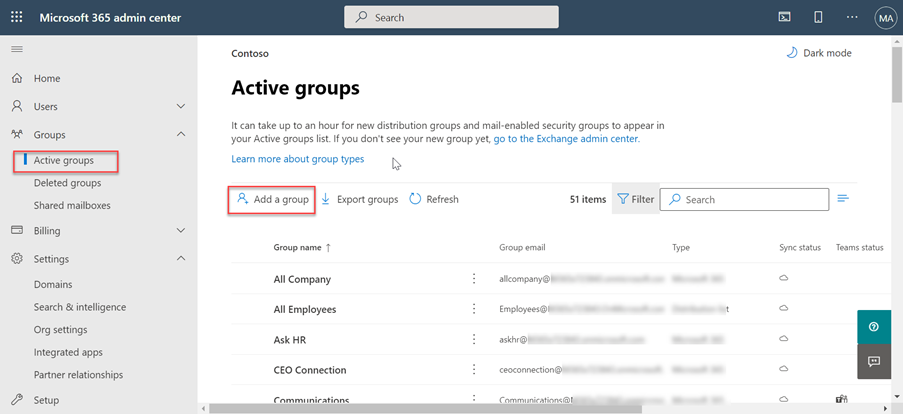
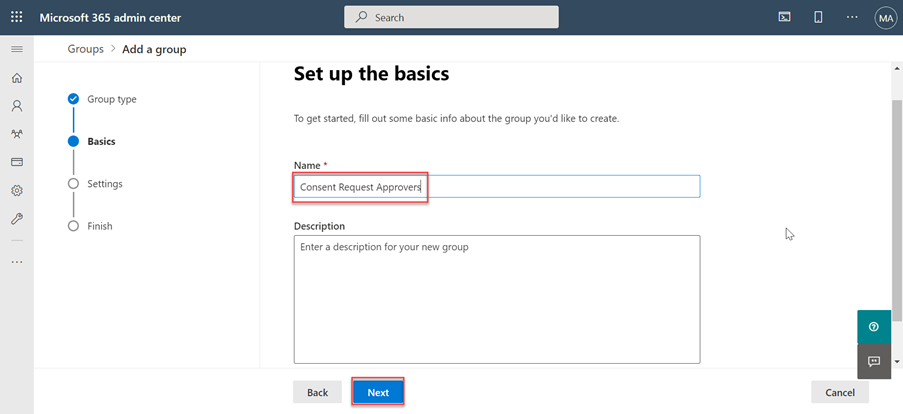
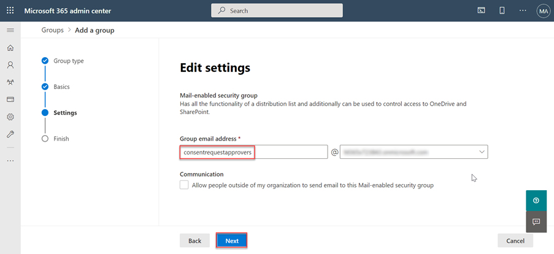
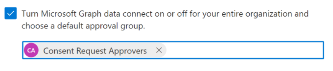

# Set up your Microsoft 365 tenant and enable Microsoft Graph Data Connect

Prior to using Microsoft Graph Data Connect for the first time, you need to configure your Microsoft 365 tenant. This involves turning on the service and configuring a security group with permissions to approve data extraction requests.

## Grant Azure AD users the Global administrator role

In this step, you will ensure that two users in your Microsoft 365 tenant have the **Global administrator** role enabled.

- [Global Administrator built-in role](/azure/active-directory/roles/permissions-reference#global-administrator).
- [Elevate access to gain the Global Administrator role](/azure/role-based-access-control/elevate-access-global-admin).

## Configure Microsoft Graph Data Connect consent request approver group

In this step, you will setup your Microsoft 365 tenant to enable usage of Microsoft Graph Data Connect.

1. Open a browser and go to your [Microsoft 365 Admin Portal](https://admin.microsoft.com/)

1. On the sidebar navigation, select **Active Groups**.
  
    

1. Select the **Add a group** button.

1. Use the following to create the new **mail-enabled** security group and select the **Add** button.
   - **Type**: Mail-enabled security

    

   - **Name**: Consent Request Approvers

    

   - **Email Prefix**: consentrequestapprovers

    

1. **It can take up to an hour** before the newly created group shows up in the list. When the group has been created, select it.

1. Go to the **Active groups** option again and search for the group you just created.

1. Select the group and in the **Members** tab, select **View all and manage members**.

1. Add the two users that you enabled the **Global administrator** role to this new group.

## Enable Microsoft Graph Data Connect in your Microsoft 365 tenant

In this step, you will enable the Microsoft Graph Data Connect service on your Microsoft 365 tenant.

1. While you are still signed in to the Microsoft 365 Admin Portal, select the **Settings > Org settings** menu item.

1. Select the **Microsoft Graph Data Connect** service.

    

1. Select the checkbox that says **turn Microsoft Graph Data Connect on or off for your entire organization** to enable Data Connect.

    

1. Enter **Consent Request Approvers** (or the name of the group you created previously) in the **group of users to make approval decisions** and select **Save**.
