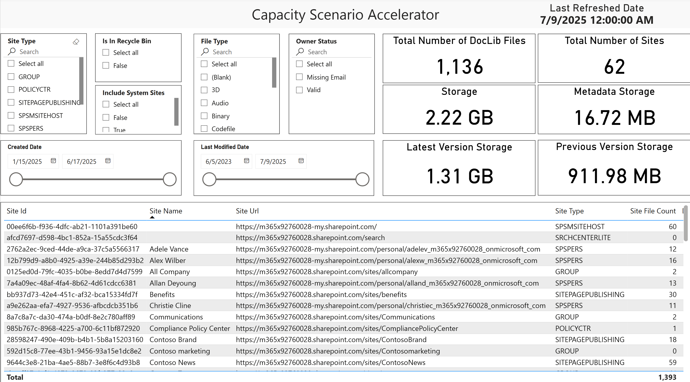
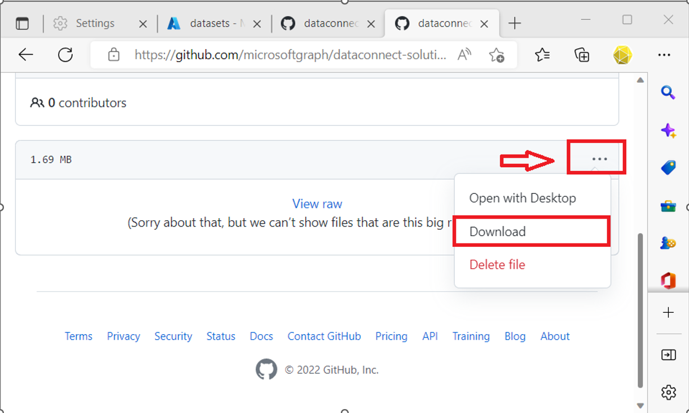

# SharePoint capacity template setup

- [SharePoint capacity template for Fabric-Lakehouse setup](#SharePoint-capacity-template-setup)
  - [**Overview**](#overview)
  - [**Installing Pre-reqs**](#installing-pre-reqs)
  - [**PBI report template**](#pbi-report-template)
  - [**Importing a pipeline from gallery and setting up**](#importing-a-pipeline-from-gallery-and-setting-up)

## Overview

**Capacity scenario is a storage use case powered by our available Sharepoint datasets. This allows customers to better understand how their storage is being used by providing meaningful insights and analytics offered by the SharePoint Sites and SharePoint Files datasets**

**After you follow these steps, you will have a great set of Power BI dashboards related to SharePoint Capacity, like the one shown below.**

 

## Installing Pre-reqs
You need to Enable Microsoft Graph Data Connect, Create an appilication identity to use with MGDC. Create a fabric workspace and Lakehouse to extract the required data from MGDC.
All the steps are listed in the [blob post](https://techcommunity.microsoft.com/blog/microsoft_graph_data_connect_for_sharepo/step-by-step-microsoft-fabric-gather-a-detailed-dataset-on-sharepoint-sites-usin/4256383).
Follow step-by-step guide from the above [blob post](https://techcommunity.microsoft.com/blog/microsoft_graph_data_connect_for_sharepo/step-by-step-microsoft-fabric-gather-a-detailed-dataset-on-sharepoint-sites-usin/4256383) and make sure steps 0  (Overview) and 1 (all from 1.a to 1.f ) are completed. 

## Importing a pipeline from gallery and setting up

Next, you will configure a pipeline in Microsoft Fabric. You will import and  pipeline to pull SharePoint data from Microsoft 365 and load into Lake house. Here is what you will need to do: 

1. Go to the Fabric Workspace and create a pipeline

    - Navigate to the Microsoft Fabric Portal at https://fabric.microsoft.com
    - In the main Microsoft Fabric page, select the option for “Data Engineering”
    - Find the “Browse” icon on the bar on the left and click on it.
    - Find the Fabric workspace you created and click on it.
    
 

2. In the workspace, click on “+ New” item.
        
 

3. Select “Data pipeline”.
    - Give the new pipeline a name as ***"Unlock SharePoint Capacity Insights"*** and click on “Create”
    
  

4. Select the "Templates” option
    - Select a pre-published pipeline ***"Unlock SharePoint Capacity Insights"***  and click on "Next"

5. Grab connection string for lakehouse sql endpoint.
    - Goto workspace -> select the SQL analytics endpoint of lakehouse that you created.

     

    - Click on "Settings/Gear icon" and copy SQL Connection string from "About navigation tab" 

     

6. Create new connection to lake house sql end point and Microsoft 365 and click on "Use this Template".
  

7. This imported pipeline might be missing two note books that are required for pipeline to run. This is due to by design /known issues that exists in pipelines tempaltes that are published to fabric template gallery.

    - Download note books [Merge Sites and Files To Final Table - Capacity Scenario](./notebooks/Merge%20Sites%20and%20Files%20To%20Final%20Table%20-%20Capacity%20Scenario.ipynb) and [Read Last Snapshot Dates - Capacity Scenario](./notebooks/Read%20Last%20Snapshot%20Dates%20-%20Capacity%20Scenario.ipynb) to local computer first and import to fabric work space. 

8. Import downloaded notebooks to workspace

    - Select on fabric workpsace (Data Factory Mode) and click on "Import -> Notebook -> from this computer"
     

    - Click on "Upload" button and select the two notebooks that you downloaded to local computer and click "Open"

9. Go to Pipeline (Unlock SharePoint Capacity Insight) window that you already imported.

    - Select the notebook activity "Read Last Snapshot Dates" and go to the settings tab of that activity
    - Choose "**Read Last Snapshot Dates - Capacity Scenario**" notebook from dropdown 

    

    - Select the notebook activity "Merge Sites and Files To Final Table" and go to the settings tab of that activity
    - Choose "**Merge Sites and Files To Final Table - Capacity Scenario**" notebook from dropdown 

    

10. Replace the default parameter value for LakehouseName parameter to actual lakehouse name, validate and save pipeline.
    

11. Pipeline is now ready to run and extract the data from MGDC to lake house. 
    -

12. Once pipeline is succesful you will see the data in Sites,Files and Files_Aggs tables in lakehouse.
    - You will see 2 staging tables and 3 final tables in lake house that contains the data for Sites(2) and Files(3).
    -

## **PBI report template**
Below steps will help to link datasets that are generated using Fabric pipeline above to link to PowerBI 
Template. 
1. Download and install Microsoft Power BI Desktop if you don’t have it installed already on your machine. 
    - Link to download Download Microsoft Power BI Desktop from Official Microsoft Download Center. [here](https://www.microsoft.com/en-us/download/details.aspx?id=58494)
2. Download the pre-created PowerBI capacity report that can generate insights from data that is produced using Fabric pipeline. Link to download PowerBI Report. [here](https://go.microsoft.com/fwlink/?linkid=2327501)

3. Open the PowerBI file and click on Transform data → Data source settings

4. You will see a lakehouse  data sources in the Data source settings page

5. Enter Connection string of SQL Endpoint for lakehouse that you want to connect to that is created in fabric in Server textbox. 
Enter lakehouse name in database textbox.

6. Now we need to give the right credentials for these data source.
    - Click on Edit Permissions and Edit under credentials and sign in with microsoft account      

7. Congratulations, you are all set and will see that the report will be refreshed with the latest data

     

8. If you see any error or data is not being refreshed then please make sure your entered right credentials in data source settings.
