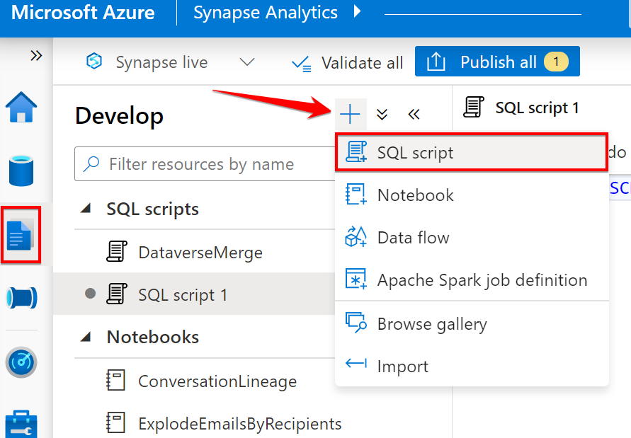
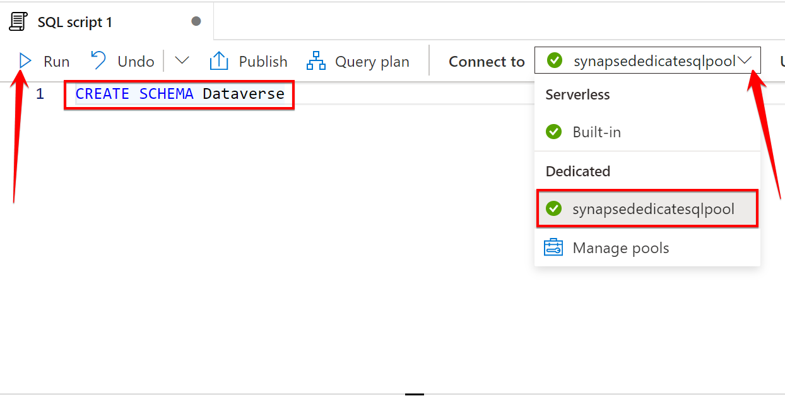
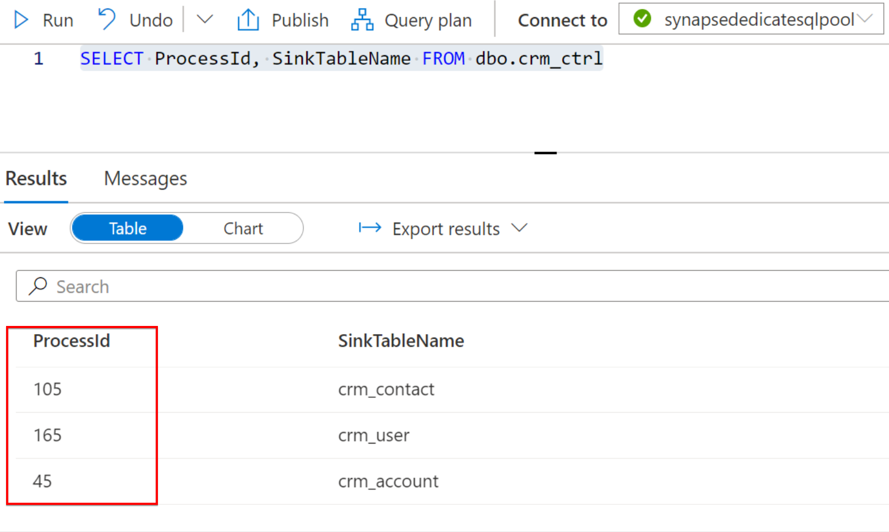
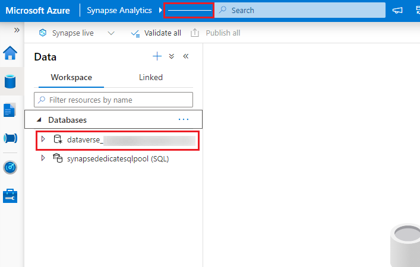
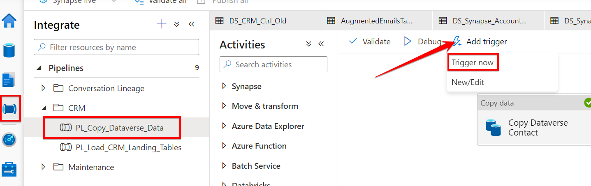
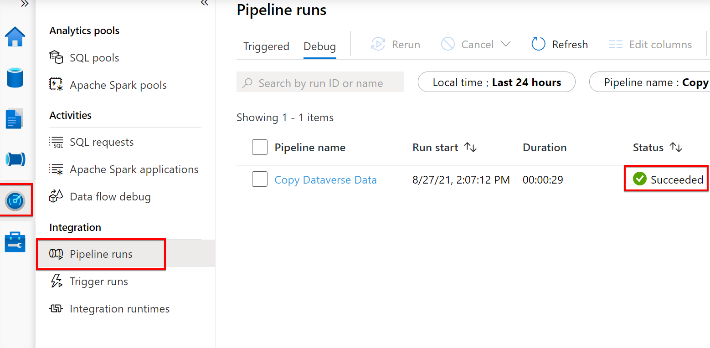
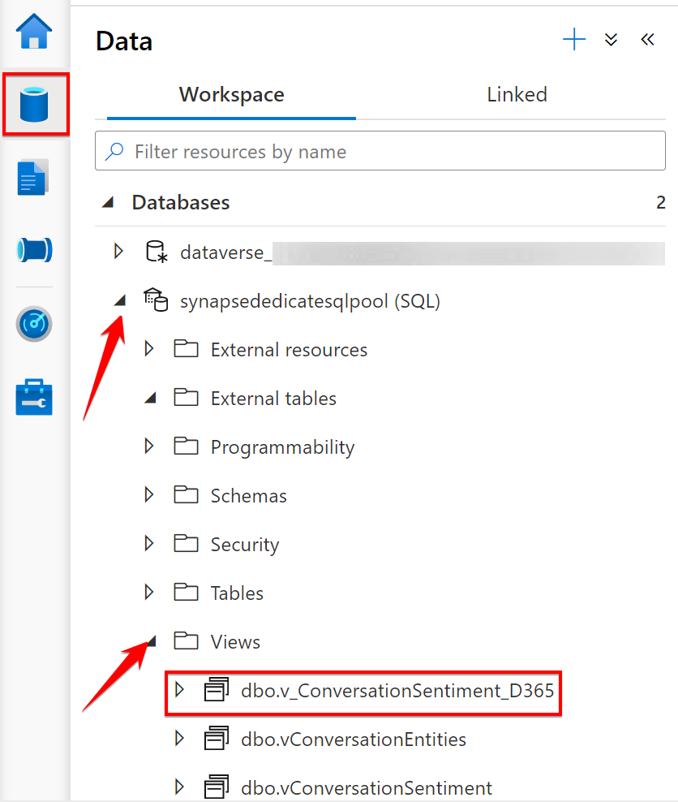
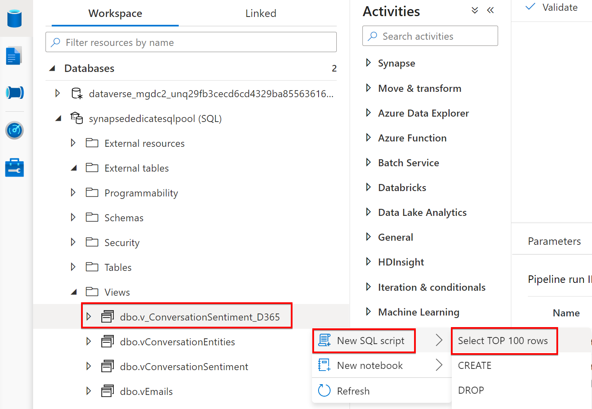
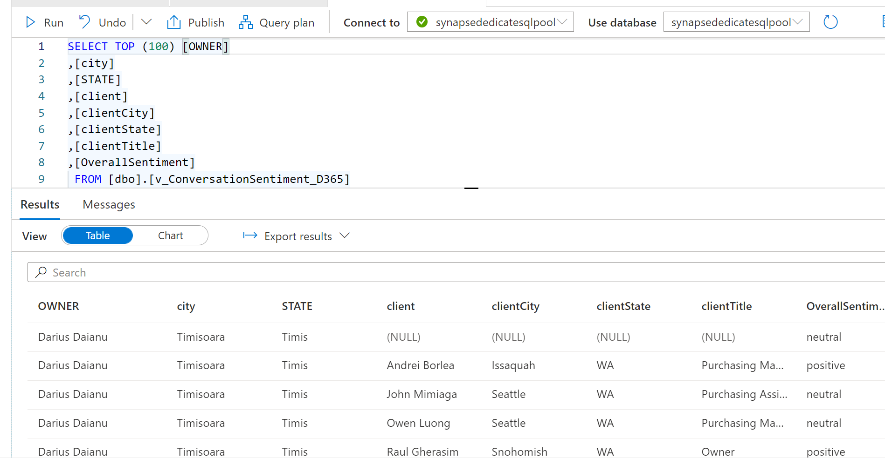

# Conversation Lineage w/ Dynamics 365

## Table of Contents
* [Tutorial Overview](#tutorial-overview)
* [Prerequisites](#prerequisites)
* [Create Azure Synapse Link](#create-azure-synapse-link)
* [Update dedicated SQL pool configuration](#update-dedicated-sql-pool-configuration)
* [Create CRM tables and Stored Procedures in Azure Synapse](#create-crm-tables-and-stored-procedures-in-azure-synapse)
* [Deploy pipeline resources to Azure Synapse](#deploy-pipeline-resources-to-azure-synapse)
* [Execute pipelines](#execute-pipelines)
* [Create D365 View](#create-d365-view)
* [Query the view](#query-the-view)

## Tutorial Overview
This tutorial provides an example of how to supplement the Conversation Lineage solution with Dynamics 365 data. In this specific example, you will learn how to:
* Extract data from D365 using Dataverse/Azure Synapse Link
* Connect the D365 data to Conversation Lineage via Synapse Pipelines and SQL views
* Query the joined dataset

## Prerequisites
To complete this tutorial, the following items must be completed:
- Completion of the [Conversation Lineage](https://github.com/microsoftgraph/dataconnect-solutions/tree/main/solutions/conversation-lineage#conversation-lineage) tutorial.
- Configuration of a Dynamics 365 environment (with Dataverse).
  -  If you do not already have one configured, please follow the Microsoft official documentation [here](https://docs.microsoft.com/en-us/power-platform/admin/create-environment#create-an-environment-with-a-database).
- Configured data within the Dynamics 365 CRM tables that matches the Conversation Lineage data. Specifically:
  -  D365 `User` (systemuser) table requires `internalemailaddress` entries with matching `Sender` and/or `Recipient` entries in the `dbo.vInteractions_one_to_one` view.
  -  D365 `Contact` table requires requires `emailaddress1` entries with matching `Sender` and/or `Recipient` entries in the `dbo.vInteractions_one_to_one` view.
    - It is also important that conversation history exists between the entities in User and Contact.
  -  D365 `Account` table requires `primarycontactid` entries matching `contactid` in the D365 `Contact` table.


## Create Azure Synapse Link
To complete this section, the following information will be needed from the resources created as part of the Conversation Lineage tutorial:
- **Resource Group Name**
- **Workspace Name** (Synapse workspace)
- **Storage Account name** (the one that was created for the Azure Synapse workspace during [this step](https://github.com/microsoftgraph/dataconnect-solutions/tree/main/solutions/conversation-lineage#create-an-azure-synapse-workspace) of the Conversation Lineage tutorial.)

> NOTE: The Dataverse (D365) tables we will use for this tutorial will be the `systemuser`, `account`, and `contact` tables. Please be sure to select these tables when initially setting up the Azure Synapse Link.  

With the above information in hand, proceed to the [Microsoft documentation](https://docs.microsoft.com/en-us/powerapps/maker/data-platform/azure-synapse-link-synapse#connect-dataverse-to-synapse-workspace) for details on how to create the Azure Synapse Link. This step will provide Synapse access to the data that will be paired with Conversation Lineage. Return to this tutorial once you have reached the completion of the **'Connect Dataverse to Synapse workspace'** section of the documentation.

Your D365 data should now be syncing to your Azure Synapse Workspace. The data is initially stored in a Spark DB inside Synapse. In the following sections, we will copy the data to the dedicated SQL DB for merging with Conversation Lineage.

## Update dedicated SQL pool configuration
1. Open your Synapse workspace and click the **Manage** tab on the left navigation. 
2. Next select **SQL pools**
3. Ensure that the dedicated SQL pool is running. If it is in a paused state, be sure to click the triangle next to the pool name to resume running.  
  

4. Go to the Develop tab on the left navigation, click the `+` sign and select **SQL script**  
  

5. In the newly created SQL script pane, update the **Connect to** drop-down to point to your dedicated SQL pool.
6. Insert *CREATE SCHEMA Dataverse* into the script and click the **Run** button when complete. 
 

7. The new schema should now be successfully created.

> NOTE: If additional users will need access to the joined data directly in the dedicated SQL database, you can add a user by executing the contents of [this file](./sql/Add_User.sql) in a SQL script similar to the above example. 

## Create CRM tables and Stored Procedures in Azure Synapse
1. Go to the Develop tab on the left navigation, click the `+` sign and select **SQL script**  
2. In the newly created SQL script pane, update the **Connect to** drop-down to point to your dedicated SQL pool.  
  
3. Execute the [SQL to create the CRM tables](./sql/Create_CRM_Tables.sql), where the CRM data will ultimately land.  

In your dedicated SQL database, the new tables should now exist along with those from Conversation Lineage. Later, the data that will populate these tables will join with Conversation Lineage to view the sentiment between users and their customers, as well as some metadata on each (city, state, title, etc).

> NOTE: The tables created assume the [Common Data Model](https://docs.microsoft.com/en-us/common-data-model) and are subsets of CRM data from this structure. For future considerations, you can choose to create schema and data columns that suit the data you want to carry over into Synapse here.

In another SQL script (or the same as above), execute the following SQL scripts against the `synapsededicatesqlpool`:
- [create_crm_control_tables](./sql/create_crm_control_tables.sql): *Creates the crm_control table that handles source to destination table mappings*
- [create_sp_crm_backup_table](./sql/create_sp_crm_backup_table.sql): *Stored Procedure to backup table data prior to processing new data*
- [create_sp_crm_copytable](./sql/create_sp_crm_copytable.sql): *Stored Procedure to update/insert data from source tables to landing tables*
- [create_sp_crm_table_restore](./sql/create_sp_crm_table_restore.sql): *Stored Procedure to restore backups as the primary landing tables should the [create_sp_crm_copytable] process fail*
- [insert_crm_ctrl](./sql/insert_crm_ctrl.sql): *Inserts records into the crm_ctrl table*
> NOTE: Before executing the **insert_crm_mapping.sql** script, be sure to execute a `SELECT ProcessId, SinkTableName FROM dbo.crm_ctrl` command and identify the ProcessId for each table (*i.e. 'crm_contact', 'crm_user', 'crm_account'*), as that will be needed in the **insert_crm_mapping.sql** script below.
  
- [insert_crm_mapping](./sql/insert_crm_mapping.sql): *Inserts records into the crm_mapping table*
   - Replace the default `ProcessId` value with those obtained in the note above. ***Please ensure you supply the correct ProcessId for each table in the insert statement to ensure the mappings work correctly!***

## Deploy pipeline resources to Azure Synapse
Locate the following details within your Synapse workspace, as they will be needed for the deployment script:  
`Dataverse DB name`  
`Synapse Workspace name`  
 

To start up the deployment, log in to [https://portal.azure.com](https://portal.azure.com) and open a bash Azure Cloud Shell:
  

The next step requires a zip archive from the `./arm/` [folder](./arm) of the GitHub repository. Copy the folder's web address into the [prompt found here](https://download-directory.github.io/), which should look similar to this:  
  
Once the GitHub directory has been pasted into the above URL, click Enter to execute the download.  

Once the download completes, rename the file to `arm.zip` and upload it using the upload functionality in Azure Cloud Shell:   


After the zip archive is uploaded, unzip the archive using the following command:
```unzip arm.zip```

To begin the deployment, execute the following command from the `arm` directory, after replacing the values of the parameters with the
values specific to the environment where the deployment will take place:

```
./d365_deploy.sh --dataverse-database-name "<dataverse-database-name>" --workspace-name "<synapse-workspace-name>" 
```
The values for the parameters should be as follows:  
- `--dataverse-database-name`, the name of the Spark DB created by Azure Synapse Link
- `--workspace-name`, the name of the Synapse Workspace

> NOTE: It is common to experience an access denied when initially attempting to run the deploy.sh from Azure Cloud Shell. To alleviate this, execute the following two lines of code from the Bash prompt in Azure Cloud Shell:  
> ```chmod +x d365_deploy.sh```  
> ```sed -i -e 's/\r$//' d365_deploy.sh```  

Execute the `d365_deploy.sh` script outlined above.
The script will perform `az login` for you, so you will be prompted to authenticate into Azure. Follow all of the Azure prompts until login is complete and the script begins executing. 
  

> NOTE: It is possible (particularly in a Windows environment) that a "bad interpreter" error will occur that looks something like this:
```
bash: ./d365_deploy.sh: /bin/bash^M: bad interpreter: No such file or directory
```
> If this happens, perform the following steps in the bash shell to resolve the issue:
> 1. **Open deploy.sh file in vim editor:** ```vim d365_deploy.sh```
> 2. **Convert to Unix format:** Inside vim, type and enter ```:set ff=unix```
> 3. **Save converted file:** Inside vim, type and enter ```:wq```  
> 
> The error should no longer occur.


## Execute pipelines
Once the deployment is complete, go to the **Integrate** tab on the left navigation in Synapse and locate the following pipelines:  
1. **PL_Copy_Dataverse_Data**: This pipeline copies the data from the `dataverse` DB (created during the [Create Azure Synapse Link step](#create-azure-synapse-link)) into the Synapse Dedicated SQL pool.  
2. **PL_Load_CRM_Landing_Tables**: This pipeline handles processing the data from the tables at the previous step (Dataverse.Account, Dataverse.contact, and Dataverse.systemuser) into the CRM landing tables (dbo.crm_account, dbo.crm_contact, and dbo.crm_user).  

We will execute the pipelines in the order indicated above. Once a pipeline has been selected, click **Add Trigger** and select **Trigger now**.  
  

To monitor the completion of the pipeline trigger, go to **Monitor**, click **Pipeline runs** and verify that the pipeline succeeds before proceeding, as this will ensure that the D365 data is successfully copied to the dedicated SQL DB.
  

> NOTE: Please wait for the successful completion of the first pipeline before initiating the second, as we will need the data to be landed in the Dedicated SQL Pool before attempting to copy to the final CRM landing tables.

## Create D365 View
1. Go back to the **Develop** tab in Synapse and open a SQL script (similar to the steps in the [Update dedicated SQL pool configuration](#update-dedicated-sql-pool-configuration) section above).
2. Ensure that the **Connect to** is set to the dedicated SQL pool.
3. Copy and **Run** contents of the [Create_View_ConversationLineage_CRM.sql](./sql/Create_View_ConversationLineage_CRM.sql) file.
4. Once complete, the view `dbo.v_ConversationSentiment_CRM` should be added. To verify, go to the **Data** tab on the left navigation, expand the dedicated SQL pool and expand views.  
  

> NOTE: If the query executed successfully, but the view is not displayed, right-click on the **Views** folder and click **Refresh**. The view should now be displayed.

## Query the view
Now that the view has been created, we should be able to see our joined dataset.  
Locate the view inside the dedicated SQL database under the **Views** folder.  
Click the `...` next to the view name and select **New SQL script** and **Select TOP 100 rows**.  
  

We can now see the resulting joined dataset.  

