# Conversation Lineage

## Table of contents
* [Tutorial Overview](#tutorial-overview)
* [Prerequisites](#prerequisites)
* [Setting up the application](#setting-up-the-application)
    * [Create an Azure AD application](#create-an-azure-ad-application)
    * [Create an Azure AD group](#create-an-azure-ad-group)
    * [Set up Graph Data Connect](#set-up-graph-data-connect)
    * [Create an Azure resource group](#create-an-azure-resource-group)
    * [Create an Azure Storage account](#create-an-azure-storage-account)
    * [Create an Azure Cognitive Service](#create-an-azure-cognitive-service)
    * [Create an Azure Synapse workspace](#create-an-azure-synapse-workspace)
        * [Create a Synapse Spark pool](#create-a-synapse-spark-pool)
        * [Create a Synapse dedicated SQL pool](#create-a-synapse-dedicated-sql-pool)
    * [Grant access to the Storage Accounts](#grant-access-to-the-storage-accounts)
    * [Create an Azure Key Vault](#create-an-azure-key-vault)
    * [Set up PowerBI](#set-up-powerbi)
    * [Creating SQL entities](#creating-sql-entities)
    * [Set up the Synapse data processing pipelines](#set-up-the-synapse-data-processing-pipelines)
    * [Monitoring the Synapse pipelines](#monitoring-the-synapse-pipelines)
    * [Approve Data Access Requests](#approve-data-access-requests)
    * [Create and visualize the PowerBI reports](#create-and-visualize-the-powerbi-reports)
* [Architectural design](#architectural-design)
    * [Data Ingestion](#data-ingestion)
    * [Table Derivation](#table-derivation)  
    * [Sentiment and entities extraction from mails](#sentiment-and-entities-extraction-from-mails)
  
## Tutorial Overview
This tutorial will provide you with an example of using [Graph Data Connect](https://docs.microsoft.com/en-us/graph/data-connect-concept-overview)
(GDC) to gain insights into an organization's communication patterns by analyzing Microsoft 365 data.  
By doing this, you will learn the key steps and Azure technologies required to build your own GDC based application.  
You will learn how to:
- extract and process Microsoft 365 data and run analytics on top of it using [Azure Synapse Analytics](https://docs.microsoft.com/en-us/azure/synapse-analytics/)
- process both historical data and future data on a daily basis using Azure Synapse triggers
- extract sentiment and NLP entities from conversations using [Azure Cognitive Services](https://azure.microsoft.com/en-us/services/cognitive-services/text-analytics/)
- visualize key insights using [PowerBI](https://docs.microsoft.com/en-us/power-bi/fundamentals/power-bi-overview)

## Prerequisites

To complete this lab, you need the following:

- Microsoft Azure subscription
  - If you do not have one, you can obtain one (for free) here: [https://azure.microsoft.com/free](https://azure.microsoft.com/free/)
  - The account used to perform the set up must have the [**global administrator** role granted to it](https://docs.microsoft.com/en-us/azure/role-based-access-control/elevate-access-global-admin),
    in order to be able to create the various infrastructure components described below
  - The Azure subscription must be in the same tenant as the Office 365 tenant as Graph Data Connect will only export 
    data to an Azure subscription in the same tenant, not across tenants.
- Office 365 tenancy
  - If you do not have one, you obtain one (for free) by signing up to the [Office 365 Developer Program](https://developer.microsoft.com/office/dev-program).
  - Multiple Office 365 users with emails sent & received
  - Access to at least two accounts that meet the following requirements:
  - One of the two accounts must be a global tenant administrator & have the **global administrator** role granted (just one account)
- Workplace Analytics licenses
  - Access to the Microsoft Graph data connect toolset is available through [Workplace Analytics](https://products.office.com/en-us/business/workplace-analytics), 
    which is licensed on a per-user, per-month basis.
  - To learn more please see [Microsoft Graph data connect policies and licensing](https://docs.microsoft.com/en-us/graph/data-connect-policies)

> NOTE: The screenshots and examples used in this lab are from an Office 365 test tenant with fake email from test users. 
> You can use your own Office 365 tenant to perform the same steps. No data is written to Office 365. 
> A copy of email data is extracted from all users in an Office 365 tenant and copied to an Azure Blob Storage 
> account that you maintain control over. Thus, you control who has access to the data within the Azure Blob Storage.
 
## Setting up the application

### Set up Graph Data Connect
For setting up Office 365 Tenant and enabling Graph Data Connect, please follow the steps from chapter `Excercise 1` 
from this GDC [tutorial](https://github.com/microsoftgraph/msgraph-training-dataconnect/blob/master/Lab.md#exercise-1-setup-office-365-tenant-and-enable-microsoft-graph-data-connect)

### Create an Azure AD application
Synapse pipelines need to interact with external Azure services in order to extract, process or store data. To be able
to do this, Synapse must authenticate itself while connecting to these services. For certain services the authentication
can be done via Managed Identity, however, for others a service principal is required.  
In this tutorial, Synapse will need a service principal to extract data from M365 and to connect to Azure Blob Storage.   
Therefore, you will need to create an Azure Active Directory app registration that will be used as the security principal:
1. Open a browser and navigate to your Azure Portal at [https://portal.azure.com](https://portal.azure.com)
2. Login using an account with global administrator rights to your Azure and Office 365 tenants.
3. Select **Azure Active Directory** (Azure AD) from the sidebar navigation.
   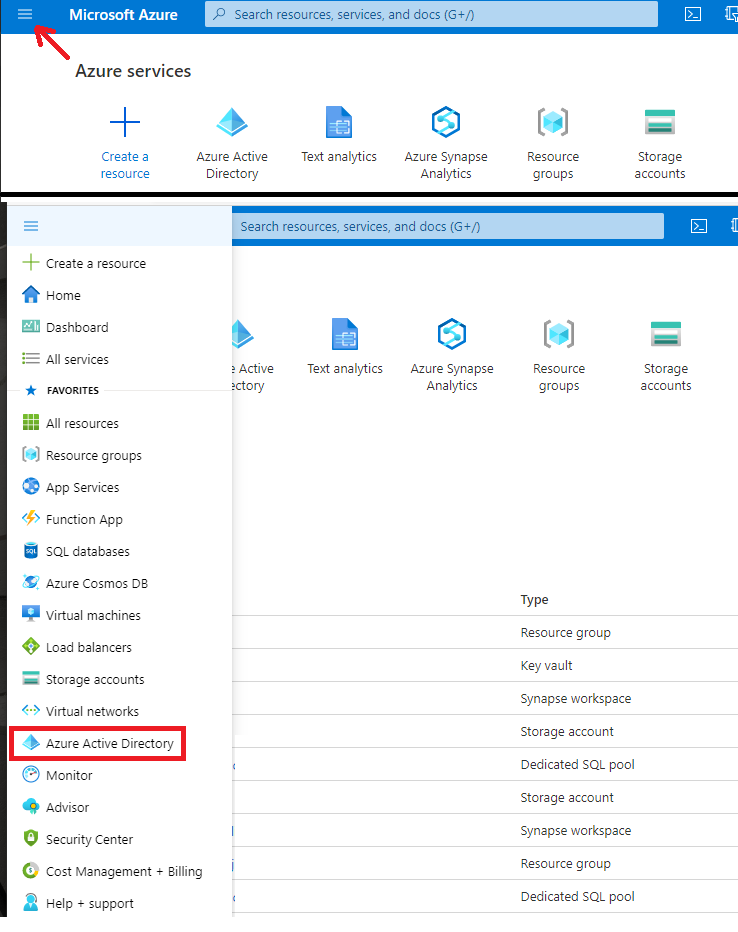
4. Select **App registrations** from the **Manage** section of the sidebar on the left, then select the **New registration** button:
   
5. Use the following values to create a new Azure AD application and select **Register**:
  - **Name**: conversation-lineage-m365-reader
  - **Supported account types**: Accounts in this organizational directory only
  - **Redirect URI**: *Leave the default values*
   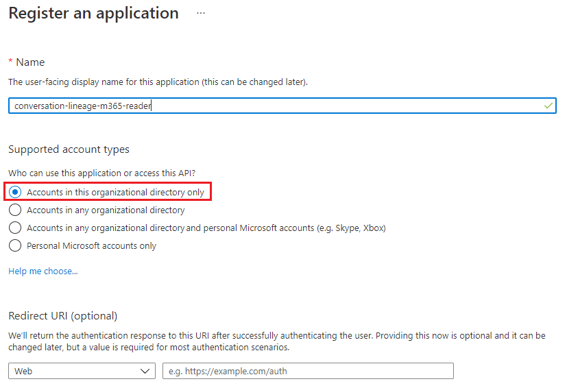
6. Click **Register**.
7. Once registration is complete, the following view should appear:
   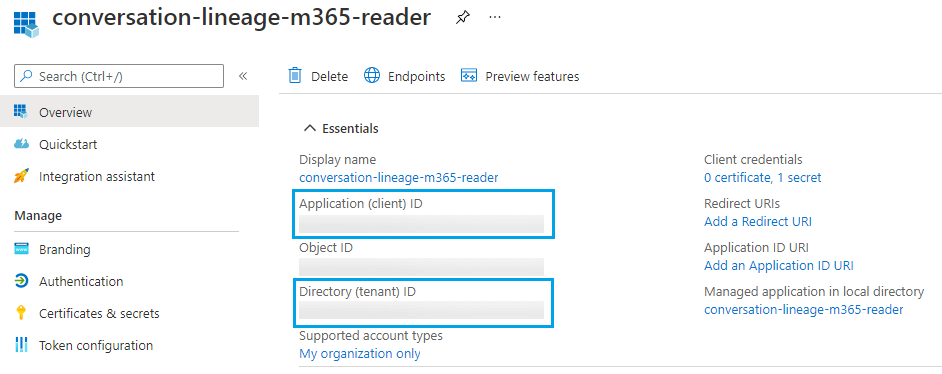  
   A. Locate the **Application (client) ID** and copy it as you will need it later in this lab. This will be referred to as the *service principal ID*.  
   B. Locate the **Directory (tenant) ID** and copy it as you will need it later in this lab. This will be referred to as the *tenant ID*.
8. Select **Certificates & secrets** under **Manage** in the sidebar navigation. Then select the **New client secret** button. Leave **Description** empty, set **Expires** to `24 months` and choose **Add**.
   > You can choose different values for **Description** and **Expires** if you like. Ensure you keep a copy of the 
   > hashed key (Value) after it is saved, as it will be saved to the Key Vault later in the tutorial. 
   > The hashed value will never be shown again, so if you forget it, you will need to create a new one!
   > This will be referenced as the *service principal key*.

   
  
9. Using the sidebar navigation for the application, select **Owners**.
10. Ensure your account is listed as an owner for the application. If it isn't listed as an owner, add it.

### Create an Azure AD group
While ingesting data from M365 you have the option of retrieving the data for all users (having an Office 365 license),
or only for a specific set of users. To achieve this, create an Azure AD security group called `MGDC101 Members`.  
> NOTE: The tutorial for AD group creation (link below) mentions two possible group types: *Security* and *Microsoft 365*.  
> Be sure to use the *Security* group type when setting up the Azure AD group.  
> Additionally, when setting up the security group you will need to choose a Membership type: *Assigned*, *Dynamic user*, or *Dynamic device*.  
> Unless otherwise directed by your organization, the *Assigned* membership type should be selected.

The steps required to create a group and add members to it are described [here](https://docs.microsoft.com/en-us/azure/active-directory/fundamentals/active-directory-groups-create-azure-portal).  

Once the group is created, add to it users for which the M365 data (profile, emails, calendar events, team chats) should
be processed. The users must have an Office 365 license, for their data to be actually retrieved.  
In the **Overview** page of the group, look for the **Object Id** and copy its value as you will need it later.

### Create an Azure resource group
Create a resource group to hold all the Azure resources required for this project.  
In order to create a resources group please follow the steps described [here](https://docs.microsoft.com/en-us/azure/azure-resource-manager/management/manage-resource-groups-portal#create-resource-groups).

### Create an Azure Storage account
Create a Storage account meant to store the raw data ingested from Microsoft 365, as well as intermediate data resulting
from transforming the input data.
In order to set it up please follow the instructions from the official documentation [here](https://docs.microsoft.com/en-us/azure/storage/common/storage-account-create?tabs=azure-portal).

When you arrive at the "Data protection" configuration step, disable all soft delete options as presented in the image below.  
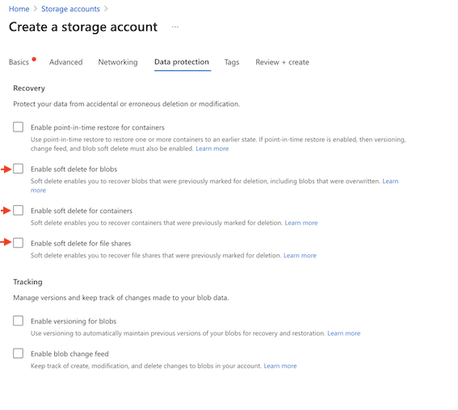

After the storage account is created, six blob containers have to be created with the following names: `emails`, 
`events`, `logs`, `managers`, `users` and `team-chats`.  
> NOTE: In the documentation for creating a container (see link below) it references selecting the *Blob containers* option under the Data storage section. This can be confusing, as the option has been changed to *Containers*. This is the option that should be selected.  
> 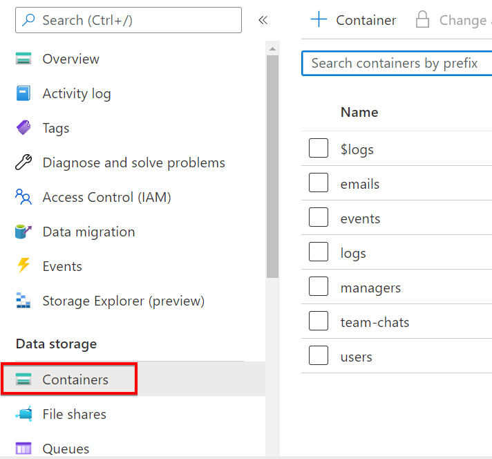

The information on how to create a container can be found [here](https://docs.microsoft.com/en-us/azure/storage/blobs/storage-quickstart-blobs-portal#create-a-container).
Once complete, navigate back to *Containers* from the Storage Account resource in the Azure portal (if not already there). The container list should now look as follows:
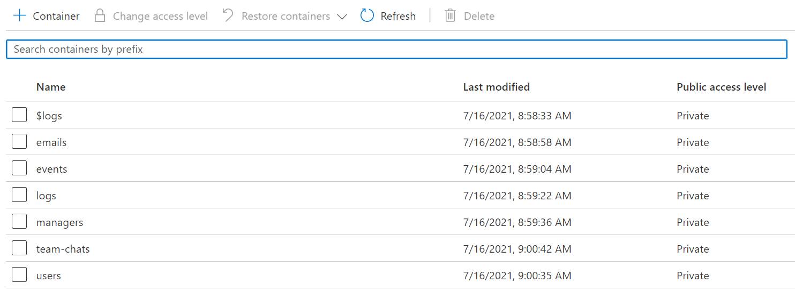
> NOTE: The $logs folder is created by default upon deploying the storage account. This is not to be confused with the *logs* container created above. *$logs* is used for Storage Analytics and can be ignored for the purposes of this tutorial.

Later in this tutorial, you will need the Azure Storage Account Key (to be referenced as `storageAccountKey`). This key can be acquired from the Access keys view (under the "Security + networking" section of the left navigation window) of the storage account. To enable copying of the key, select **Show keys** and then copy. 
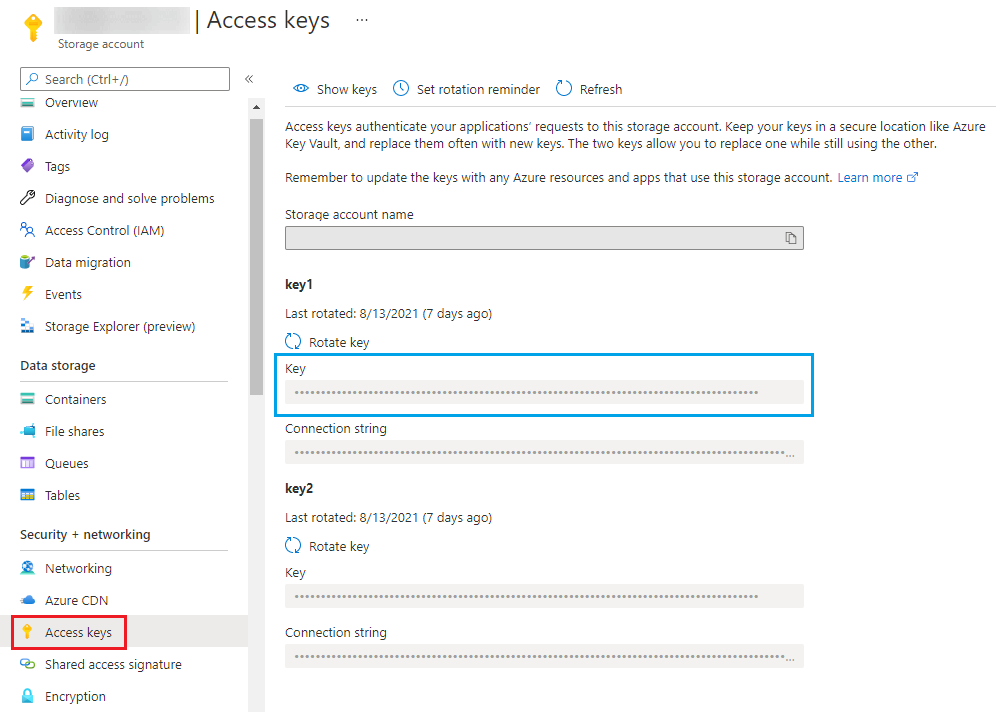  


### Create an Azure Cognitive Service
Create an instance of Azure Cognitive Services meant to be used for sentiment analysis of interactions between users.
1. From *Azure Cognitive Services* we'll use the *Text Analytics* service.  
2. Go to the Azure portal and search for `Text Analytics`.  
3. Select the **Text analytics** service and Click **Create**.  
4. Click **Continue to create your resource**  
5. Select your resource group (created earlier) and an appropriate **Region**, **Name**, and **Pricing tier**. Also be sure to review and acknowledge the terms of the Responsible AI Notice.  
> ***IMPORTANT:***  
> When choosing the name of the service, you MUST select a name with a length of less than 15 characters. If the name is too long, the pipeline (executed at a later step) will not  complete successfully.  

6. Once complete, click **Review + create** and then **Create**.  
7. Once the *Text Analytics* service is created, visit the Keys and Endpoint section (beneath Resource Management on the left navigation menu). Later in this documentation, you will require the key and endpoint values found here. Respectively, they will be referenced as `azure-ai-key` and `azure-ai-endpoint`.  


From *Text Analytics* service, we'll use 2 provided API functions:
- [sentiment analysis](https://docs.microsoft.com/en-us/azure/cognitive-services/text-analytics/how-tos/text-analytics-how-to-sentiment-analysis?tabs=version-3-1)
- [named entity recognition](https://docs.microsoft.com/en-us/azure/cognitive-services/text-analytics/how-tos/text-analytics-how-to-entity-linking?tabs=version-3-1)

### Create an Azure Synapse workspace
Create the Synapse workspace used to process all the data.
For setting up a Synapse workspace, please follow the [official Synapse documentation](https://docs.microsoft.com/en-us/azure/synapse-analytics/get-started-create-workspace)
and make sure to use your resource group. 
> IMPORTANT:
> There is one necessary step not mentioned in the documentation. Before creating the workspace, be sure to visit the **Security** tab and create SQL administrator credentials for the workspace. The values you enter for **SQL Server admin login** and **SQL Password** will be referenced later as `jdbcUsername`and `jdbcPassword`, respectively.  

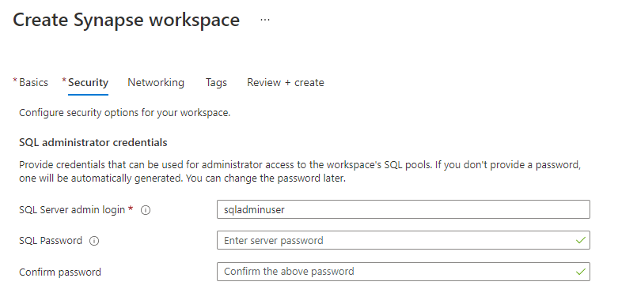  
> NOTE: The official Synapse documentation tutorial will instruct you to create a new storage account (not the one created in an earlier [step](#create-an-azure-storage-account)). When filling in the **Workspace name**, **Data Lake Storage Storage Account name**, and **File system name** fields, feel free to use your own naming conventions. You only need to follow the tutorial to the point that the Synapse workspace is created, then return to this tutorial.

### Create a Synapse Spark pool
Certain more complex transformations of data will be performed using Apache Spark. This requires the computation
resources of a Spark cluster. Synapse provides an integrated Spark cluster via Spark pools.  

From Synapse Studio, create a Spark pool named `mgdc101synapse` by adapting the steps in [this tutorial](https://docs.microsoft.com/en-us/azure/synapse-analytics/quickstart-create-apache-spark-pool-studio#create-the-apache-spark-pool-in-synapse-studio). Return to this tutorial once you reach step 4 of the **Create a Synapse Spark pool** section.
In order to keep costs low, assuming you will use a rather small input dataset, use small nodes and keep the number of
nodes to a minimum. Also, to enable automatic pausing after the pool is idle, go to `Pause Settings` (on the right of the pool name in the pools list), select "Enabled", and set the desired idle duration.


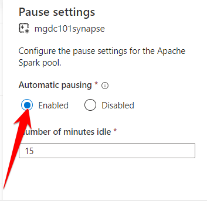

If you would like to learn more about Apache Spark in Synapse, follow the link [here](https://docs.microsoft.com/en-us/azure/synapse-analytics/spark/apache-spark-overview).

In the Spark pool, a few libraries need to be installed for the spark notebooks to execute properly. The necessary steps
for installing the libraries are presented [here](./conversations_text_analytics/README.MD#spark-pool-prerequisites).  

### Create a Synapse dedicated SQL pool
In order to keep most data transformations as accessible as possible, SQL queries are used. Also, the data is exposed
to PowerBI for visualization in tabular format (more precisely as views). Therefore, Synapse dedicated SQL pools are 
used.  
The SQL pool is an analytics engine which offers both compute and storage capabilities.

From Synapse Studio, create a dedicated SQL pool named `synapsededicatesqlpool` by adapting the relevant steps from [this guide](https://docs.microsoft.com/en-us/azure/synapse-analytics/quickstart-create-sql-pool-studio).
This can also be [done from Azure portal](https://docs.microsoft.com/en-us/azure/synapse-analytics/quickstart-create-sql-pool-portal).  
In order to keep costs low, assuming you will use a rather small input dataset, set the "Performance level" of the pool
to the smallest available value (`DW100c`). The pool does not have the option to automatically shut down while idle, so
consider pausing it yourself while not in use. However, make sure this does not interfere with scheduled processing
via Synapse triggers (described below).

Please follow the next link to learn more about [Azure Synapse SQL architecture](https://docs.microsoft.com/en-us/azure/synapse-analytics/sql/overview-architecture)
and about [dedicated SQL pools](https://docs.microsoft.com/en-us/azure/synapse-analytics/sql-data-warehouse/sql-data-warehouse-overview-what-is).

### Grant access to the Storage Accounts
Now that both storage accounts have been created, grant the service principal (created at [this](#create-an-azure-ad-application) step) the
`Storage Blob Data Contributor` role to both resources by following the steps described [here](https://docs.microsoft.com/en-us/azure/role-based-access-control/role-assignments-portal?tabs=current).

### Create an Azure Key Vault
Create a KeyVault meant to store any sensitive pieces of information meant to be used by the Synapse pipelines.  
To create the vault, follow [this guide](https://docs.microsoft.com/en-us/azure/key-vault/general/quick-create-portal#create-a-vault).
To add secrets to the vault, follow [this guide](https://docs.microsoft.com/en-us/azure/key-vault/secrets/quick-create-portal#add-a-secret-to-key-vault).

Here is a list of all the secrets that have to be saved in Azure Key Vault and what their names **must** be:
- The Azure Storage Account Key, using the name `storageAccountKey`
- Synapse dedicated SQL pool credentials (these are the credentials you were requested to enter while setting up the 
  dedicated sql pool: `SQL Server admin login` and `SQL Password`):
  - username, using the name `jdbcUsername`
  - secret password, using the name `jdbcPassword`
- The service principal key used to extract data from M365 and to connect to Azure Blob Storage. The name of
  the secret has to be `m365-reader-secret`
- The Text Analytics Key, using the name `azure-ai-key`

In order for the Synapse workspace to be able to extract secrets from the Key Vault, the `Get` and `List` Secret Permissions
must be assigned. This is done from the "Access policies" section of the Key Vault. The necessary steps to achieve this are presented [here](https://docs.microsoft.com/en-us/azure/key-vault/general/assign-access-policy-portal#assign-an-access-policy).  
On **Step 4** of the above guide, supply the managed identity for your Synapse workspace. This will simply be the name of your Synapse workspace created at [this step](#create-an-azure-synapse-workspace).  
  
### Set up PowerBI
To create, edit and visualize the final reports over the processed data, you will need to have [PowerBI Desktop](https://docs.microsoft.com/en-us/power-bi/fundamentals/desktop-what-is-desktop) 
installed (either locally or on a Windows VM accessed via RDP).  
To perform the installation, please follow [these steps](https://docs.microsoft.com/en-us/power-bi/fundamentals/desktop-getting-started#install-and-run-power-bi-desktop).  
To share the reports with others you will also need an appropriate [license](https://docs.microsoft.com/en-us/power-bi/fundamentals/service-features-license-type).


### Creating SQL entities
The Synapse pipelines are responsible with transforming the data and exposing it to PowerBI for reporting. The end goal
is to expose the data in tabular format, so that the data incorporates a known schema, and it can be efficiently queried. 
As a consequence, the final data is stored in SQL tables. It is exposed to PowerBI via SQL views, built on top of those
tables, to decouple the schema used by the pipelines from the schema exposed to PowerBI. Also, most intermediate 
results of the transformations performed by the pipelines are also stored as SQL tables, in the SQL pool.  

You will need to create all the database entities (tables, views, stored procedures) used by the pipelines, before
actually creating the pipelines.
To do this, you can use the **Develop** tab in Synapse Studio in order to run sql queries.
In order to run a sql query from the **Develop** tab, open it and from the upper right `+` icon, select new **SQL script**
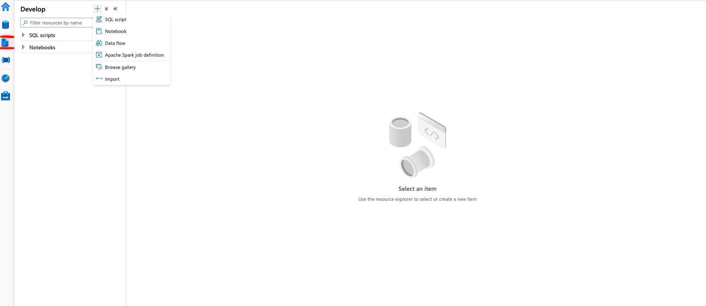

It is important to mention that each time you create a new SQL script, before running any SQL command, you have to select
the dedicated SQL pool you created earlier (instead of the Built-in pool) in the **Connect To** section:
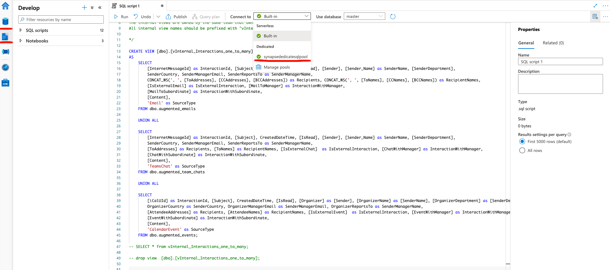
 
Once you've done this, copy the content of each of the following SQL statements into the SQL script in Synapse and execute them one at a time. To execute a statement, hit the **Run** button and all the statements in the script will be run sequentially.  
   [create_tables.sql](./sql/create_tables.sql)  
   [create_views_private.sql](./sql/create_views_private.sql)  
   [create_views_public.sql](./sql/create_views_public.sql)  
   [stored_procedure.sql](./sql/stored_procedure.sql)  

More details about the SQL entities and about the SQL files provided can be found [here](./sql/README.md)


### Limiting the size of the input data
Before deploying the Synapse pipelines, in order to minimize costs, you should consider keeping the size of the input 
data reasonably small. This can be achieved via 2 mechanisms:

#### Limit the number of users for which data is processed
Only the data generated by the users that are members of the AD group [described earlier](#create-an-azure-ad-group)
will be processed by the Synapse pipelines.  
By providing a group with a smaller number of members (but enough to provide meaningful results), less data will be
processed. This will result in smaller pipeline execution durations, and lower cost (as smaller pool sizes can be used).

#### Limit the time span of the processed data
The application processes email, calendar events and team chats data sent between users. Each such interaction occurred
at a certain point in time. The pipelines process all such events from a starting point (in the past), up to the current
time.  
By selecting a starting point that is not very far in the past (but far enough to provide meaningful results), less data
will be processed.


## Set up the Synapse data processing pipelines
To start up the deployment, log in to [https://portal.azure.com](https://portal.azure.com) and open a bash Azure Cloud Shell:


*Observation:* The first time you open it, Azure will display the following window requesting permission
to create a temporary storage account where all the deployment files that the user uploads will be stored.
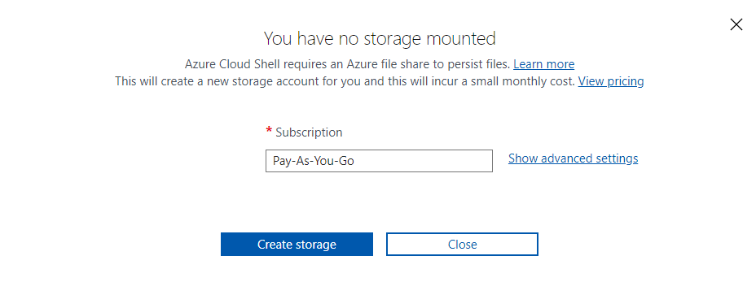  
Click **Create storage** and proceed further.

The next step requires a zip archive from the `./arm/` [folder](./arm) of the GitHub repository. Copy the folder's web address into the [prompt found here](https://download-directory.github.io/), which should look similar to this:  
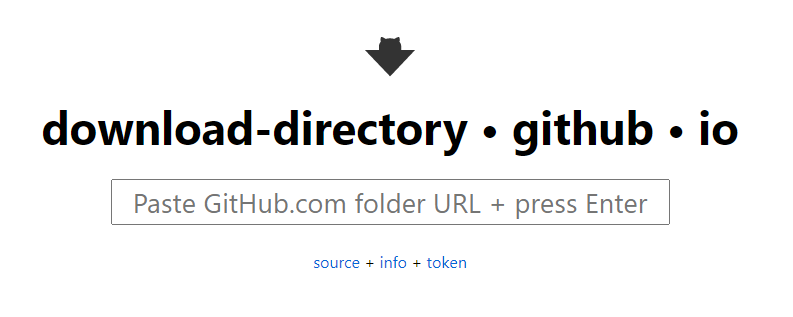  
Once the GitHub directory has been pasted into the above URL, click Enter to execute the download.  

Once the download completes, rename the file to `arm.zip` and upload it using the upload functionality in Azure Cloud Shell:   


After the zip archive is uploaded, unzip the archive using the following command:
```unzip arm.zip```

This will provide you with the ARM template of each Synapse component that needs to be deployed.
You would normally have to execute the appropriate [az synapse command](https://docs.microsoft.com/en-us/cli/azure/synapse?view=azure-cli-latest)
specific for each entity type that needs to be deployed, and provide the ARM template of that component.
Since this can be quite a tedious process, you are provided with a script that will deploy all the synapse components
(linked services, pipelines, datasets, notebooks & triggers) for you.
To run it, execute the following command from the `arm` directory, after replacing the values of the parameters with the
values specific to the environment where the deployment will take place:

```
./deploy.sh --workspace-name "<synapse-workspace-name>" --spark-pool-name "<spark-pool-name>" --start-date "YYYY-MM-DD" --key-vault-endpoint "https://<keyvault-name>.vault.azure.net/" --storage-account-endpoint "https://<storage-account-name>.blob.core.windows.net/"  --service-principal-tenant-id "<tenant-id>" --service-principal-id "<sp-id>" --dedicated-sql-pool-endpoint "<synapse-workspace-name>.sql.azuresynapse.net" --sql-pool-database-name "<dedicated-sql-pool-name>" --azure-ai-endpoint "<azure-ai-endpoint>" --m365-extraction-group-id "<group_id>"
```
The values for the parameters should be as follows, for:
- `--workspace-name`, the name of the Synapse Workspace created at [this step](#create-an-azure-synapse-workspace)
- `--spark-pool-name`, the name of the Synapse Spark pool created at [this step](#create-a-synapse-spark-pool)
- `--start-date`, the start date and hour of day in UTC, of the backfill trigger (trigger that processes historical data
  starting from given start date, to the current date). The format of the date has to be `YYYY-MM-DDTHH:00:00Z` (e.g. `2020-01-01T06:00:00Z`)
- `--key-vault-endpoint`, the URL of the Key Vault service created at [this step](#create-an-azure-key-vault)
- `--storage-account-endpoint`, the url of the Storage Account created at [this step](#create-an-azure-storage-account)
- `--service-principal-tenant-id`, the tenant id of the service principal created at [this step](#create-an-azure-ad-application)
- `--service-principal-id`, the application id of the service principal created at [this step](#create-an-azure-ad-application)
- `--dedicated-sql-pool-endpoint`, can be found as "Dedicated SQL endpoint", on the "Overview" page of the Synapse Studio created at [this step](#create-an-azure-synapse-workspace)
- `--sql-pool-database-name`, the name of the Synapse Dedicated Sql Pool resource, created at [this step](#create-a-synapse-dedicated-sql-pool)
- `--azure-ai-endpoint`, the endpoint of the Text Analytics resource created at [this step](#create-an-azure-cognitive-service)
- `--m365-extraction-group-id`, the Object Id of the group created at [this step](#create-an-azure-ad-group)

> NOTE: It is common to experience an access denied when initially attempting to run the deploy.sh from Azure Cloud Shell. To alleviate this, execute the following two lines of code from the Bash prompt in Azure Cloud Shell:  
> ```chmod +x deploy.sh```  
> ```sed -i -e 's/\r$//' deploy.sh```  

Execute the `deploy.sh` script outlined above.
The script will perform `az login` for you, so you will be prompted to authenticate into Azure. Follow all of the Azure prompts until login is complete and the script begins executing. 
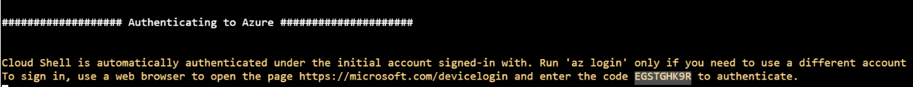  

The pipelines created by the script are orchestrated by Synapse triggers. One trigger is responsible for populating all the historical data from a given starting date and time, up to the start of the current hour.  
Starting from that point, a second, recurring trigger will process new data that will arrive in the future, by running
every 24 hours and handling the last day's data.

The deployment script will create these triggers, but they will be stopped. Inside of the Synapse workspace, you will have to go to the **Manage** menu,
select **Triggers** and then activate each of the two triggers by pressing the **Activate** triangle button.  
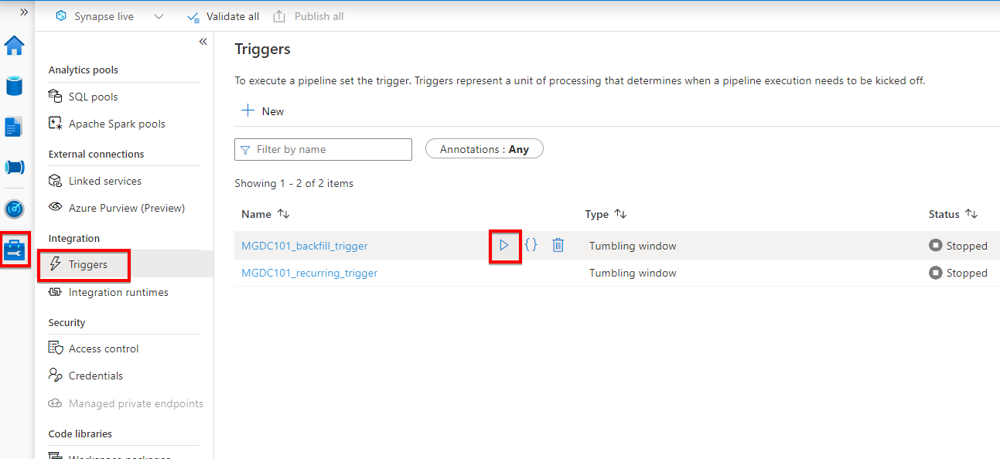  

The Synapse triggers used are referred to as **Tumbling window** triggers. To find out more about this specific type of trigger, you can find additional information [here](https://docs.microsoft.com/en-us/azure/data-factory/how-to-create-tumbling-window-trigger?tabs=data-factory).

> NOTE: It is possible (particularly in a Windows environment) that a "bad interpreter" error will occur that looks something like this:
```
bash: ./deploy.sh: /bin/bash^M: bad interpreter: No such file or directory
```
> If this happens, perform the following steps in the bash shell to resolve the issue:
> 1. **Open deploy.sh file in vim editor:** ```vim deploy.sh```
> 2. **Convert to Unix format:** Inside vim, type and enter ```:set ff=unix```
> 3. **Save converted file:** Inside vim, type and enter ```:wq```  
> 
> The error should no longer occur.


### Monitoring the Synapse pipelines
Once the Synapse pipelines are started by the triggers, they can be monitored by going to the **Monitor** tab, then to the
**Pipeline Runs** section. Once the pipelines complete, their status will become "Succeeded".  However, there are a few approvals that will be needed to allow the pipelines to finish.
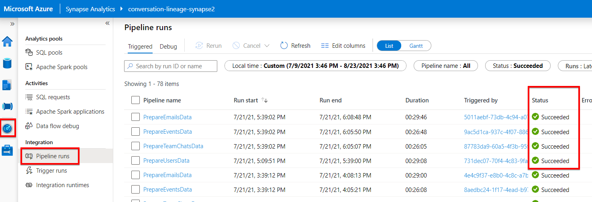

#### Approve Data Access Requests
The first time a pipeline that read from M365 is run, it needs to be approved by a member of the "Consent Request Approvers" group described earlier. The pipeline stage reading from M365 will remain in a pending state for up to 24 hours until this approval is given, before timing out.

When the `End2EndMgdc101WithConvLineage` pipeline is triggered  to run for the first time, there will be 5 Data Access
Requests that will be generated in the Microsoft 365 Admin Center. The Data Access Requests can be seen in the [Settings
section of the admin center](https://portal.office.com/adminportal/home?#/Settings/PrivilegedAccess). 

The Data Access Request won't show up all at the same time. First the access requests for user and managers data will show up.
After the PrepareUsersData pipeline finishes, 3 more Data Access Request will show up, for emails, team chats and calendar
events data.

The user that approves the Data Access Requests has to be different from the user that created and deployed all the resources
in the resource group.

In order to approve a Data Access Request, click the one you want to approve and a popup will appear with the two options,
approve or deny, as shown in the image below.

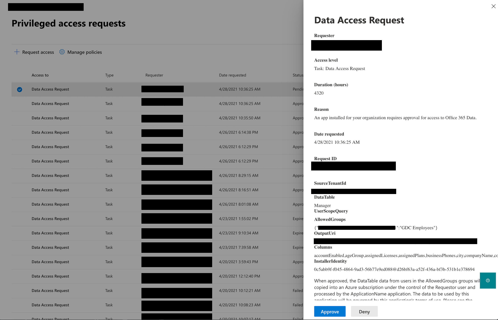


### Create and visualize the PowerBI reports
The main pipeline started by the backfill trigger will, in turn, launch child pipelines. Once they have all successfully 
completed and the main pipeline completes as well, the final step is to create and visualize the PowerBI reports
on top of the data.

The PowerBI presentation is based on the views created from the derived table.  
The statements for the SQL views creation can be found [here](./sql/views_creation_sql.sql).  
The PowerBI report can be found [here](./power_bi_presentation/MGDC%20Conversation%20Lineage.pbix).  
The PowerBI report documentation can be found [here](./power_bi_presentation/README.MD).

In order to create/update the views necessary for the PowerBI please open a sql query window:  


Execute the sql script necessary for the PowerBI reports:  


## Architectural design

There are 3 types of entities that represent conversations: mails, chats and calendar events.

There are 3 major pipeline steps in retrieving and processing the conversations:
1) The data ingestion from Graph-Data-Connect.
2) Table derivation necessary for obtaining the views that will contain the information for PowerBI
3) Sentiment extraction on the conversation content retrieved by the step 1. 


### Data Ingestion

The workflow steps are focused on extracting the following type of information:
- M365 user profile data
- M365 emails data
- M365 calendar events data
- M365 Teams chat data


The users processing pipeline:


The mails processing pipeline:


The calendar events processing pipeline:


The teams chat processing pipeline:


### Table derivation


###  Sentiment and entities extraction from mails 

In order to follow the setup steps for the text analytics pipeline, please consult the setup instructions [here](conversations_text_analytics/README.MD)


 
