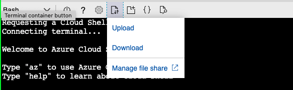
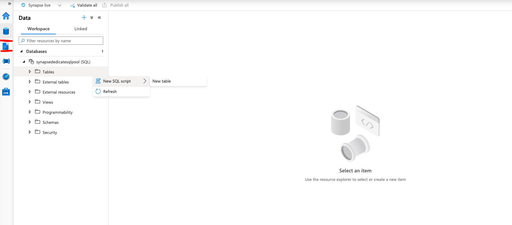
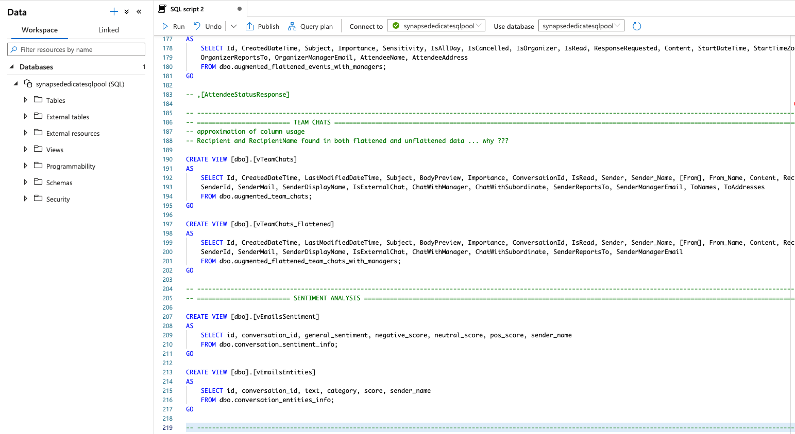

# Conversation Lineage

## Table of contents
- [Tutorial Overview](#tutorial-overview)
- [Prerequisites](#prerequisites)
- [Set up the Synapse data processing pipelines](#set-up-the-synapse-data-processing-pipelines)
    - [Arm files deployment](#arm-files-deployment)
    - [Trigger deployment](#trigger-deployment)
    - [Sql deployment](#sql-deployment)
- [Architectural design](#architectural-design)
    - [Data Ingestion](#data-ingestion)
    - [Table Derivation](#table-derivation)  
    - [Sentiment and entities extraction from mails](#sentiment-and-entities-extraction-from-mails)
    - [PowerBI presentation](#powerbi-presentation)

  
## Tutorial Overview
This tutorial will provide you with an example of using [Graph Data Connect](https://docs.microsoft.com/en-us/graph/data-connect-concept-overview)
(GDC) to gain insights into an organization's communication patterns by analyzing Microsoft 365 data.  
By doing this, you will learn the key steps and Azure technologies required to build your own GDC based application.  
You will learn how to:
- extract and process Microsoft 365 data and run analytics on top of it using [Azure Synapse Analytics](https://docs.microsoft.com/en-us/azure/synapse-analytics/)
- process both historical data and future data on a daily basis using Azure Synapse triggers
- extract sentiment and NLP entities from conversations using [Azure Cognitive Services](https://azure.microsoft.com/en-us/services/cognitive-services/text-analytics/)
- visualize key insights using [PowerBI](https://docs.microsoft.com/en-us/power-bi/fundamentals/power-bi-overview)

## Prerequisites

To complete this lab, you need the following:

- Microsoft Azure subscription
  - If you do not have one, you can obtain one (for free) here: [https://azure.microsoft.com/free](https://azure.microsoft.com/free/)
  - The account used to perform the set up must have the [**global administrator** role granted to it](https://docs.microsoft.com/en-us/azure/role-based-access-control/elevate-access-global-admin),
    in order to be able to create the various infrastructure components described below
  - The Azure subscription must be in the same tenant as the Office 365 tenant as Graph Data Connect will only export 
    data to an Azure subscription in the same tenant, not across tenants.
- Office 365 tenancy
  - If you do not have one, you obtain one (for free) by signing up to the [Office 365 Developer Program](https://developer.microsoft.com/office/dev-program).
  - Multiple Office 365 users with emails sent & received
  - Access to at least two accounts that meet the following requirements:
  - One of the two accounts must be a global tenant administrator & have the **global administrator** role granted (just one account)
- Workplace Analytics licenses
  - Access to the Microsoft Graph data connect toolset is available through [Workplace Analytics](https://products.office.com/en-us/business/workplace-analytics), 
    which is licensed on a per-user, per-month basis.
  - To learn more please see [Microsoft Graph data connect policies and licensing](https://docs.microsoft.com/en-us/graph/data-connect-policies)

> NOTE: The screenshots and examples used in this lab are from an Office 365 test tenant with fake email from test users. 
> You can use your own Office 365 tenant to perform the same steps. No data is written to Office 365. 
> A copy of email data is extracted from all users in an Office 365 tenant and copied to an Azure Blob Storage 
> account that you maintain control over. Thus, you control who has access to the data within the Azure Blob Storage.
 
### Set up Graph Data Connect
For setting up Office 365 Tenant and enabling Graph Data Connect, please follow the steps from chapter `Excercise 1` 
from this GDC [tutorial](https://github.com/microsoftgraph/msgraph-training-dataconnect/blob/master/Lab.md#exercise-1-setup-office-365-tenant-and-enable-microsoft-graph-data-connect)

### Create an Azure resource group
Create a resource group to hold all the Azure resources required for this project.

### Create an Azure Storage account
Create a Storage account meant to store the raw data ingested from Microsoft 365, as well as intermediate data resulting
from transforming the input data.

### Create an Azure Cognitive Service
Create an instance of Azure Cognitive Services meant to be used for sentiment analysis of interactions between users.
From *Azure Cognitive Services* we'll use *Text Analytics* service.
In order to set it up please follow the instructions from the official documentation [here](https://docs.microsoft.com/en-us/azure/cognitive-services/text-analytics/how-tos/text-analytics-how-to-call-api?tabs=synchronous#create-a-text-analytics-resource)
From *Text Analytics* service we'll use 2 provided api functions:
- [sentiment analysis](https://docs.microsoft.com/en-us/azure/cognitive-services/text-analytics/how-tos/text-analytics-how-to-sentiment-analysis?tabs=version-3-1)
- [named entity recognition](https://docs.microsoft.com/en-us/azure/cognitive-services/text-analytics/how-tos/text-analytics-how-to-entity-linking?tabs=version-3-1)

### Create an Azure Key Vault
Create a KeyVault meant to store any sensitive pieces of information meant to be used by the Synapse pipelines.
For example, you'll need to store the storage account key, the Cognitive service key, the Synapse SQL pool password etc.

### Create an Azure Synapse workspace
Create the Synapse workspace used to process all the data.
For setting up a Synapse workspace, please follow the [official Synapse documentation](https://docs.microsoft.com/en-us/azure/synapse-analytics/get-started-create-workspace)
and make sure to use your resource group.

### Create a Synapse Spark pool
Certain more complex transformations of data will be performed using Apache Spark. This requires the computation
resources of a Spark cluster. Synapse provides an integrated Spark cluster via Spark pools.  

From Synapse Studio, create a Spark pool named `mgdc101synapse` by adapting the steps in [this tutorial](https://docs.microsoft.com/en-us/azure/synapse-analytics/quickstart-create-apache-spark-pool-studio).
This can also be [done from Azure portal](https://docs.microsoft.com/en-us/azure/synapse-analytics/quickstart-create-apache-spark-pool-portal).  
In order to keep costs low, assuming you will use a rather small input dataset, use small nodes and keep the number of
nodes to a minimum. Also, to enable automatic pausing after the pool is idle, go to `Pause Settings` (on the right of 
the pool name in the pools list), select "Enabled", and set the desired idle duration.

Please follow the next link to learn more about [Apache Spark in Synapse](https://docs.microsoft.com/en-us/azure/synapse-analytics/spark/apache-spark-overview).

### Create a Synapse dedicated SQL pool
In order to keep most data transformations as accessible as possible, SQL queries are used. Also, the data is exposed
to PowerBI for visualization in tabular format (more precisely as views). Therefore, Synapse dedicated SQL pools are 
used.  
The SQL pool is an analytics engine which offers both compute and storage capabilities.

From Synapse Studio, create a dedicated SQL pool named `synapsededicatesqlpool` by adapting the relevant steps from [this guide](https://docs.microsoft.com/en-us/azure/synapse-analytics/quickstart-create-sql-pool-studio).
This can also be [done from Azure portal](https://docs.microsoft.com/en-us/azure/synapse-analytics/quickstart-create-sql-pool-portal).  
In order to keep costs low, assuming you will use a rather small input dataset, set the "Performance level" of the pool
to the smallest available value (`DW100c`). The pool does not have the option to automatically shut down while idle, so
consider pausing it yourself while not in use. However, make sure this does not interfere with scheduled processing
via Synapse triggers (described below).

Please follow the next link to learn more about [Azure Synapse SQL architecture](https://docs.microsoft.com/en-us/azure/synapse-analytics/sql/overview-architecture)
and about [dedicated SQL pools](https://docs.microsoft.com/en-us/azure/synapse-analytics/sql-data-warehouse/sql-data-warehouse-overview-what-is).

### Set up PowerBI
To create, edit and visualize the final reports over the processed data, you will need to have [PowerBI Desktop](https://docs.microsoft.com/en-us/power-bi/fundamentals/desktop-what-is-desktop) 
installed (either locally or on a Windows VM accessed via RDP).  
To perform the installation, please follow [these steps](https://docs.microsoft.com/en-us/power-bi/fundamentals/desktop-getting-started#install-and-run-power-bi-desktop).  
To share the reports with others you will also need an appropriate [license](https://docs.microsoft.com/en-us/power-bi/fundamentals/service-features-license-type).


## Set up the Synapse data processing pipelines
In order to start up the deployment log in to portal.azure.com and open an azure cloud shell:   


Select the necessary ARM template JSON files from the `./arm/End2EndMgdc101WithConvLineage/` [folder](./arm/End2EndMgdc101WithConvLineage) and upload them using
the upload functionality in azure cloud shell:   



### Arm files deployment
Once the files are uploaded, please execute the appropriate command specific for each entity type that needs to be deployed.   
The documentation for Synapse deployment commands can be found [here](https://docs.microsoft.com/en-us/cli/azure/synapse?view=azure-cli-latest)

Example: in order to deploy a pipeline, run the following:
```shell
az synapse pipeline create --file @pipeline.json --name 'ConversationLineage' --workspace-name <Azure Synapse Workspace Name>
```

### Trigger deployment
Synapse triggers are responsible with coordinating the processing of historical data, and the processing of future data on a scheduled basis.  
In order to configure the Synapse triggers, please execute the appropriate trigger az commands.  
Documentation for synapse trigger commands can be found [here](https://docs.microsoft.com/en-us/cli/azure/synapse/trigger?view=azure-cli-latest#az-synapse-trigger-create)

```shell
az synapse trigger create --workspace-name <Azure Synapse Workspace Name>  --name 'ConversationLineageTrigger' --file @trigger.json
  ```

### Sql deployment
In order to create/update the associated sql tables, open a sql editor on the "Tables" folder in Synapse workspace manager:  


Use the script located here [./sql/tables_creation.sql](./sql/tables_creation.sql) and execute it in Synapse workspace manager:  


### Limiting the size of the input data
In order to minimize costs, you should consider keeping  the size of the input data reasonably small. This can be achieved
via 2 mechanisms:

#### Limit the number of users for which data is processed

#### Limit the time span of the processed data


## Architectural design

There are 3 types of entities that represent conversations: mails, chats and calendar events.

There are 3 major pipeline steps in retrieving and processing the conversations:
1) The data ingestion from Graph-Data-Connect.
2) Table derivation necessary for obtaining the views that will contain the information for PowerBI
3) Sentiment extraction on the conversation content retrieved by the step 1. 


### Data Ingestion

The workflow steps are focused on extracting the following type of information:
- M365 user profile data
- M365 emails data
- M365 calendar events data
- M365 Teams chat data


The users processing pipeline:


The mails processing pipeline:


The calendar events processing pipeline:


The teams chat processing pipeline:


### Table derivation


###  Sentiment and entities extraction from mails 

In order to follow the setup steps for the text analytics pipeline, please consult the setup instructions [here](conversations_text_analytics/README.MD)

### PowerBI presentation
The PowerBI presentation is based on the views created from the derived table.  
The statements for the SQL views creation can be found [here](./sql/views_creation_sql.sql).  
The PowerBI report can be found [here](./power_bi_presentation/MGDC%20Conversation%20Lineage.pbix).  
The PowerBI report documentation can be found [here](./power_bi_presentation/README.MD).

In order to create/update the views necessary for the PowerBI please open a sql query window:  
  

Execute the sql script necessary for the PowerBI reports:  

 
