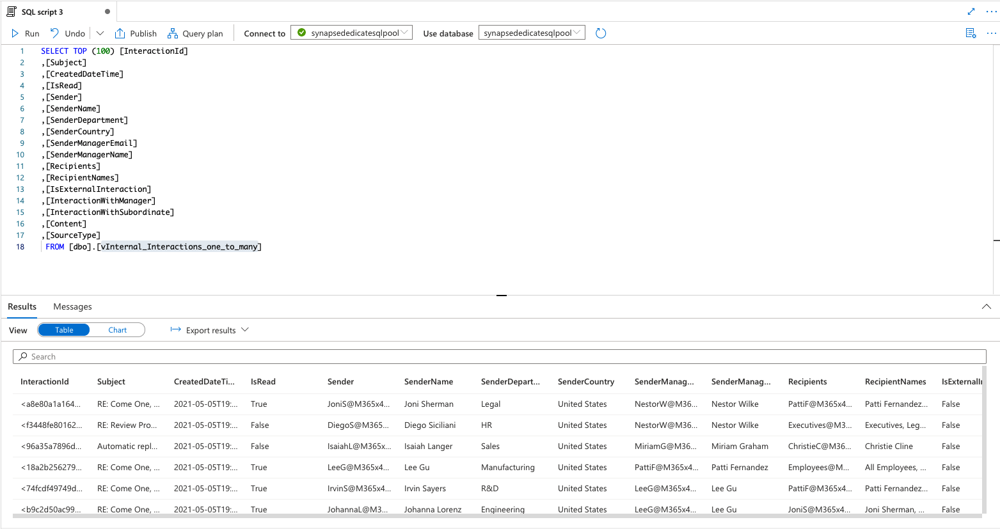
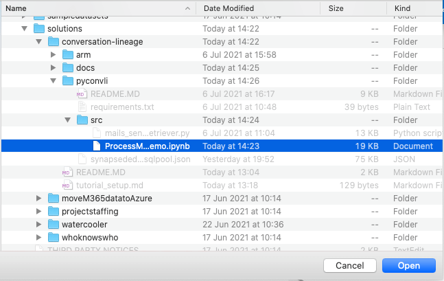
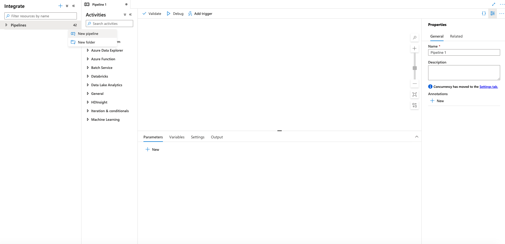
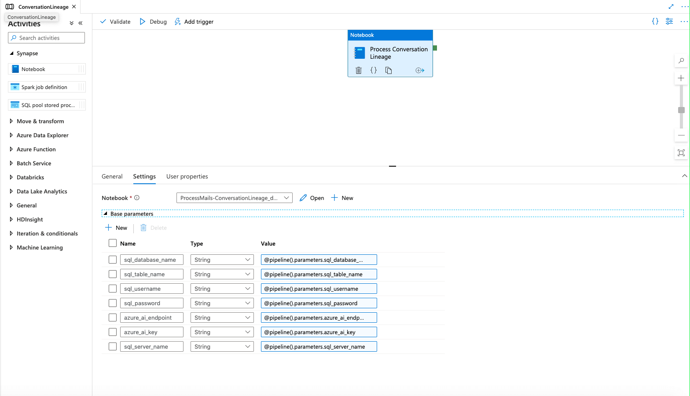
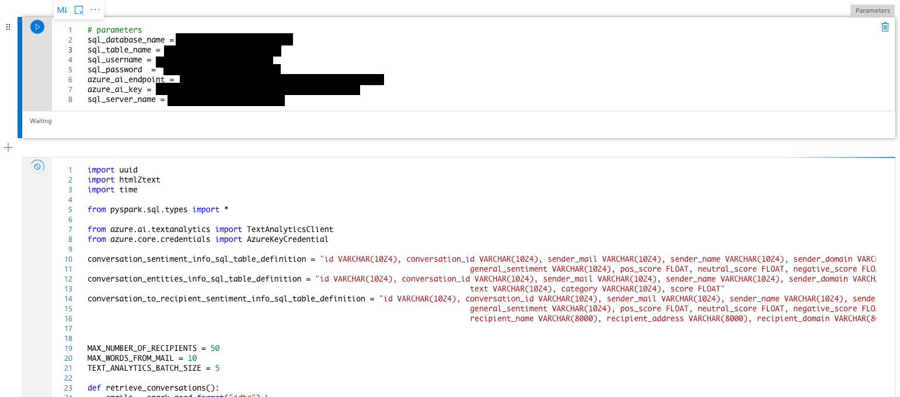
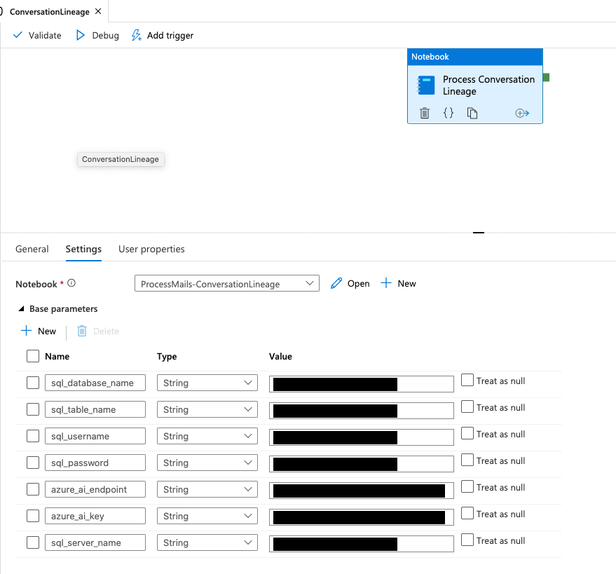
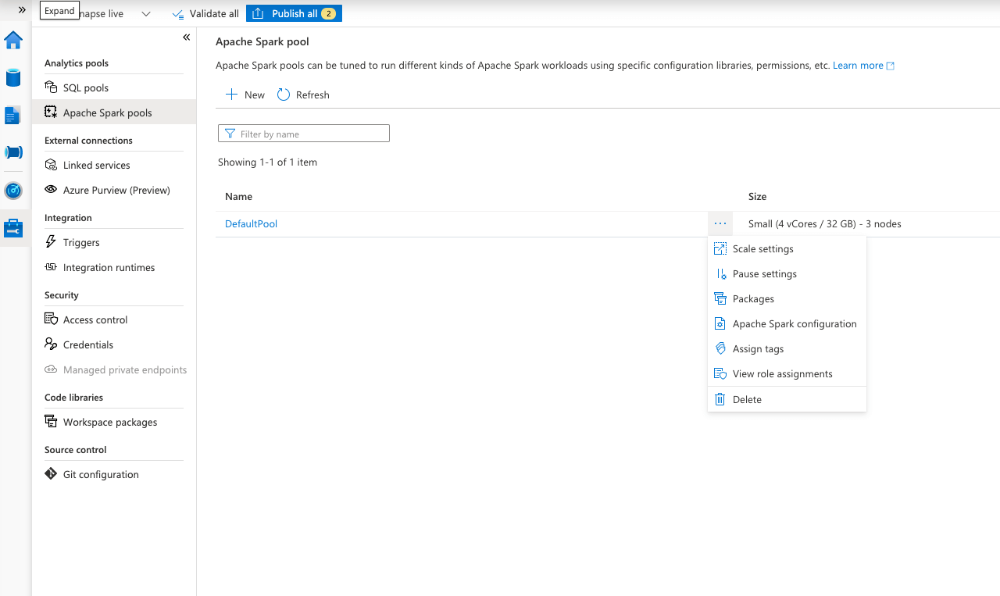
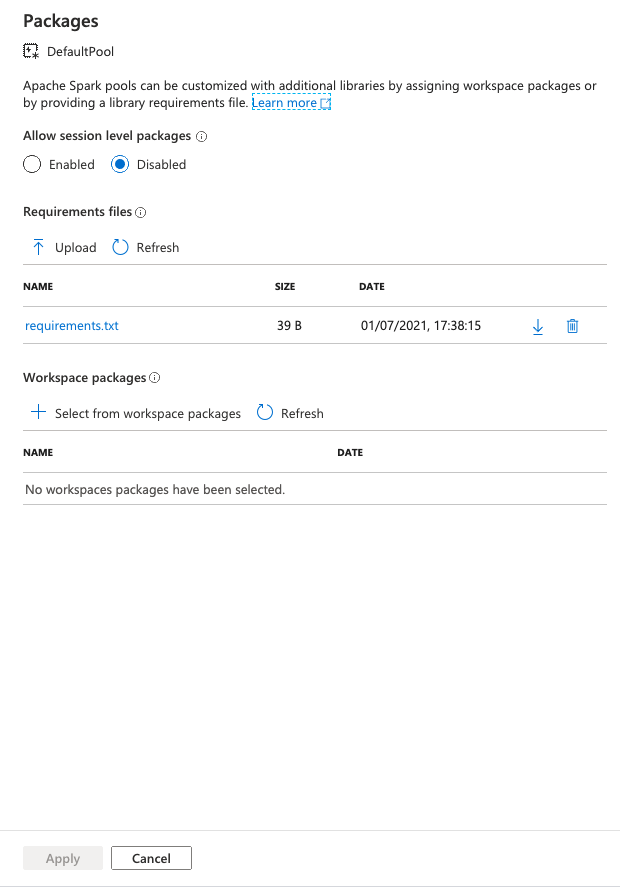

# Conversation lineage python scripts

## Table of content

- [Project Description](#project-description)
- [Prerequisites](#prerequisites)  
- [Input Data](#input-data)
- [Azure Ai Text Analytics usage](#azure-ai-text-analytics-usage)
- [Deployment on azure synapse](#deployment-on-azure-synapse)
    - [Deployment and configuration](#deployment-and-configuration)
- [Deployment using az command line and arm templates](#deployment-using-az-command-line-and-arm-templates)
    - [Open the azure cloud shell](#open-the-azure-cloud-shell)
    - [Deploy the notebook](#deploy-the-notebook)  
    - [Deploy the pipeline](#deploy-the-pipeline)
    - [Run the pipeline](#run-the-pipeline)
- [Pipeline and notebook parameters](#pipeline-and-notebook-parameters)


## Project description:
  - extract conversation analytics from the conversation flow between members of a company
  - more specifically: extract sentiment and nlp entities with possible purpose of identifying conversation sentiment
  over certain topics and write it to a sql table with the goal of exposing the insights through a power-bi presentation notebook.


## Prerequisites

All the workflows are dependent on the [Graph-Data-Connect](https://docs.microsoft.com/en-us/graph/data-connect-concept-overview)
and run in [Azure Synapse Analytics](https://docs.microsoft.com/en-us/azure/synapse-analytics/). 

For setting up an *Azure Synapse Workspace* please follow the [official synapse documentation](https://docs.microsoft.com/en-us/azure/synapse-analytics/get-started-create-workspace)    
For setting GDC please use the following tutorial chapter from this Microsoft GDC [tutorial](https://github.com/microsoftgraph/msgraph-training-dataconnect/blob/master/Lab.md#exercise-1-setup-office-365-tenant-and-enable-microsoft-graph-data-connect).    
You will also need a user with [global administration role](https://docs.microsoft.com/en-us/azure/role-based-access-control/elevate-access-global-admin).  

## Input data:
The source for the azure text analytics service is the content of the `dbo.vInternal_Interactions_one_to_many` view. 
This view represents a data union of all the common fields of the augmented_emails, augmented_team_chats and augmented_events tables, 
under a single schema describing interactions between users.  
The script for the view can be found [here](../sql/private_views_creation_sql.sql)

This view is created as a result of running the workflow described [here](../README.MD#tutorial-for-setting-up-the-conversation-lineage-processing-pipelines)

Sample data:   



## Azure AI Text Analytics usage.
In order to extract the sentiment from the mails content we make use of the [azure-ai-textanalytics](https://pypi.org/project/azure-ai-textanalytics/) python library

Usage example for azure-ai-textanalytics:
  - instantiate the class:
    ```python
    text_analytics_client = TextAnalyticsClient(endpoint=azure_ai_endpoint,credential=AzureKeyCredential(azure_ai_key))
    ```
    - `azure_ai_endpoint` must be in the following format: `https://{service_name}.cognitiveservices.azure.com/"`
    - `azure_ai_key` represents the secret key for using the service
  
  - extract the entities:
    ```python
    entities_result = text_analytics_client.recognize_entities(content)
    ```
    - `content` represents a list of strings
    - `entities_result` is a json containing the following fields (more details [here](https://docs.microsoft.com/en-us/azure/cognitive-services/text-analytics/how-tos/text-analytics-how-to-entity-linking?tabs=version-3))
    ```json
        {
          "documents": [
            {
              "id": "1",
              "entities": [
                {
                  "text": "tour guide",
                  "category": "PersonType",
                  "offset": 4,
                  "length": 10,
                  "confidenceScore": 0.45
                },
                {
                  "text": "Space Needle",
                  "category": "Location",
                  "offset": 30,
                  "length": 12,
                  "confidenceScore": 0.38
                },
                {
                  "text": "trip",
                  "category": "Event",
                  "offset": 54,
                  "length": 4,
                  "confidenceScore": 0.78
                },
                {
                  "text": "Seattle",
                  "category": "Location",
                  "subcategory": "GPE",
                  "offset": 62,
                  "length": 7,
                  "confidenceScore": 0.78
                },
                {
                  "text": "last week",
                  "category": "DateTime",
                  "subcategory": "DateRange",
                  "offset": 70,
                  "length": 9,
                  "confidenceScore": 0.8
                }
              ],
              "warnings": []
            }
          ],
          "errors": [],
          "modelVersion": "2020-04-01"
        }
    ```
  - extract the sentiment for the mail content:
    ```python
    sentiment_results = text_analytics_client.analyze_sentiment(content)
    ```
    - `content` represents a list of strings
    - `sentiment_results` is a json containing the following fields (more details [here](https://docs.microsoft.com/en-us/azure/cognitive-services/text-analytics/how-tos/text-analytics-how-to-sentiment-analysis?tabs=version-3-1))
    ```json
      {
        "documents": [
          {
            "id": "1",
            "sentiment": "positive",
            "confidenceScores": {
              "positive": 1,
              "neutral": 0,
              "negative": 0
            },
            "sentences": [
              {
                "sentiment": "positive",
                "confidenceScores": {
                  "positive": 1,
                  "neutral": 0,
                  "negative": 0
                },
                "offset": 0,
                "length": 58,
                "text": "The restaurant had great food and our waiter was friendly.",
                "targets": [
                  {
                    "sentiment": "positive",
                    "confidenceScores": {
                      "positive": 1,
                      "negative": 0
                    },
                    "offset": 25,
                    "length": 4,
                    "text": "food",
                    "relations": [
                      {
                        "relationType": "assessment",
                        "ref": "#/documents/0/sentences/0/assessments/0"
                      }
                    ]
                  },
                  {
                    "sentiment": "positive",
                    "confidenceScores": {
                      "positive": 1,
                      "negative": 0
                    },
                    "offset": 38,
                    "length": 6,
                    "text": "waiter",
                    "relations": [
                      {
                        "relationType": "assessment",
                        "ref": "#/documents/0/sentences/0/assessments/1"
                      }
                    ]
                  }
                ],
                "assessments": [
                  {
                    "sentiment": "positive",
                    "confidenceScores": {
                      "positive": 1,
                      "negative": 0
                    },
                    "offset": 19,
                    "length": 5,
                    "text": "great",
                    "isNegated": false
                  },
                  {
                    "sentiment": "positive",
                    "confidenceScores": {
                      "positive": 1,
                      "negative": 0
                    },
                    "offset": 49,
                    "length": 8,
                    "text": "friendly",
                    "isNegated": false
                  }
                ]
              }
            ],
            "warnings": []
          }
        ],
        "errors": [],
        "modelVersion": "2020-04-01"
      }
    ```  
  - more information about the usage of the cognitive services library can be found here:[Azure Text Analytics](https://azure.microsoft.com/en-us/services/cognitive-services/text-analytics/#features)


## Deployment on azure synapse

The mail sentiment and entity extraction code is deployed in  [Azure Synapse](https://azure.microsoft.com/en-us/services/synapse-analytics/).


### Deployment from azure synapse workspace manager

#### Deployment and configuration

Upload the notebook from the [./src/ProcessMails-ConversationLineage_demo.ipynb](./src/ProcessMails-ConversationLineage_demo.ipynb)


Select the notebook:  


Attach the spark pool to the notebook:  


Navigate to ingest tab folder (from the left menu).
Create a new pipeline:


Add a synapse notebook, select the uploaded notebook and configure parameters as shown below:


### Deployment using az command line and arm templates
The following instructions should be followed in order to deploy the notebook in your resource group.
As a prerequisites you should provide `Azure Synapse Workspace Name` and the `Spark Pool Name`
The location of the files to upload: `notebook.json` and `pipeline.json` is in [./conversation-lineage/arm/conversations_text_analytics](../arm/conversations_text_analytics)

#### Open the azure cloud shell


Using the upload functionality upload the `notebook.json` and `pipeline.json` to the shell container.


#### Deploy the notebook
```
az synapse notebook create --file @notebook.json --name 'ProcessMails-ConversationLineage' --workspace-name '<Azure Synapse Workspace Name>' --spark-pool-name '<Spark Pool Name>'
```


#### Deploy the pipeline 

```
az synapse pipeline create --file @pipeline.json --name 'ConversationLineage' --workspace-name <Azure Synapse Workspace Name>
```

#### Run the pipeline
```
az synapse pipeline create-run --workspace-name <Azure Synapse Workspace Name> --name 'ConversationLineage' \
    --parameters '{"sql_server_name": "<SQL Pool Server Name>", "sql_database_name": "<SQL Pool Database Name>", "sql_table_name": "<SQL Pool Table name>", "sql_username": "<SQL Pool Username>", "sql_password": "<SQL Pool Password>", "azure_ai_endpoint": "<Azure Text Analytics URL>", "azure_ai_key": "<Azure Text Analytics Secret Key>"}'
```

### Pipeline and notebook parameters:
In order to provide parameters for debugging insert a cell in which you'll define the notebook parameters as described here:
- 

The global parameters should be set as show in here:  
- 

### Prerequisites
A requirements.txt file containing the following lines is provided: [requirements.txt](./requirements.txt)
containing the following lines
```text
azure-ai-textanalytics==5.0.0
html2text
```

In order to deploy the requirements in the synapse spark pool, navigate to the *Apache Spark pools* menu entry in synapse.
Select your created spark pool and click on the spark pool package menu entry as shown here: 
Click on the upload icon and upload the requirements.txt file as shown here: 


