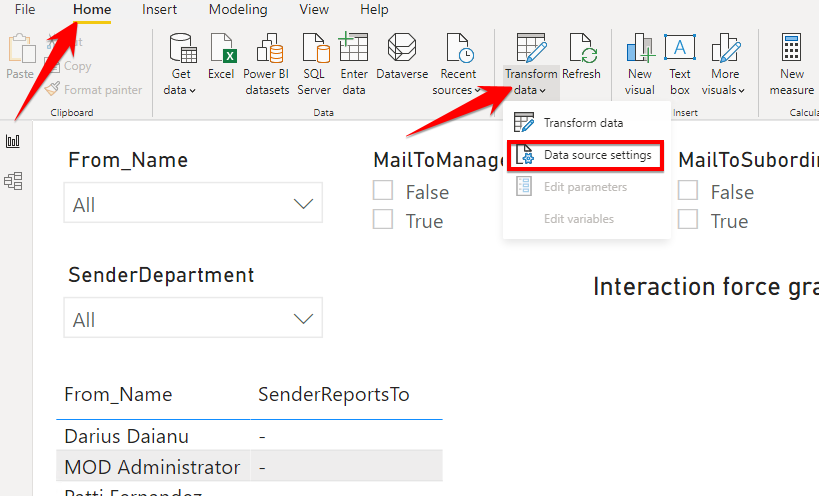
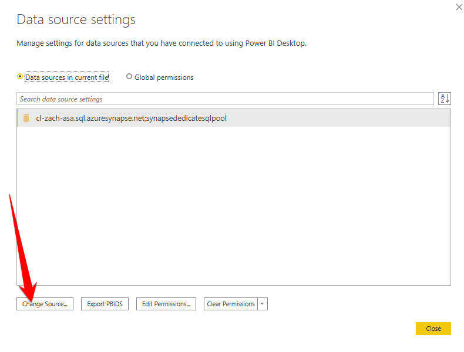
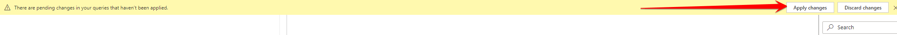
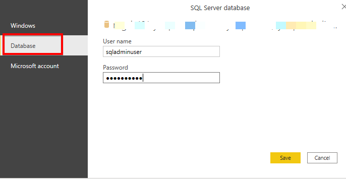
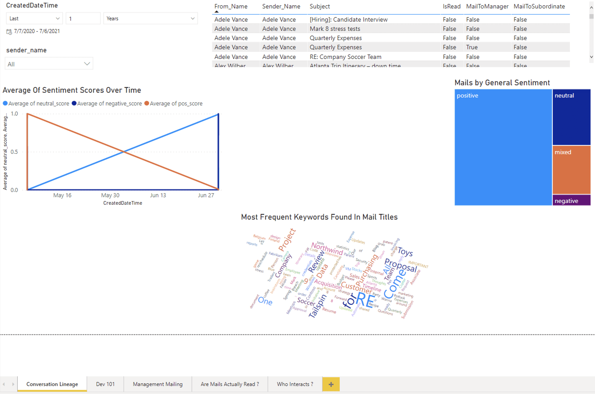
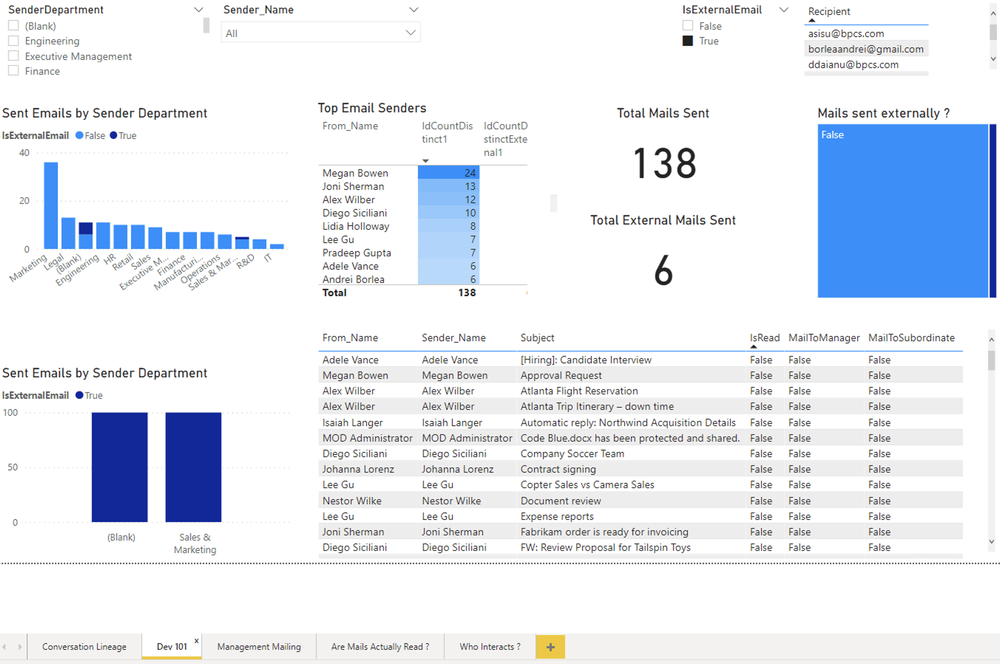
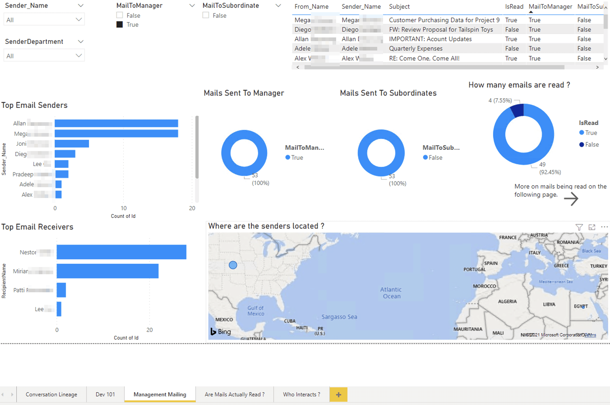
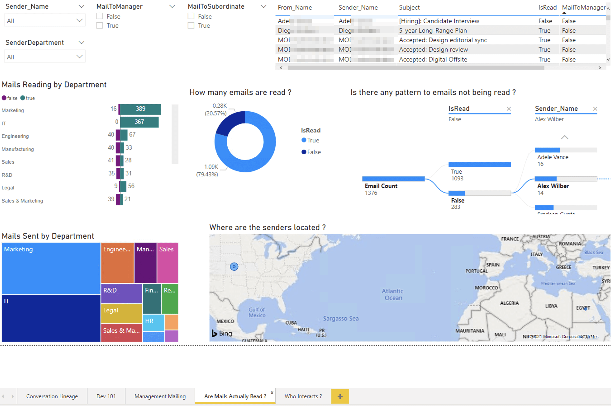
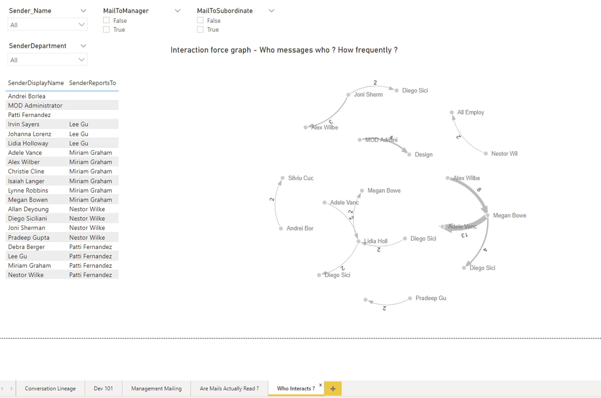

# Report Pages in PowerBI presentation

## Table of contents
- [Plugins used](#plugins-used)
- [Update PowerBI Data Source](#update-powerbi-data-source)
- [All Report Pages](#all-report-pages)

# Plugins used

The folloing plugins were added from [App Source](https://appsource.microsoft.com/en-us/marketplace/apps):
- [Word Cloud from Microsoft](https://appsource.microsoft.com/en-us/product/power-bi-visuals/wa104380752?tab=overview)   
- [Tornado Chart from Microsoft](https://appsource.microsoft.com/en-us/product/power-bi-visuals/wa104380768?tab=overview)  
- [Force-Directed Graph from Microsoft](https://appsource.microsoft.com/en-us/product/power-bi-visuals/WA104380764?tab=overview)  

# Update PowerBI Data Source
The current report is connected to sample Azure resources, but can be updated to the Synapse resources created earlier in the Conversation Lineage tutorial by completing the below steps.

In order to connect to the Dedicated SQL Pool created at [this step](../README.MD#create-a-synapse-dedicated-sql-pool) of the Conversation Lineage tutorial, you will need the following information:

- **Dedicated SQL Endpoint** - can be found by navigating to your Synapse Workspace in the Azure portal  from the Overview section (see below). Copy the value using *Copy to clipboard* and save for later.   
  
- **Synapse SQL Admin User** - This is the secret value stored in key vault as `jdbcUsername`. 
- **Synapse SQL Admin Password** This is the secret value stored in key vault as `jdbcPassword`.  

With the above information ready, complete the following:  
1. Download a copy of the .pbix report from the link [here](https://github.com/microsoftgraph/dataconnect-solutions/blob/main/solutions/conversation-lineage/power_bi_presentation/MGDC%20Conversation%20Lineage.pbix).  
2. Open the report on a machine with access to PowerBI Desktop.  
3. We will be updating the data source connection next, so hit the `escape` key or close out of all prompts until none are left.  
>  NOTE: You will likely see an **Enable script visuals** prompt. This is not necessary for our PowerBI visualizations, so please click cancel to avoid unnecessary installation steps.  
>  
4. Once you are no longer prompted, go to the **Home** tab on the ribbon and select ***Transform data > Data source settings***.  
   
5. In the **Data source settings** window, select ***Change Source...*** in the bottom left-hand corner.  

6. In the **SQL Server database** window, change the Server value to be the `Dedicated SQL Endpoint` copied earlier in the tutorial. Leave the **Database** name as `synapsededicatesqlpool`, as this should be the name used when setting up your Dedicated SQL Pool. Click **OK** and then select **Close**.  

7. There should now be a yellow message at the top of the report saying *'There are pending changes in your queries that haven't been applied'*. Click **Apply changes** in the upper right-hand corner.  

8. Once again, you will be prompted with the **SQL Server database** window. Switch from the Windows auth tab to Database auth by clicking **Database** and enter the `Synapse SQL Admin User` as the **User name** and `Synapse SQL Admin Password` as the **Password**.  

9. Click **Save**.
10. Once the connection has been established, the data should begin populating for each visualization.  
> NOTE: The tabs for `[H]Tables` and `[H]Targets` will likely have the following message. Click the **Fix this** button and the visuals should refresh with data from the newly connected views.  
> 
11. The report updates should now be complete.
 

# All Report Pages  
Below are a list of all pages in the PowerBI report. Although the data may look different, the end result of following the above steps should look something like as follows:

## Conversation Lineage Report

## Dev101 Report

## Mails Management

## Are Mails Read

## Who Interacts with Whom

