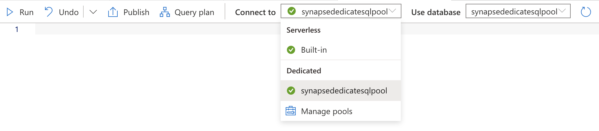

# Synapse SQL Scripts
Scripts in this folder are used for either **creating** database objects, **checking** objects or **select** from objects.

**Important**: When saving one such script on Synapse, don't forget to connect to `synapsededicatesqlpool`, 
as shown in the picture, otherwise your scripts will not run in the proper context.

## Internal terminology
**Raw tables** = (All) Tables that are created. They're called *raw*, since they're abstracted to views, and not used directly by consumers.

**Public views** = Views that are exposed to endpoints (currently, PowerBI is the sole consumer of this data). This adds much needed 
decoupling between the raw tables (which might get changed over time and with the evolution of the data pipelines) and the data that is imported in PowerBI.

**Pipeline / private views** = Views that are used in data pipelines, but are **not** to be used by consumers (PowerBI).

## Scripts
Script naming policy:
+ start with type: `create_*`, `check_*`, `select_*`,
+ what it impacts: `*_views_*`, `*_tables_*`,
+ end with purpose: `*_public`, `*_private`.

| Script              | Description |
| ------------------- | ----------- |
| [check_sanity.sql](./check_sanity.sql) | Sanity checks for common issues (eg: record duplication from pipelines). |
| [check_views_public.sql](./check_views_public.sql) | Checks if you can select from public views (i.e. views that are used by data consumers, such as PowerBI). |
| [create_tables.sql](./create_tables.sql) | Creates all needed tables in Synapse (without prefilled data). After triggering the [pipelines](https://github.com/microsoftgraph/dataconnect-solutions/tree/main/solutions/conversation-lineage#data-ingestion), these tables will be filled and become the raw tables. |
| [create_views_public.sql](./create_views_public.sql) | Creates public views, used by Synapse data consumers. |
| [create_views_private.sql](./create_views_private.sql) | Creates private/pipeline views, used (only) by pipeline steps. |
