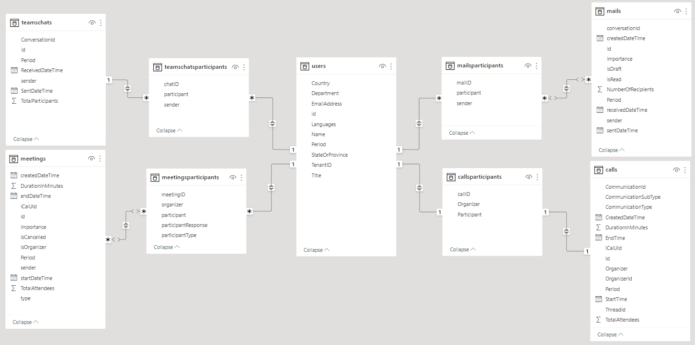
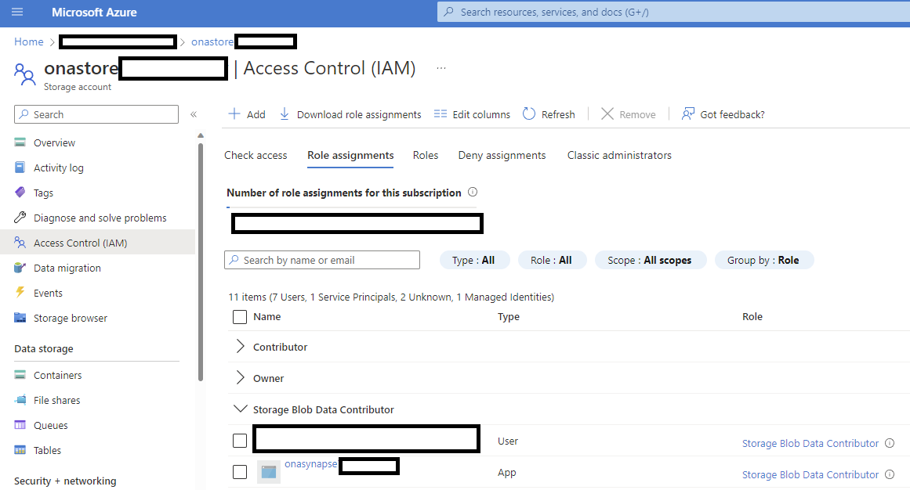
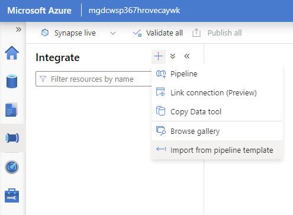
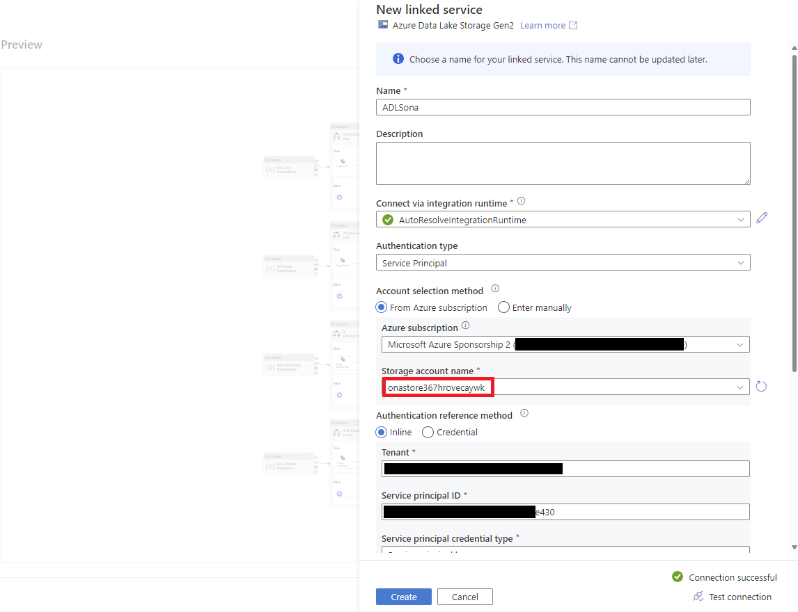
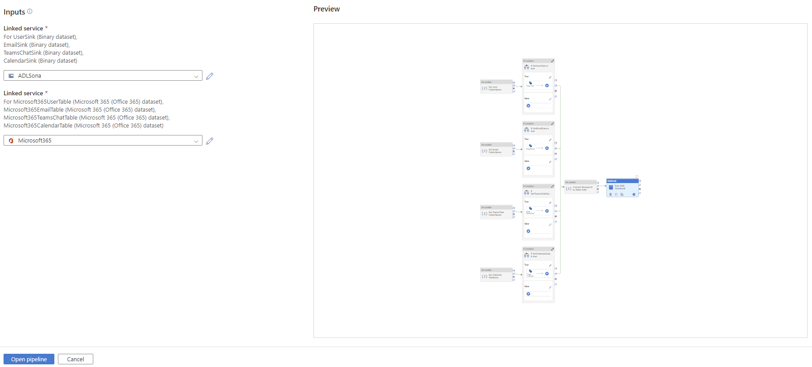
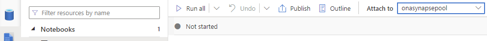
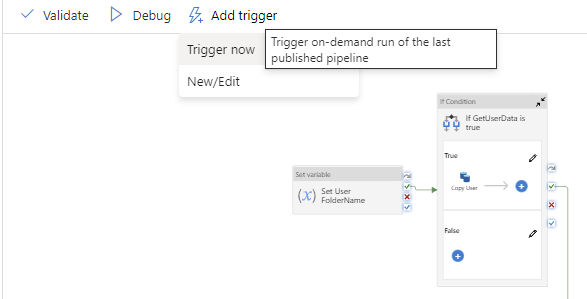

# PREVIEW Employee Productivity Data Tables template

- [Overview](#Overview)
- [Installing Pre-reqs](#Installing-Pre-reqs)
- [Synapse Pipeline Template](#Synapse-Pipeline-Template)
- [Preview Considerations](#Preview-Considerations)

## Overview

**Disclaimer: This template is only available for customers in the Preview program. Also, the template is in Preview stage at this time. See [Preview Considerations](#Preview-Considerations) for more information.**

The purpose of this template is to facilitate a data model to analyze employee communication signals by saving time to prepare M365 data through sourcing, normalizing, cleansing, and deduping.

The template leverages five data sets:
- AAD Users (BasicDataSet_v0.User_v1)
- Teams Chats (BasicDataSet_v0.TeamChat_v1)
- Teams Calls (BasicDataSet_v0.TeamsCallRecords_v1)
- Outlook Emails (BasicDataSet_v0.Message_v1)
- Outlook Calendar (BasicDataSet_v0.CalendarView_v0)

**After you follow these steps, you will have access to a star data model for employee communications, like the one shown below.**

 

## Installing Pre-reqs

If you do not have an Microsoft Graph Data Connect app, please proceed to the detailed documentation [here](https://github.com/microsoftgraph/dataconnect-solutions/tree/main/solutions/ona/PreRequisites)  

If you already have an Microsoft Graph Data Connect app and its secret, the automated deployment to Azure helps setup the required resources in 5 minutes. 

The link below sets up the Azure resource group for the template, which are:

- Create a Synapse Workspace
- Create a Spark Pool for the Synapse workspace
- Create a storage account for the extracted data
- Grant permission to the Synapse workspace & the Microsoft Graph Data Connect Service Principal to the storage account as Blob Data Contributor

The required deployment assets are exactly the same to those for the ONA template, hence the naming convention is replicated but can be renamed post-deployment.

Custom deployment - Microsoft Azure [here](https://portal.azure.com/#create/Microsoft.Template/uri/https%3A%2F%2Fraw.githubusercontent.com%2Fmicrosoftgraph%2Fdataconnect-solutions%2Fmain%2Fsolutions%2Fona%2FARMTemplate%2Fazuredeploy.json?token=AATN3TJ6UQWU7TFMZ2R6ZW3ASL5JQ)

Provide Storage Blob Data Contributor access to the user who is developing the solution. The Synapse workspace should already have access with the automated deployment. 

## Synapse Pipeline Template

1.  Download the pipeline template .zip from [here](https://github.com/microsoftgraph/dataconnect-solutions/tree/main/solutions/employee-productivity-data-tables/SynapsePipelineTemplate)

2.  In the Synapse Studio, select the fourth icon on the left to go to the Integrate page. Click on the "+" icon to Add new resource -> Import from pipeline template, and select the downloaded template

3.  Create the new linked services required by this pipeline

4.  Provide the parameters of the Linked Service 
        a. Select Authentication Type = Service Principal 
        b. Use the storage account name (starting with "onastore"), SPN id and secret (SPN key) from the pre-req steps above
        c. Test Connection and then click on Create

5.  Repeat the linked Service creation steps for the source linked service and select "Open Pipeline"

6.  Navigate to the Develop page (third icon on the left) -> ONA and ensure the notebook is attached to the Synapse Pool

7.  Click on "Publish All" to validate and publish the pipeline

8. Review the changes and click Publish

9. Verify that the pipeline has been successfully published

10. Trigger the pipeline

11. Provide the required parameters. Use one month per pipeline run. Use date format 'YYYY-MM-DD'.
Use the Storage Account created in the resource group (simply replace with the storage account name created in the resource group or to get the URL, navigate to the resource group -> storage account -> Endpoints -> Data Lake Storage -> Primary endpoint)
If required, change the flags if only certain datasets should run

12. Congratulations! You just triggered the Microsoft Graph Data Connect pipeline! Once the admin consents to the request the data will be processed and delivered to your storage account

13. You will see the data in the storage account

## **Preview Considerations**
This template is in PREVIEW stage at this time. The following considerations apply:
- There may be updates performed regularly to fit for adjustments and fixes 