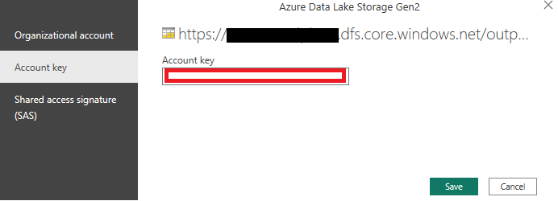

# **PBI Report Template**

- [Setup](#Setup)
- [Data Source Updates](#Data-Source-Updates)
- [Usage](#Usage)

## Setup

Below steps will help to link datasets that are generated using Synapse pipeline above to link to PowerBI 
Template. 
1. Download and install Microsoft Power BI Desktop if you don’t have it installed already on your machine. 
    - Link to download Download Microsoft Power BI Desktop from Official Microsoft Download Center. [here](https://www.microsoft.com/en-us/download/details.aspx?id=58494)
2. Download the pre-created PowerBI report from this folder.

3. Open the PowerBI file and click on Transform data → Data source settings

4. You will see 2 data sources in the Data source settings page

5. Select one of the data source settings and click on Change Source.
    - Change the Storage account path in URL with right storage account that data is generated from synapse pipeline in the steps above. You can get the storage account that is used in Synapse template pipeline Step 11 above
    - Repeat changing storage account names to all Data sources in current file.

6. Set the right storage account key / credentials for these data sources.
    - Click on Edit Permissions

                

    - Click on Edit under credentials

                

    - Enter the storage account key value

                

    - The storage key can be retrieved by navigating to the storage account in azure portal (storage account → access keys)

                

7. Confirm the Source and Navigation steps in each data source match to the folder location and file ID

8. Congratulations, you are all set and will see that the report will be refreshed with the latest data

     

## Data Source Updates

To update the data source to point at a different file, these steps are recommended:

1. Within the Power Query portal from Transform data → Data source settings, duplicate the query that you are going to update.

   

2. From the duplicated query, replace the URL in the Source step and click on the Binary content:

   

3. Continue with replacing the next steps in the duplicated query.

   

4. Copy the Source and Navigation formulas into the main query in the same steps.

   

5. In the Navigation step, double click the file and proceed inserting a new step.

   

6. Delete the old Imported step (and any other that applied to the previous data only) and save & apply changes. 

## Usage

**Overview Page**
From the Overview page, you can start analyzing the network graph created from the interactions of the M365 communication data, understand the flow of interactions between departments, have a glance at the raw data populating the graphs, and evaluate the amount of connections and interactions of the nodes. There are date and flags filters available for comparison.

Each node is a person. If a node interacts with another node, then they become a connection.
An interaction can be either of the following:
-  One email with 5 or less recipients
-  One meeting of 5 or less attendees
-  Eight chat messages (each with 5 or less recipients)

This blend of interactions is informed by investigations from Microsoft Research (MSR) using statistical insights from US-based Microsoft employees.
The two flags available to classify the nodes are the following and can be configured using parameters:
-  Bridge flag: Top 15 percentile bridging index
-  Degree flag: Top 15 percentile degree index 

**Node Analysis Page**
The Node Analysis page provides additional drill-down information of the interactions in the organization and insights on how people prefer to communicate. 

**Influence Analysis Page**
Influence – Explore influential connections: Measures the influence of nodes as being well-connected to others. This is based on the PageRank of the graph. A high score identifies that the node’s perspective will cascade to others efficiently. How to engage:
- Identify influencers
- Explore the profile of the influencers: Title, Department, Country
- Compare period vs period to analyze consistency

**Network Size and Breadth Page**
Network Size and Breadth – Empower inclusive networks: Rank the nodes based on their number of connections to identify isolated groups that may be lacking information or left apart.
- Identify siloes and communities that may not be interacting the most
- Compare period vs period to analyze consistency

**Bridging Analysis Page**
Bridging – Evaluate information flow: Measures the connectivity of nodes to detected graph communities. First, graph communities are discovered using LPA (label propagation algorithm). Then, we count how many communities a node is connected to and normalize by the total number of communities. A node connected to no communities will be 0. A node connected to all communities with be 1.
- Identify key bridges and their departments
- Analyze the correlation of bridging and influence
