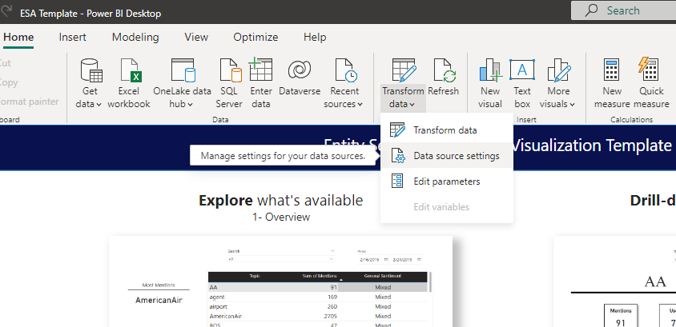

# **PBI Report Template**

- [Setup](#Setup)
- [Data Source Updates](#Data-Source-Updates)
- [Usage](#Usage)

## Setup

Below steps will help to link datasets that are generated using Synapse pipeline above to link to PowerBI 
Template. 
1. Download and install Microsoft Power BI Desktop if you don’t have it installed already on your machine. 
    - Link to download Download Microsoft Power BI Desktop from Official Microsoft Download Center. [here](https://www.microsoft.com/en-us/download/details.aspx?id=58494)
2. Download the pre-created PowerBI report from this folder.

3. Open the PowerBI file and click on Transform data → Data source settings

4. You will see 1 data source in the Data source settings page

5. Select it and click on Change Source. Change the Storage account path in URL with right storage account that data is generated from synapse pipeline in the steps above. You can get the storage account that is used in Synapse template pipeline. **Make sure the URL says dfs, not blob. If it says blob, change it to dfs.**

6. Set the right storage account key / credentials for these data sources.
    - Click on Edit Permissions

                

    - Click on Edit under credentials

                

    - Enter the storage account key value

                

    - The storage key can be retrieved by navigating to the storage account in azure portal (storage account → access keys)

                

7. Confirm the Source and Navigation steps in each data source match to the folder location and file ID

8. Congratulations, you are all set and will see that the report will be refreshed with the latest data

     

## Data Source Updates

To update the data source to point at a different file, these steps are recommended:

1. Within the Power Query portal from Transform data → Data source settings, duplicate the query that you are going to update.

   

2. From the duplicated query, replace the URL in the Source step and click on the Binary content:

   

3. Continue with replacing the next steps in the duplicated query.

   

4. Copy the Source and Navigation formulas into the main query in the same steps.

   

5. In the Navigation step, double click the file and proceed inserting a new step.

   

6. Delete the old Imported step (and any other that applied to the previous data only) and save & apply changes. 

## Usage

**Overview Page**
Each page of the dashboard serves a particular purpose. Some are self-explanatory, like the Overview page. This page gives you a high-level view of all the data represented on a simple table. Keep in mind that we’ve filtered each widget to only provide the Top 100 Topics by Mention. Otherwise, there would be thousands of not-applicable Topics and Topics that have only been mentioned once. Accompanying the table are the three topics with the Most Mentions, Most Positive Mentions, and Most Negative Mentions.

**Sentiment Scatter Plot Page**
This scatter plot is based on each Topic’s Sentiment Score and its number of Mentions. The dots are colored according to General Sentiment to ease reviewing the data. This is especially helpful for differentiating between the Neutral, Mixed, and Polarized general sentiments, but also emphasizes the differences between Positive and Very Positive, and Negative and Very Negative. Additionally, instead of having to remember each Topic and search for it on the View Topic page, you can get a quick snapshot of it by mousing over the datapoint and bringing up its Topic Tooltip. In this way, you can quickly check the data while having it all on the board. The Sentiment Scatter Plot serves as a quick way to review the data. 

**Conflate Topics Page**
You’ll quickly realize that the entities aren’t always aggregated perfectly. Senders may be discussing the same Topic, but not using the same word. In a dataset about airline reviews, for instance, you might find a lot of posts about baggage-handling. The Senders could use words “bag,” “bags,” or “baggage” in reference to it. For situations like these, we’ve provided the Conflate Topics page.  Select the Topics that are alike in the slicer at the top left, and you’ll find your grouping on the table to its immediate right. All of the data displayed is an aggregate of the provided Topics. Using this tool, you can merge Topics together that are similar, but not identical. 

**Compare Topics**
Just like with the Merge Alike Topics page, select which Topics you’d like to compare in the slicer in the top left and they’ll be added to the table to its immediate right. All of the visuals on this page will show the group of Topics you’ve selected.

**View Topic**
For an in-depth view of a single Topic, visit the View Topic page. It provides a more readable interface than a table. By showing the various metric values, plus a couple graphs for how mentions and sentiment have changed over time, you’ll gain a better understanding of the chosen Topic. Perhaps you'll even pick up correlations between time and popularity. 

