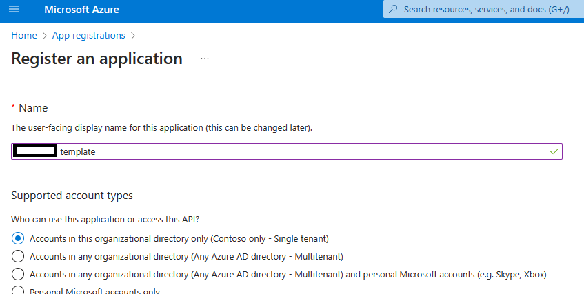
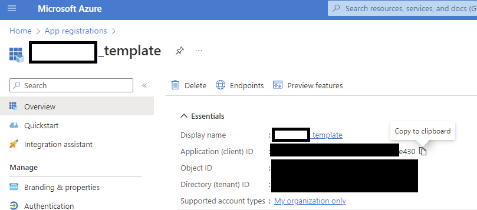
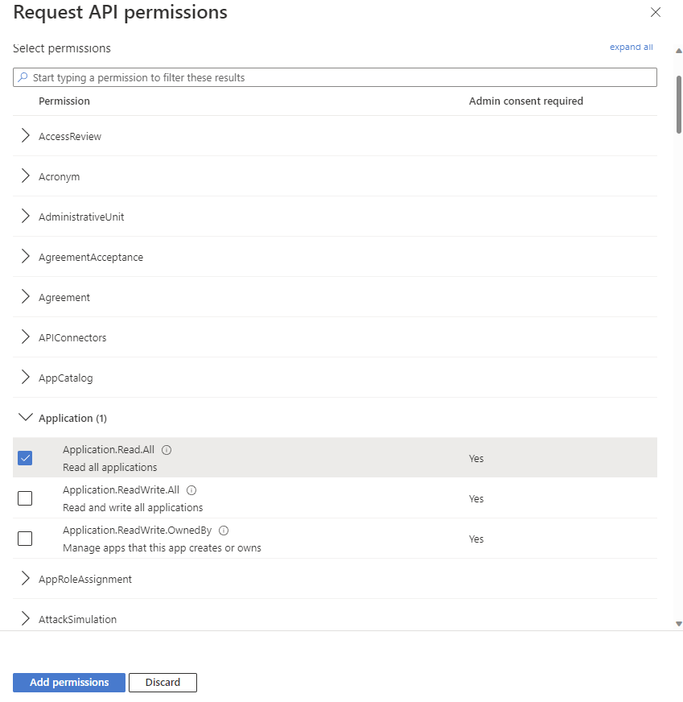

# Installing Pre-reqs

- [Application Registration](#Application-Registration)
- [Azure Resources Deployment](#Azure-Resources-Deployment)
- [Synapse Pipeline Packages](#Synapse-Pipeline-Packages)

## Application Registration

The first step to running this template would be to create an application in the tenant and use that appId 
and secret to setup the other required resources.

1. Navigate to app registrations in your subscription.

2. Register a new application

3. Save the application id (In the screenshot, the one ending in e430). Navigate to API permissions in the Manage menu on the left

4. Select "Microsoft Graph" from the Add permission flyout

5. Select "Application permissions -> Applications -> Application.Read.All"

6. Explicitly Grant consent for the new permissions

7. Verify that that the status shows as granted for the new Application.Read.All permission

8. Navigate to "Certificates and secrets" in the left pane and click on "New client secret"

9. Provide a description and add a secret

10. Copy the value of this new secret and save it securely before navigating away from this page

## Azure Resources Deployment

1. Use this link to initiate the setup of the pre-requisites. Use the appid and secret created in the 
previous steps. Custom deployment - Microsoft Azure [here](https://portal.azure.com/#create/Microsoft.Template/uri/https%3A%2F%2Fraw.githubusercontent.com%2Fv-travhanes%2Fdataconnect-solutions%2Fmain%2Fsolutions%2Fesa%2FARMTemplate%2Fazuredeploy.json)

The link above sets up the Azure resource group for the template, which are:

- Create an ACS Language Resource
- Create a Synapse Workspace
- Create a Spark Pool for the Synapse workspace
- Create a storage account for the extracted data
- Grant permission to the Synapse workspace & the MGDC Service Principal to the storage account as Blob Data Contributor

By clicking on the above button (or navigating to the linked URL), you will be brought to the Azure portal on the Custom deployment page.

2. On that screen, on top of providing information about the resource group and region to deploy the components into, you will need to provide the following information:

- Application Id to be used by MGDC (from step #3, ending in e430)
- Application secret for that app

3. Once all required information has been provided, click on the Review + create button at the bottom of the page. This will validate that the information provided to the template is correct. 

4. Once the information has been validated, click on the Create button at the bottom of the page.

This will initiate the deployment. It should normally take about 5 minutes for the whole deployment to complete.

## Synapse Pipeline Packages

1.  Navigate to the Synapse workspace just created and open the Synapse Studio.

2.  In the Synapse Studio, select the sixth icon on the left to go to the Manage page. Click on Apache Spark pools and right-click the pool to select the Packages.

3. Upload the following file as a Required File and click Apply.

- [env](env.yml)

