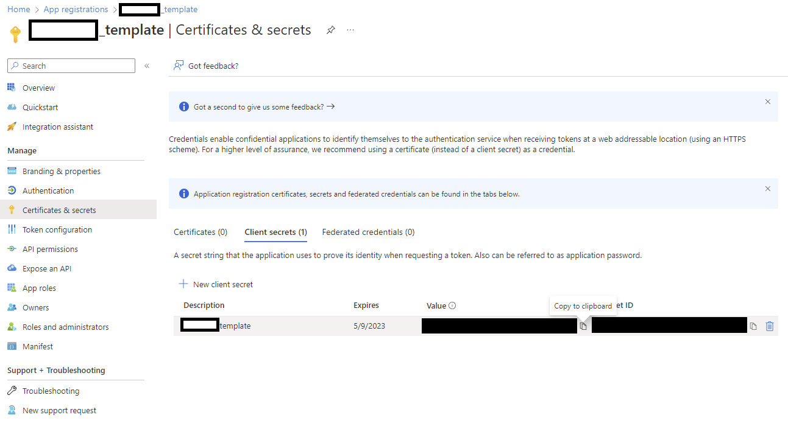
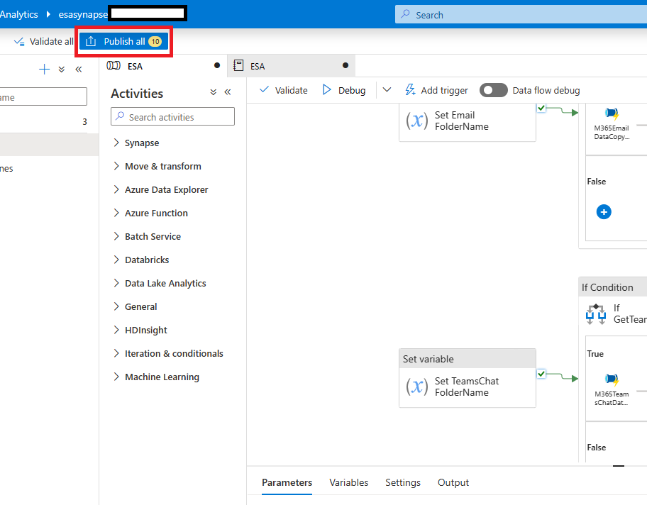

# Synapse Pipeline Integration

1.  If you haven't already, download the ESA pipeline template .zip from [here](https://github.com/v-travhanes/dataconnect-solutions/tree/main/solutions/esa/SynapsePipelineTemplate)

2.  In the Synapse Studio, select the fourth icon on the left to go to the Integrate page. Click on the "+" icon to Add new resource -> Import from pipeline template, and select the downloaded template

3.  Create the new linked services required by this pipeline

4.  Provide the parameters of the Linked Service 

        a. Select Authentication Type = Service Principal 

        b. Use the storage account name (starting with "onastore"), for Service Principal ID use the Application (client) ID), and for Service Principal key use the value from the secret of the application certificate. See screenshots below

        
        c. Test Connection and then click on Create

5.  Repeat the linked Service creation steps for the source linked service and select "Open Pipeline"

6.  Navigate to the Develop page (third icon on the left) -> ONA and ensure the notebook is attached to the onasynapsepool

7.  Update your ACS Key, Location, and Endpoint in the Synapse Notebook.

7.  Click on "Publish All" to validate and publish the pipeline

8. Review the changes and click Publish

9. Verify that the pipeline has been successfully published

Configure the Synapse Pipeline Package required as described [here](https://github.com/microsoftgraph/dataconnect-solutions/tree/main/solutions/ona/PreRequisites#Synapse-Pipeline-Packages)

10. Trigger the pipeline

11. Provide the required parameters. Use one month per pipeline run. Use date format 'YYYY-MM-DD'.
Use the Storage Account created in the resource group (simply replace with the storage account name created in the resource group or to get the URL, navigate to the resource group -> storage account -> Endpoints -> Data Lake Storage -> Primary endpoint)
If required, change the flags if only certain datasets should run

12. Congratulations! You just triggered the MGDC pipeline! Once the admin consents to the request the data will be processed and delivered to your storage account

13. You will see the data in the storage account

