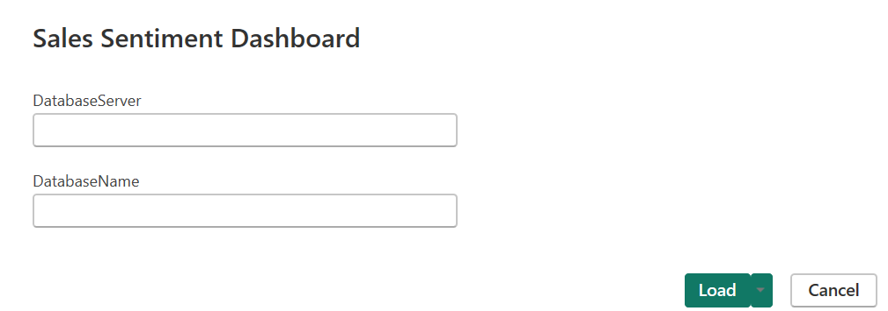
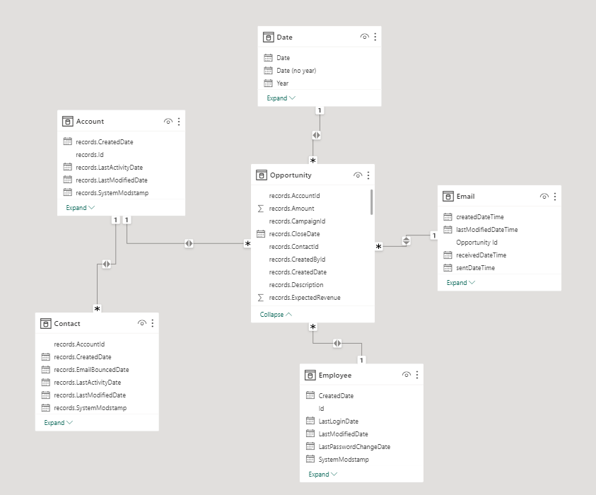
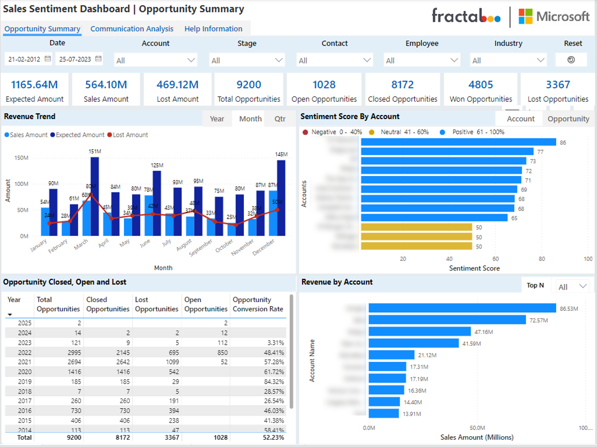
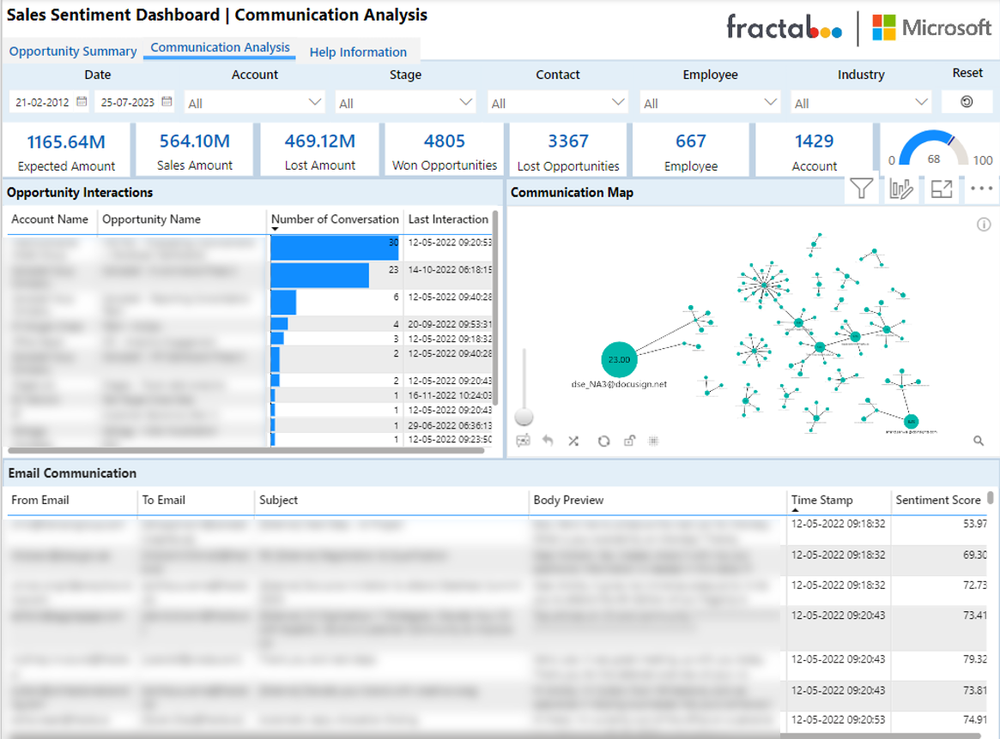
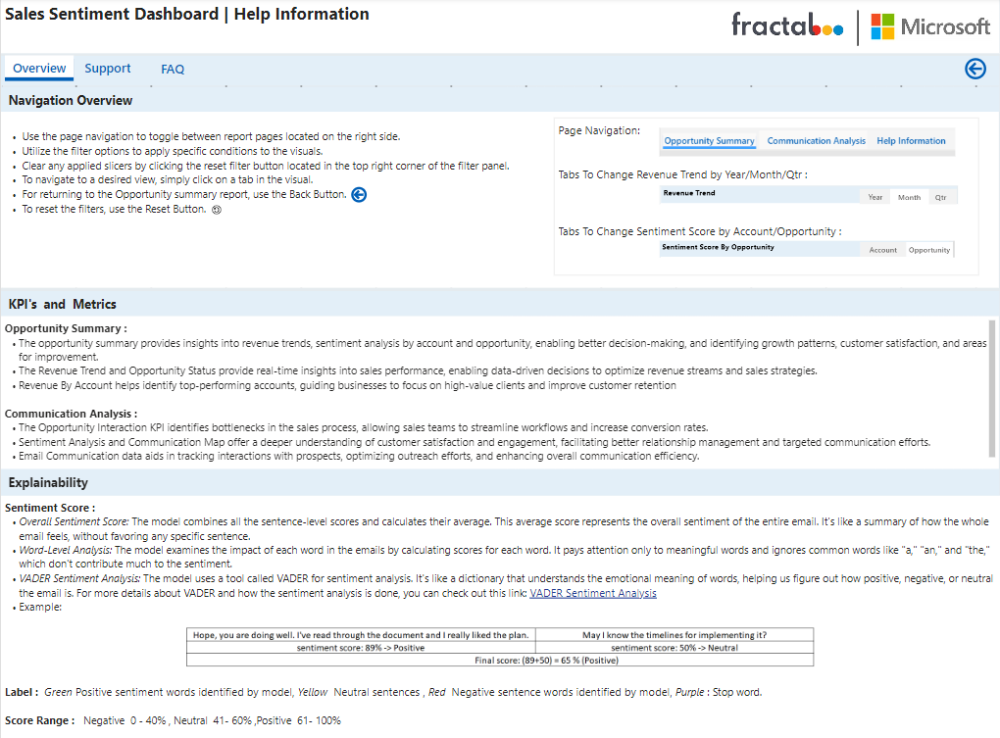

# Power BI Sales Sentiment Dashboard

## Data Sources: 

1. Salesforce    
    - Opportunity: Tracks potential sales deals with details like amount, stage, and close date.                                             
    - Contact: Stores individual's contact information for effective customer communication.
    - Account: Manages company or organization details to monitor customer relationships.
    - Employee: Maintains user information and permissions within the Salesforce platform
    
 2. Microsoft 365 
    - Messages: Stores email communication data, including sender, recipient, and content.

### **Data Connection** 

 - **Azure Syanapse Analtics SQL** : Import Mode 
  
 - **Access Power BI Report Using Parameters**:
    - Configured parameterization for the Server Name and Database Name, integrated dynamic M queries for each table.
    - Upon downloading the PowerBI template file, open it, and input the parameter values as given below, providing the respective data source parameters.

 

### **Data Model** 

 - Data model created, enabling data integration and analysis of Salesforce and M-365 data source in a centralized platform, supporting data-driven decision-making.

## KPIs & Measures:

 
### Opportunity Summary:

 

 

- **Analyze Revenue trend over time**: Track the revenue generated from opportunities over different time periods, enabling you to identify growth patterns, seasonality, trends, and opportunity lost.
- **Sentiment by Account or Opportunity**: Evaluate the sentiment associated with each account or opportunity, providing insights into customer satisfaction and potential areas for improvement.
- **Opportunity  Closed, Open and Lost**: Get a comprehensive overview of all opportunities, including key metrics and important details, allowing you to assess the overall performance briefly.
- **Revenue by accounts**: Gain visibility into revenue generated from different accounts, helping you prioritize and focus on high-value customers for continued growth.

### Communication Analysis:

 

- **Opportunity Interactions** : Enables sales teams to track account and opportunity data in a structured format. Facilitates analysis of conversation counts, identifying engagement levels with accounts. Last interaction timestamp helps prioritize follow-ups and ensures timely communication. Provides an overview of the sales pipeline, allowing for better sales forecasting and planning.
- **Communication Map** : Offers a visual representation of email interactions, making it easier to identify key communication patterns and relationships. Helps sales and customer support teams understand the most frequent interactions between email addresses. 
- **Email Communications** : Empowers teams to analyze email conversations in detail, improving customer communication. Enables understanding of sentiment scores, aiding in gauging customer satisfaction, and addressing concerns promptly.

### Help Information:
 

#### **Navigation**

- **Opportunity Summary** :
   The opportunity summary provides insights into revenue trends, sentiment analysis by account and opportunity, enabling better decision-making, and identifying growth patterns, customer satisfaction, and areas for improvement.
   The Revenue Trend and Opportunity Status provide real-time insights into sales performance, enabling data-driven decisions to optimize revenue streams and sales strategies.
   Revenue By Account helps identify top-performing accounts, guiding businesses to focus on high-value clients and improve customer retention

- **Communication Analysis** :
   The Opportunity Interaction KPI identifies bottlenecks in the sales process, allowing sales teams to streamline workflows and increase conversion rates.
   Sentiment Analysis and Communication Map offer a deeper understanding of customer satisfaction and engagement, facilitating better relationship management and targeted communication efforts.
   Email Communication data aids in tracking interactions with prospects, optimizing outreach efforts, and enhancing overall communication efficiency.

#### **Explainability**

- Overall Sentiment Score: The model combines all the sentence-level scores and calculates their average. This average score represents the overall sentiment of the entire email. It's like a summary of how the whole email feels, without favoring any specific sentence.
- Word-Level Analysis: The model examines the impact of each word in the emails by calculating scores for each word. It pays attention only to meaningful words and ignores common words like "a," "an," and "the," which don't contribute much to the sentiment.
- VADER Sentiment Analysis: The model uses a tool called VADER for sentiment analysis. It's like a dictionary that understands the emotional meaning of words, helping us figure out how positive, negative, or neutral the email is. For more details about VADER and how the sentiment analysis is done, you can check out this link: VADER Sentiment Analysis.
- Score Range : Negative  0 - 40% , Neutral  41- 60% ,Positive  61- 100%  
