# PREVIEW M365 and LLMs Foundational template

- [Overview](#Overview)
- [Installing Pre-reqs](#Installing-Pre-reqs)
- [Deployment](#Deployment)
- [Experience](#Experience)
- [Considerations](#Considerations)

## Overview

The purpose of this foundational template is to perceive the benefits from AI advancements (LLMs) to reason over enterprise M365 data in a fast-moving market.
By bringing your own enterprise M365 data into an LLM to enrich prompt results, multiple analytical and knowledge finding opportunities are revealed, some of which include: 
- Uncover knowledge in documents, emails, and chats from your organization
- Accelerate knowledge finding
- Enhance productivity and faster access to expertise
- Tailor LLMs with your own business data

This template accelerates the deployment of an application through automated resource provisioning, data pipeline, and LLM model configuration. Additionally, the data transformations are optimized for embeddings and LLM tokenization.
The following Azure components are used in the template:
- Azure Synapse Analytics
- Azure Data Lake Gen2
- Azure Cognitive Services (Search)
- Azure OpenAI Studio

In the data pipelines, the data sets which compose the source of information are:
- AAD Users (BasicDataSet_v0.User_v1)
- Teams Chats (BasicDataSet_v0.TeamChat_v1)
- Teams Call Records (BasicDataSet_v0.TeamsCallRecords_v1)
- Outlook Emails (BasicDataSet_v0.Message_v1)
- Outlook Calendar (BasicDataSet_v0.CalendarView_v0)
- SharePoint Sites (SharePointSitesDataset_v0_Preview)

**After you follow these steps, you will have a web chat application powered by Azure OpenAI, like the one shown below.**

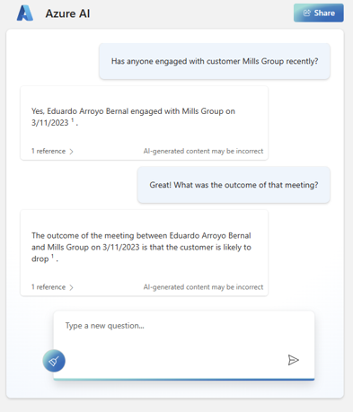 

## Installing Pre-reqs

[Apply for access to Azure OpenAI Service](https://aka.ms/oaiapply). Access is currently limited as we navigate high demand, upcoming product improvements, and [Microsoft’s commitment to responsible AI](https://www.microsoft.com/ai/responsible-ai?activetab=pivot1:primaryr6). More specific information is included in the application form. We appreciate your patience as we work to responsibly enable broader access to the Azure OpenAI Service.

If you do not have an MGDC app, please proceed to the detailed documentation [here](https://github.com/microsoftgraph/dataconnect-solutions/tree/main/solutions/ona/PreRequisites)  

If you already have an MGDC app and its secret, the automated deployment to Azure helps setup the required resources in 5 minutes. 

Custom deployment - Microsoft Azure [here](https://portal.azure.com/#create/Microsoft.Template/uri/https%3A%2F%2Fraw.githubusercontent.com%2Fmicrosoftgraph%2Fdataconnect-solutions%2Fmain%2Fsolutions%2Fm365LLM%2FARMTemplate%2Fazuredeploy.json?token=AATN3TJ6UQWU7TFMZ2R6ZW3ASL5JQ)

## Deployment

1.  Download the pipeline template .zip from [here](https://github.com/microsoftgraph/dataconnect-solutions/tree/main/solutions/m365LLM/SynapsePipelineTemplate)

2.  In the Synapse Studio, select the fourth icon on the left to go to the Integrate page. Click on the "+" icon to Add new resource -> Import from pipeline template, and select the downloaded template

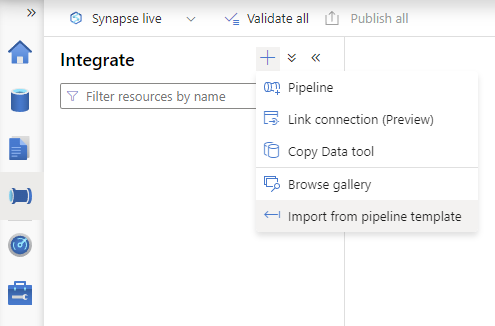

3.  Create the new linked services required by this pipeline

4.  Provide the parameters of the Linked Service 

        a. Select Authentication Type = Service Principal 

        b. Use the storage account name, for Service Principal ID use the Application (client) ID, and for Service Principal key use the value from the secret of the application certificate. See screenshots below

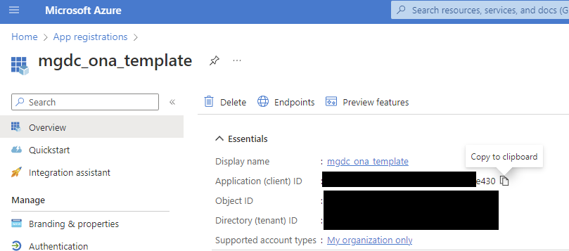
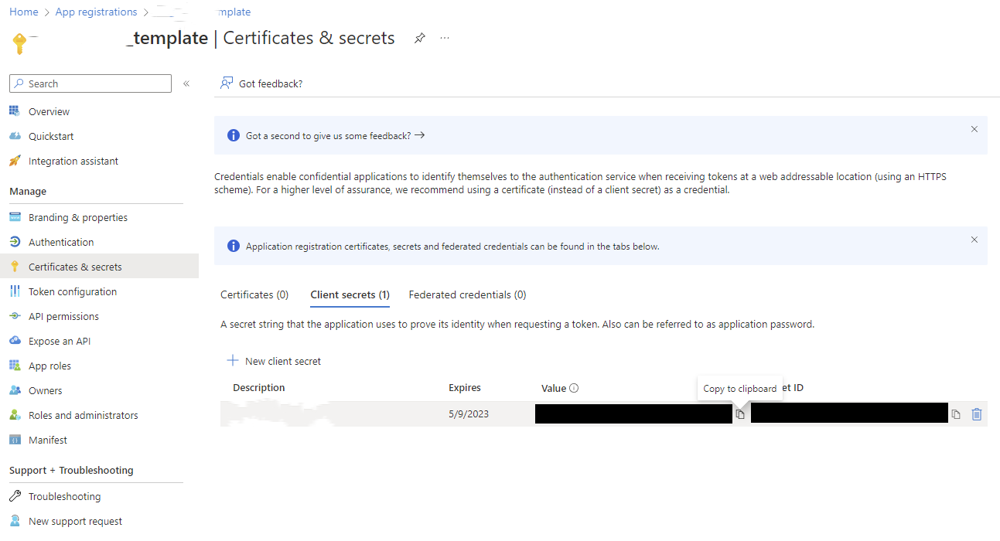
        
        c. Test Connection and then click on Create

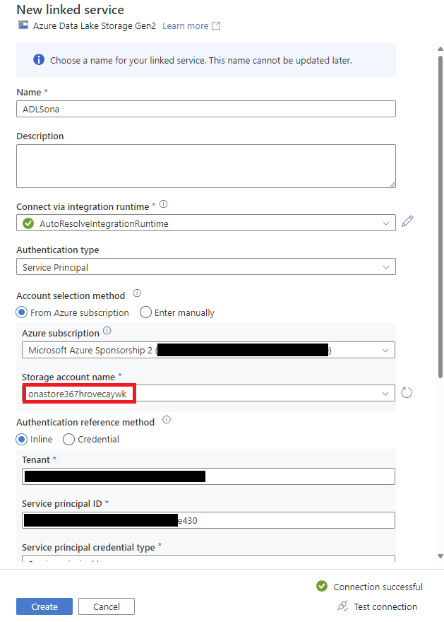

5.  Repeat the linked Service creation steps for the source linked service and select "Open Pipeline"

6.  Navigate to the Develop page (third icon on the left) -> ONA and ensure the notebook is attached to the onasynapsepool

7.  Click on "Publish All" to validate and publish the pipeline

8. Review the changes and click Publish

9. Verify that the pipeline has been successfully published

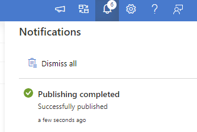

10. Trigger the pipeline

11. Provide the required parameters. Use one month per pipeline run. Use date format 'YYYY-MM-DD'.
Use the Storage Account created in the resource group (simply replace with the storage account name created in the resource group or to get the URL, navigate to the resource group -> storage account -> Endpoints -> Data Lake Storage -> Primary endpoint)
If required, change the flags if only certain datasets should run

12. Congratulations! You just triggered the MGDC pipeline! Once the admin consents to the request the data will be processed and delivered to your storage account

13. You will see the data in the storage account

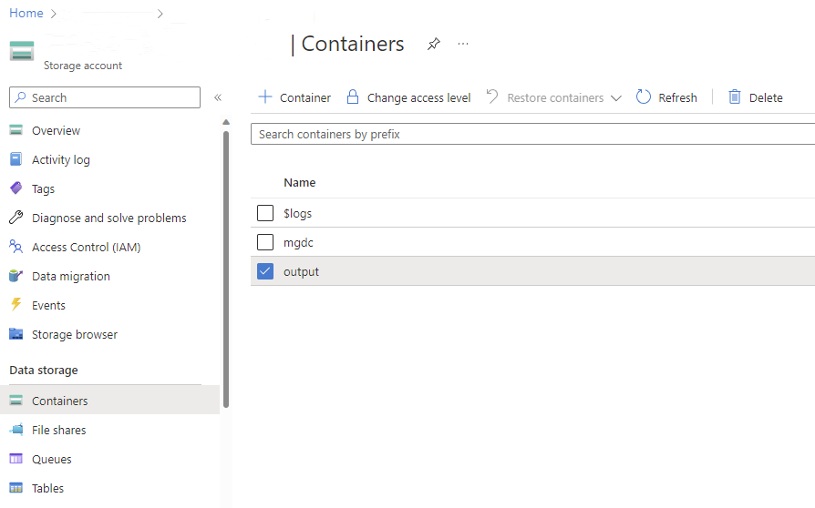

14. Go to the Azure OpenAI resource Explore functionality to create a new model.

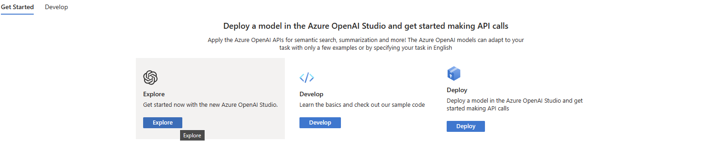

15. Click on the Bring Your Own Data feature.

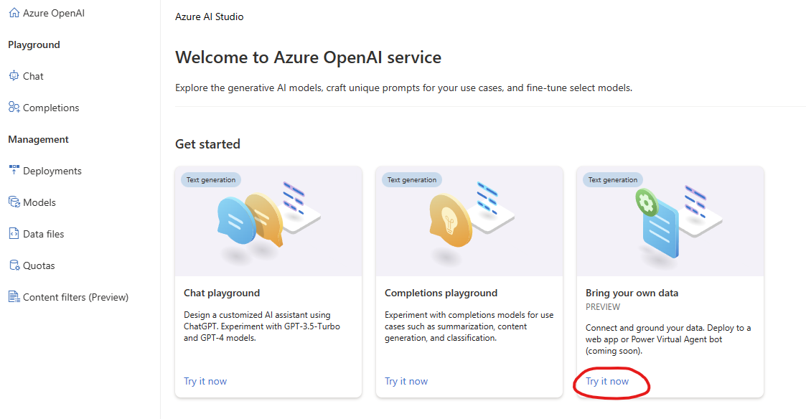

16. Choose the storage account where the output from the pipeline was saved. 

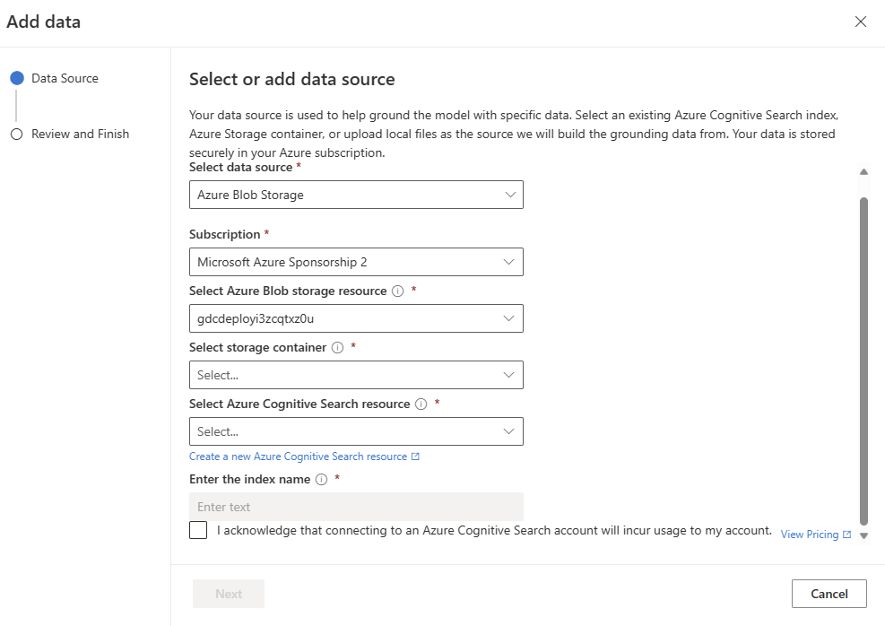

Note: you can also add additional documents in the supported file formats to further enrich the results. 

17. Once the model is ready, you can deploy it to a web app to enable the chat experience. 

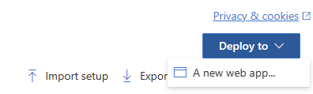
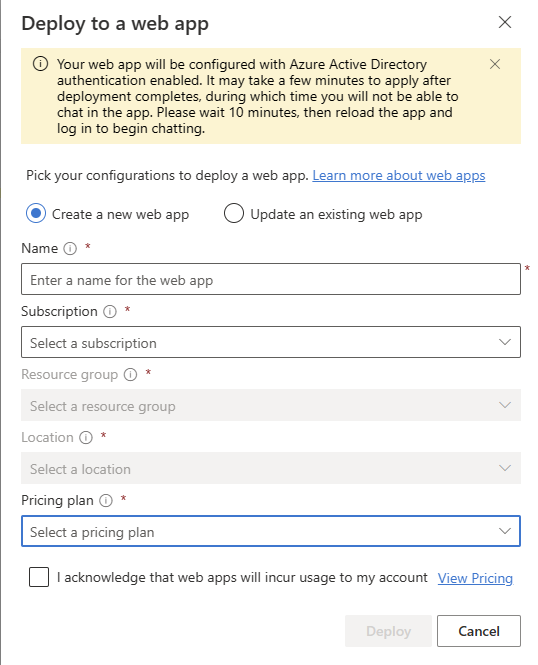

## **Experience**

The use cases are endless but to explore a few try similar prompts as these:

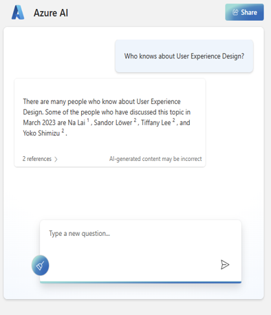

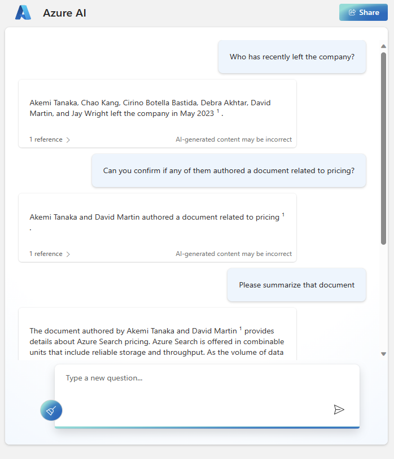

## **Considerations**

The following considerations apply:
- There may be updates performed regularly to fit for adjustments and fixes 
- Responsible AI with the Azure OpenAI Service: At Microsoft, we're committed to the advancement of AI driven by principles that put people first. Generative models such as the ones available in Azure OpenAI Service have significant potential benefits, but without careful design and thoughtful mitigations, such models have the potential to generate incorrect or even harmful content. Microsoft has made significant investments to help guard against abuse and unintended harm, which includes requiring applicants to show well-defined use cases, incorporating Microsoft’s principles for responsible AI use, building content filters to support customers, and providing responsible AI implementation guidance to onboarded customers. More details on the RAI guidelines for the Azure OpenAI Service can be found [here](https://learn.microsoft.com/en-us/legal/cognitive-services/openai/transparency-note?context=/azure/cognitive-services/openai/context/context).