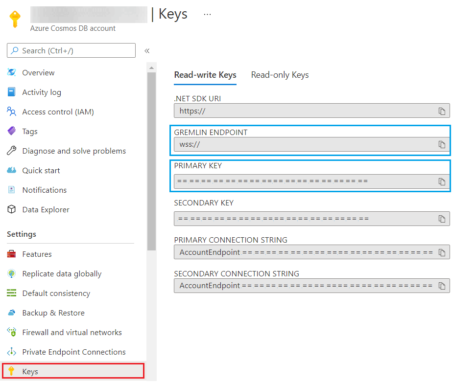
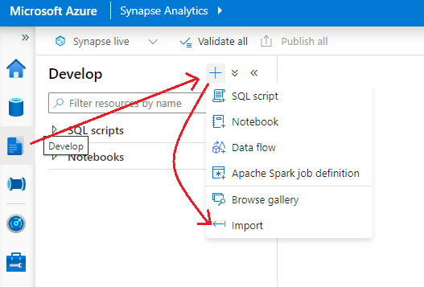

# MGDC with Azure Cosmos DB

## Table of contents
* [Tutorial Overview](#tutorial-overview)
* [Prerequisites](#prerequisites)
* [Create and Configure Azure Cosmos DB](#create-and-configure-azure-cosmos-db)
* [Update Azure Key Vault](#update-azure-key-vault)
* [Update Synapse Workspace](#update-synapse-workspace)
    * [Add Workspace Package to Spark Pool](#add-workspace-package-to-spark-pool)
    * [Import Python Notebook](#import-python-notebook)
    * [Import Pipeline](#import-pipeline)
    * [Add Trigger](#add-trigger)
* [Execute Pipeline](#execute-pipeline)
* [Query Data in Cosmos DB](#query-data-in-cosmos-db)

## Tutorial Overview

This tutorial will provide an example of how to load [Graph Data Connect](https://docs.microsoft.com/en-us/graph/data-connect-concept-overview)
(GDC) to gain insights into a Cosmos DB Grmelin API Graph database. By doing this, you will learn the key steps and Azure technologies required to build your own GDC based Graph database.  

**You will learn how to**:
- Take GDC data already loaded into Azure Synapse and model and load the data into a CosmosDB Gremlin API

## Prerequisites

To complete this lab, you need the following:

- Microsoft Azure subscription
  - If you do not have one, you can obtain one (for free) here: [https://azure.microsoft.com/free](https://azure.microsoft.com/free/)
  - The account used to perform the set up must have the [**Contributor** role for the subscription granted to it](https://docs.microsoft.com/en-us/azure/role-based-access-control/elevate-access-global-admin),
    in order to be able to create the various infrastructure components described below
  - The Azure subscription must be in the same tenant as the Office 365 tenant, as Graph Data Connect will only export 
    data to an Azure subscription in the same tenant, not across tenants.
- Office 365 tenancy
  - If you do not have one, you obtain one (for free) by signing up to the [Office 365 Developer Program](https://developer.microsoft.com/office/dev-program).
  - Multiple Office 365 users with emails sent & received
  - Access to at least two accounts that meet the following requirements:
      - One of the two accounts must be a global tenant administrator
      - That same account must have the **global administrator** role granted
- Workplace Analytics licenses
  - Access to the Microsoft Graph Data Connect toolset is available through [Workplace Analytics](https://products.office.com/en-us/business/workplace-analytics), 
    which is licensed on a per-user, per-month basis.
  - To learn more please see [Microsoft Graph data connect policies and licensing](https://docs.microsoft.com/en-us/graph/data-connect-policies)

> NOTE: The screenshots and examples used in this lab are from an Office 365 test tenant with fake email data from test users. 
> You can use your own Office 365 tenant to perform the same steps. No data is written to Office 365. 

The tutorial assumes that you already have Graph Data Connect in Azure Synapse. For an example of how to load that data into Azure Synapse, you can refer to the [Coversation Lineage Tutorial](https://github.com/microsoftgraph/dataconnect-solutions/tree/main/solutions/conversation-lineage).

## Create and Configure Azure Cosmos DB

1. Open a browser and navigate to your Azure Portal at [https://portal.azure.com](https://portal.azure.com)
2. In the search bar, type **Azure Cosmos DB** and then Click on **Azure Cosmos DB** in the Services list.
3. Click on **Create**, then click on the **Create** button in the section labled **Gremlin (Graph)**.  
   A. Select your prefered Subscription, Resource Group and Location.  
   B. Type in the *Account Name* you'd like to use for your Cosmos DB instance. We will refer to this name later in the tutorial as `cosmos-name`.  
   C. Choose your prefered pricing option, then click on **Review + Create** and proceed to **Create**.  
   D. The Cosmos DB instance will take a little time to deply.  
4. From the Overview page of the Azure Cosmos DB instance you just created, click on **Data Explorer**.
5. Click on **New Graph**, then select the option to create a **New Graph**.  
   A. Enter a *Database id* and a *Graph id* and make a record of the values. We will reference them later in the tutorial as `database-id` and `graph-id`, respectively.  
   B. Choose **Database throughput** that will meet your needs.  
   C. For the *Partition key*, enter in `/pk`.  
   D. Click **OK**.

## Update Azure Key Vault

In your Azure Keyvault, you will need to add the following keys:  
- *gremlinEndpoint* with value `wss://<cosmos-name>.gremlin.cosmos.azure.com:443/`  
   - `cosmos-name` is the name of your Cosmos DB instance created earlier.
- *gremlinUsername* with value `/dbs/<database-id>/colls/<graph-id>`  
   - `database-id` and `graph-id` are the *Database id* and *Graph id* you entered in the steps above.
- *gremlinPassword* with your Cosmos DB *Primary Key* as the value.  
   - You can find this by clicking on **Keys** on the Cosmos DB Overview screen in the Portal.  


## Update Synapse Workspace


### Add Workspace Package to Spark Pool
   
1. Download the file: [gremlinpython-3.5.1-py2.py3-none-any.whl](https://github.com/microsoftgraph/dataconnect-solutions/blob/main/solutions/mgdc-cosmos/packages/gremlinpython-3.5.1-py2.py3-none-any.whl)
2. In your Synapse Workspace, in the **Manage hub**, click on **Workspace packages**.
3. Click on **Upload** near the top of the window to open the *Upload packages* dialog box.  
   A. In the dialog box, click on the folder icon.  
   B. Navigate to the **gremlinpython-3.5.1-py2.py3-none-any.whl** file you downloaded and click open.  
   C. Click on the **Upload** button at the bottom of the dialog box.  
4. In the Azure portal, navigate to the Overview page for your Synapse Workspace.
5. Click **Apache Spark pools** in the left menu bar, then click on the spark pool you've previously created.
6. Click on **Packages** in the left menu bar.
7. Click on **Select from workspace packages**.  
   A. Check the box next to **gremlinpython-3.5.1-py2.py3-none-any.whl**, then click **Select**.  
8. Click **Save** at the top of the window.
   
   
### Import Python Notebook

1. Download the file: [MGDCToCosmosDB.ipynb](https://github.com/microsoftgraph/dataconnect-solutions/blob/main/solutions/mgdc-cosmos/arm/notebook/MGDCToCosmosDB.ipynb)
2. Inside your Azure Synapse workspace, navigate to the **Develop hub**.
3. Click on the + symbol, then select **Import**.
4. Navigate to the downloaded notebook file, select it, then click **Open**.


   
### Import Pipeline
   
1. Download the file: [PL_MGDC_CosmosDB.zip](https://github.com/microsoftgraph/dataconnect-solutions/blob/main/solutions/mgdc-cosmos/arm/pipeline/PL_MGDC_CosmosDB.zip)
2. Inside your Azure Synapse workspace, navigate to the **Integrate hub**.
3. Click on the + symbol, then select **Import from pipeline template**.
4. Navigate to and select **PL_MGDC_CosmosDB.zip**, then click **Open**.
5. Open the **PL_MGDC_CosmosDB** pipeline and update the following pipeline parameters:  
   a. `sql_database_name` - Set this to the name of your dedicated SQL pool.  
   b. `sql_server_name` - Set this to the name of your Azure Synapse workspace.  
   c. `keyvault_name` - Set this to the name of your Keyvault.

### Add Trigger

1. In the Synapse workspace, navigate to the **Integrate hub**, then select the **PL_MGDC_CosmosDB** pipeline. 
2. Click on **Trigger** then **New/Edit**.
3. In the **Choose trigger...** dropdown, select **New**
4. Fill out the fields in the trigger with your prefered values, then click **OK**

## Execute Pipeline

1. In the Synapse workspace, navigate to the **Integrate hub**, then click on **PL_MGDC_CosmosDB** pipeline. 
2. Click on **Trigger**, then **Trigger Now.**  

With this step complete, our Cosmos DB instance should be populated with data.

## Query Data in Cosmos DB

1. In the Azure portal, from the Overview page of the Azure Cosmos DB instance you created, click on **Data Explorer**.
2. Expand your database and graph dropdowns, then click on the **Graph** option. 
3. Click the **Load Graph** button near the window center (or **Execute Gremlin Query** on the right) to do some basic exploration of the data. 

> NOTE: You may execute different queries to investigate more specific data. For example:  
> 1. ```g.E()``` to view the edge data.
> 2. ```g.V('<office365-user>').as('b').bothE().as('e').select ('b', 'e')```, where `office365-user` would be a user that's available on your MGDC data set.

## Setting Up Linkcurious for Cosmos DB

It is highly recommended that you use a robust graph visualization tool such as [Linkurious](http://linkurio.us/) for navigating the data. You can find instructions for setting up Linkurious for Cosmos DB [here](https://doc.linkurio.us/admin-manual/latest/configure-cosmos/). You will need the information you recorded earlier in the tutorial to configure Linkurious.

There are also [other recommended graph visualization tools](https://docs.microsoft.com/en-us/azure/cosmos-db/graph/graph-visualization-partners) aside from Linkurious.
