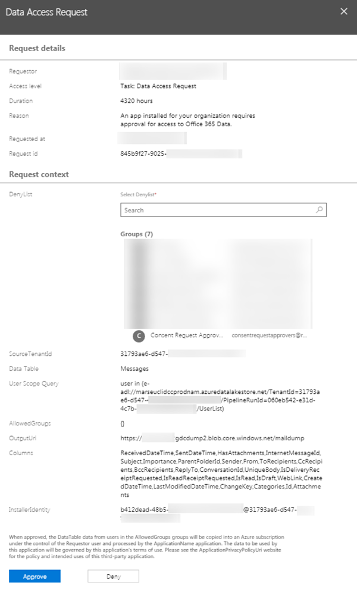
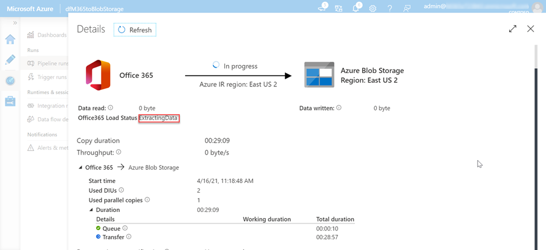

# Monitor data consent requests with Microsoft 365 Admin Center and PowerShell

A Microsoft 365 administrator has the ability to approve or deny consent requests. This can be done via the Microsoft 365 Admin Center or programmatically via PowerShell.

## Approve consent requests

### Approve via Microsoft 365 Admin Center

1. Open a browser and go to your [Microsoft 365 Admin Portal](https://admin.microsoft.com).

1. To approve or deny consent requests, go to [Privileged Access](https://portal.office.com/adminportal/home#/Settings/PrivilegedAccess).

1. Select a pending **Data Access Request**.

1. In the **Data Access Request** call out, select the **Approve** button.

    

### Approve via PowerShell

1. Open Windows PowerShell.
1. Ensure that your PowerShell session has enabled remotely signed scripts.

    ```powershell
    Set-ExecutionPolicy RemoteSigned
    ```

1. Connect to Exchange Online.

    1. Obtain a sign in credential by executing the following PowerShell. Sign in using a different user than one that created and started the Azure Data Factory pipeline, who has the **Global administrator** role applied, who is a member of the group that has rights to approve requests to data in Microsoft 365, and has multi-factor authentication enabled.

        ```powershell
        $UserCredential = Get-Credential
        ```

    1. Create a new Exchange Online PowerShell session and load (import) it.

        ```powershell
        $Session = New-PSSession -ConfigurationName Microsoft.Exchange -ConnectionUri https://ps.protection.outlook.com/powershell-liveid/ -Credential $UserCredential -Authentication Basic -AllowRedirection
        Import-PSSession $Session -DisableNameChecking
        ```

        > [!IMPORTANT]
        > After you are finished with this session, be sure you you disconnect from the session using the PowerShell command `Remove-PSSession $Session`. Exchange Online only allows for three open remote PowerShell sessions to protect against denial-of-service (DoS) attacks. If you simply close the PowerShell window, it will leave the connection open.

1. Get a list of all pending data requests from Microsoft Graph data connect by executing the following PowerShell.

    ```powershell
    Get-ElevatedAccessRequest | where {$_.RequestStatus -eq 'Pending'} | select RequestorUPN, Service, Identity, RequestedAccess | fl
    ```

    - Examine the list of data access requests returned. In the following image, notice there are two pending requests.

        

1. Approve a data access returned in the previous step by copying the Identity GUID of a request by executing the following PowerShell.

    > [!NOTE]
    > Replace the GUID in the following code snippet with the GUID from the results of the previous step.

    ```powershell
    Approve-ElevatedAccessRequest -RequestId fa041379-0000-0000-0000-7cd5691484bd -Comment 'approval request granted'
    ```

1. After a few moments, you should see the status page for the activity run update to show it is now _extracting data_.

    

1. This process of extracting the data can take some time depending on the size of your Microsoft 365 tenant.

---

## Verify extracted data from Microsoft 365 to Azure Storage Blob

1. Open a browser and go to your [Azure Portal](https://portal.azure.com/).

1. Sign in using an account with **Global administrator** rights to your Azure and Microsoft 365 tenants.

1. On the sidebar navigation, select the **All resources** menu item.

1. In the list of resources, select the **Azure Storage account** you created previously in this tutorial.

1. On the sidebar navigation menu, select **Blobs** from the **Azure Storage account** blade.

1. Select the **container** created previously in this tutorial that you configured the Azure Data Factory pipeline as the sink for the extracted data. You should see data in this container now.

    
