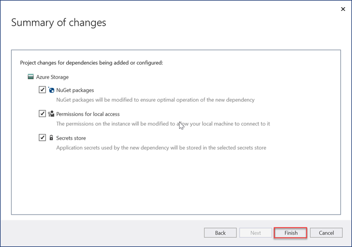

<a name="create-app"></a>

# Create your ASP.NET Web Application to process the exported data

In this section we will be building your first ASP.NET project application for to process the Microsoft Graph Data Connect data that was exported.

## Create a new ASP.NET project

1. Open Visual Studio and select **File > New > Project**.

1. In the **New Project** dialog, do the following.

    1. Search **ASP.NET Web Application** in the search box and select the **ASP.NET Web Application (.NET Framework)** option.
    1. Click on **Next**.

        

    1. Enter **EmailMetrics** for the name of the project.
    1. Select **.NET Framework 4.7.2** for the framework option.
    1. Select **Create**.

    > [!IMPORTANT]
    > Ensure that you enter the exact same name for the Visual Studio Project that is specified in this quick start instructions. The Visual Studio Project name becomes part of the namespace in the code. The code inside these instructions depends on the namespace matching the Visual Studio Project name specified in these instructions. If you use a different project name the code will not compile unless you adjust all the namespaces to match the Visual Studio Project name you enter when you create the project.

    1. In the new **ASP.NET Web Application** project dialog, select MVC.
    1. Select **Create**.

    

## Add and configure your Azure Storage as a Connected Service

1. In the **Solution Explorer** tool window, right-click the **Connected Services** node and select **Add Connected Service**.

    

1. On the **Connected Services** dialog, select the green **+** sign which is located in the upper-right corner of the dialog.

1. In the **Add dependency** dialog, select **Azure Storage** and select **Next**.

    

1. In the **Azure Storage** dialog, select the subscription and storage account where you exported the data in the previous exercise, select **Next**.

    

1. Provide the **Azure Storage connection** a name of **AzureStorageConnectionString** and select **Next**.
1. Select **Finish**.

    

## Create a new model class that will be used to store the email metrics

1. In the  **Solution Explorer** tool window, right-click the **Models** folder and select **Add > Class**.

    

1. In the **Add New Item** dialog, select **Class**, set the name of the file to _EmailMetric.cs_ and select **Add**.

1. Add the following code to the class EmailMetric you just created.

    ```csharp
    public string Email;
    public double RecipientsToEmail;
    ```

## Create a new controller that will calculate and display the results

1. Right-click the **Controllers** folder and select **Add > Controller**.

1. In the **Add Scaffold** dialog, select **MVC 5 Controller - Empty** and select **Add**.

1. When prompted, name the controller **EmailMetricsController** and select **OK**.

1. Add the following using statements after the existing using statements at the top of the file containing the **EmailMetricsController** class.

    ```csharp
    using System.Collections.Generic;
    using System.Configuration;
    using System.IO;
    using System.Linq;
    using System.Threading.Tasks;
    using System.Web.Mvc;
    using Azure.Storage.Blobs;
    using Azure.Storage.Blobs.Models;
    using Newtonsoft.Json.Linq;
    ```

1. Add the following code to the **EmailMetricsController** class. These will be used to connect to the **Azure Storage Account** that contains the exported data.

    ```csharp
    private const string connectionStringName = "AzureStorageConnectionString";
    private const string emailBlobName = "m365mails";

    ```

1. Add the following method to the **EmailMetricsController** class. This will process an **Azure Blob** and update a collection representing the email accounts and how many recipients there were combined across all emails found for the extracted accounts.

    ```csharp
    private async Task ProcessBlobEmails(List<Models.EmailMetric> emailMetrics, BlobClient emailBlob)
    {
        using (var stream = new MemoryStream())
        {
            var response = await emailBlob.DownloadToAsync(stream);
            var pos = stream.Seek(0, SeekOrigin.Begin);

            using (var reader = new StreamReader(stream))
            {

                string line;
                while ((line = reader.ReadLine()) != null)
                {
                    var jsonObj = JObject.Parse(line);

                    // extract sender
                    var sender = jsonObj.SelectToken("Sender.EmailAddress.Address")?.ToString();
                    // No sender - skip this one
                    if (string.IsNullOrEmpty(sender)) continue;

                    // extract and count up recipients
                    var totalRecipients = 0;
                    totalRecipients += jsonObj.SelectToken("ToRecipients")?.Children().Count() ?? 0;
                    totalRecipients += jsonObj.SelectToken("CcRecipients")?.Children().Count() ?? 0;
                    totalRecipients += jsonObj.SelectToken("BccRecipients")?.Children().Count() ?? 0;

                    var emailMetric = new Models.EmailMetric();
                    emailMetric.Email = sender;
                    emailMetric.RecipientsToEmail = totalRecipients;

                    // if already have this sender...
                    var existingMetric = emailMetrics.FirstOrDefault(metric => metric.Email == emailMetric.Email);
                    if (existingMetric != null)
                    {
                        existingMetric.RecipientsToEmail += emailMetric.RecipientsToEmail;
                    }
                    else
                    {
                        emailMetrics.Add(emailMetric);
                    }
                }
            }
        }
    }
    ```

1. Add the following method to the **EmailMetricsController** class. This will enumerate through all blobs in the specified **Azure Storage** account's specified container and send each one to `ProcessBlobEmails()` method added in the last step.

    ```csharp
    private async Task<List<Models.EmailMetric>> ProcessBlobFiles()
    {
        var emailMetrics = new List<Models.EmailMetric>();
        var connectionString = ConfigurationManager.ConnectionStrings[connectionStringName];

        // Connect to the storage account
        var containerClient = new BlobContainerClient(connectionString.ConnectionString, emailBlobName);

        foreach (var blob in containerClient.GetBlobs())
        {
            if (blob.Properties.BlobType == BlobType.Block &&
                // Don't process blobs in the metadata folder
                !blob.Name.StartsWith("metadata/"))
            {
                var blobClient = containerClient.GetBlobClient(blob.Name);
                await ProcessBlobEmails(emailMetrics, blobClient);
            }
        }

        return emailMetrics;
    }
    ```

1. Add the following action to the **EmailMetricsController** that will use the methods added this class to process the emails and send the results to the view.

    ```csharp
    [HttpPost, ActionName("ShowMetrics")]
    [ValidateAntiForgeryToken]
    public async Task<ActionResult> ShowMetrics()
    {
        var emailMetrics = await ProcessBlobFiles();

        return View(emailMetrics);
    }
    ```

## Create a new view for the EmailMetrics index action

1. In the  **Solution Explorer** tool window, right-click the **Views > EmailMetrics** folder and select **Add > View**.

1. In the **Add New Scaffolded Item** dialog box, select **MVC 5 View**, then select **Add**.

1. In the **Add View** dialog, set the **View** name to **Index**, leave the remaining input controls to their default values, and select **Add**.

    

1. Update the markup in the new **Views > EmailMetrics > _Index.cshtml_** to the following. This will add a form with a single button that will submit an HTTP POST to the custom controller action added in the last step.

    ```html
    @{
    ViewBag.Title = "Index";
    }

    <h2>Email Metrics</h2>
    ```

1. This application will look at the email data for emails extracted to the **Azure Blob Storage** account and display the total number of recipients from each sender.

    ```html
    @using (Html.BeginForm("ShowMetrics", "EmailMetrics", FormMethod.Post))
    {
    @Html.AntiForgeryToken()
    <div>
        <button type="submit">View email metrics</button>
    </div>

    <div>
        <em>Please be patient as this can take a few moments to calculate depending on the size of the exported data...</em>
    </div>
    }
    ```

## Create a new view for the EmailMetrics ShowMetrics action

1. In the **Solution Explorer** tool window, right-click the **Views > EmailMetrics** folder and select **Add > View**.

1. In the **Add View** dialog, set the following values and leave the remaining input controls to their default values and select **Add**.

    - **View name**: ShowMetrics
    - **Template**: List
    - **Model class**: EmailMetric (EmailMetric.Models)

        

    >[!TIP]
    > In case you can't see the **EmailMetric** model in the dropdown box, please build the solution.

1. Update the markup in the new **Views > EmailMetrics > _ShowMetrics.cshtml_** to the following. This will display the results of the calculations.

    ```html
    @model IEnumerable<EmailMetrics.Models.EmailMetric>

    @{
    ViewBag.Title = "ShowMetrics";
    }

    <h2>Email Metrics</h2>

    <table class="table">
    <tr>
        <th>Sender</th>
        <th>Number of Recipients</th>
    </tr>

    @foreach (var item in Model)
    {
    <tr>
        <td>@Html.DisplayFor(modelItem => item.Email)</td>
        <td>@Html.DisplayFor(modelItem => item.RecipientsToEmail)</td>
    </tr>
    }

    </table>
    ```

## Update the navigation to have a way to get to the new controller

1. In the **Solution Explorer** tool window, locate and open the file **Views > Shared > _Layout.cshtml_**.
1. Replace the contents with the following code.

    ```html
    <!-- new code -->
    <li>@Html.ActionLink("Email Metrics", "Index", "EmailMetrics")</li>
    ```

## Test the application

1. In Visual Studio, select **Debug > Start Debugging**.

1. When the application is built and loads in a new browser window, select the **Email Metrics** item in the top navigation bar.

1. On the **Email Metrics** page, select the **View email metrics** button.

    

1. When the page loads, you will see a list of emails addresses that were found among all emails with a sum of all the recipients sent between them, as shown from a small sample set in a test email extract in the following figure.

    
