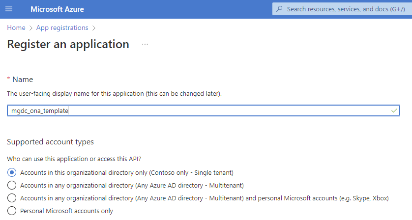
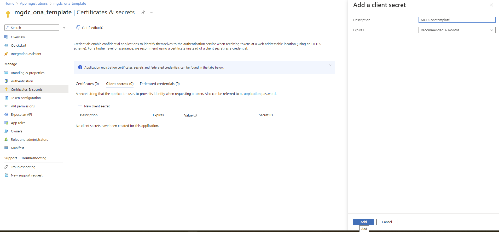
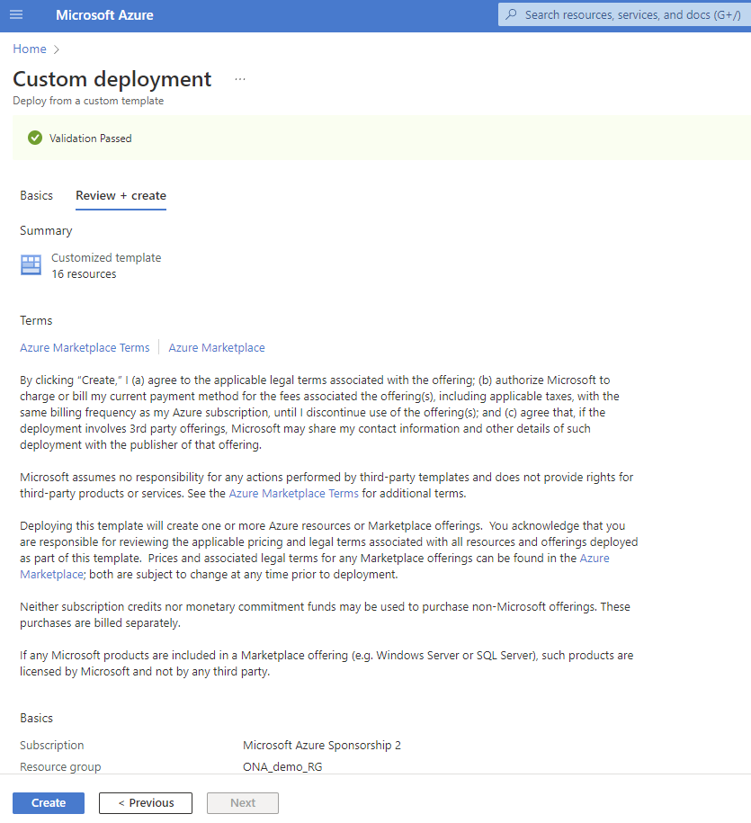

# Installing Pre-reqs

The first step to running this template would be to create an application in the tenant and use that appId 
and secret to setup the other required resources.

1. Navigate to app registrations in your subscription.

2. Register a new application

3. Save the application id (In the screenshot, the one ending in e430). Navigate to API permissions in the Manage menu on the left

4. Select "Microsoft Graph" from the Add permission flyout

5. Select "Application permissions -> Applications -> Application.Read.All"

6. Explicitly Grant consent for the new permissions

7. Verify that that the status shows as granted for the new Application.Read.All permission

8. Navigate to "Certificates and secrets" in the left pane and click on "New client secret"

9. Provide a description and add a secret

10. Copy the value of this new secret and save it securely before navigating away from this page

11. Use this link to initiate the setup of the pre-requisites. Use the appid and secret created in the 
previous steps. Custom deployment - Microsoft Azure [here](https://portal.azure.com/#create/Microsoft.Template/uri/https%3A%2F%2Fraw.githubusercontent.com%2Fmicrosoftgraph%2Fdataconnect-solutions%2Fmain%2Fsolutions%2Fona%2FARMTemplate%2Fazuredeploy.json?token=AATN3TJ6UQWU7TFMZ2R6ZW3ASL5JQ)

The link above sets up the pre-requisites to using the information oversharing template, which are:

- Create a Synapse Workspace
- Create a Spark Pool for the Synapse workspace
- Create a storage account for the extracted data
- Grant permission to the Synapse workspace & the MGDC Service Principal to the storage account as Blob Data Contributor

By clicking on the above button (or navigating to the linked URL), users will be brought to the Azure portal on the Custom deployment page.

On that screen, on top of providing information about the resource group and region to deploy the components into, they will need to provide the following information:

- Application Id to be used by MGDC (from step #3, ending in e430)
- Application secret for that app

Once all required information has been provided, click on the Review + create button at the bottom of the page:

This will validate that the information provided to the template is correct. Once the information has been validated, click on the Create button at the bottom of the page.

This will initiate the deployment. It should normally take about 5 minutes for the whole deployment to complete.