# PREVIEW Organizational Network Analysis template

- [Overview](#Overview)
- [Installing Pre-reqs](#Installing-Pre-reqs)
- [Synapse Pipeline Template](#Synapse-Pipeline-Template)
- [PBI Report Template](#PBI-Report-Template)
- [Preview Considerations](#Preview-Considerations)

## Overview

**Disclaimer: This template is only available for customers in the Preview program. Also, the template is in Preview stage at this time. See [Preview Considerations](#Preview-Considerations) for more information. Feedback is welcome [here](https://aka.ms/ona-m365-feedback)**

The purpose of ONA is to harness information flows and team connectivity to unlock productivity, innovation, employee engagement and organizational change. This solution template enables customers to leverage ONA metrics from M365 data and analyze the networks within.

The template leverages four data sets:
- AAD Users (BasicDataSet_v0.User_v1)
- Teams Chats (BasicDataSet_v0.TeamChat_v1)
- Outlook Emails (BasicDataSet_v0.Message_v1)
- Outlook Calendar (BasicDataSet_v0.CalendarView_v0)

The later 3 are used to extract interactions from user-to-user activity. More calculation details are available [here](https://github.com/microsoftgraph/dataconnect-solutions/tree/main/solutions/ona/PBItemplate#usage)  

**After you follow these steps, you will have a Power BI dashboard related to Organizational Network Analysis, like the one shown below.**

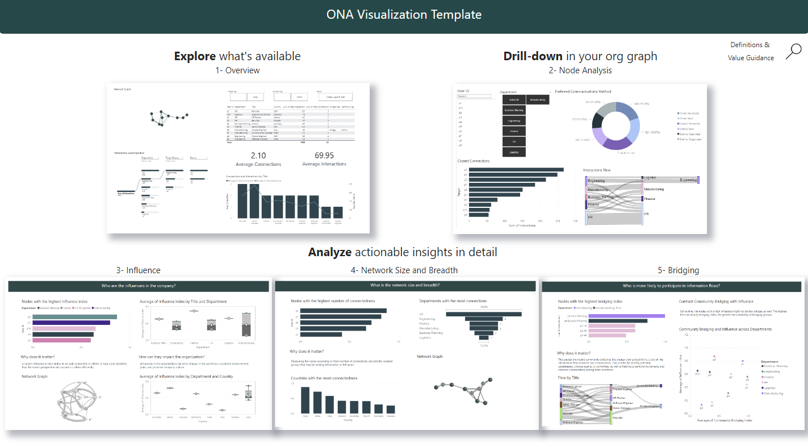 

## Installing Pre-reqs

If you do not have an MGDC app, please proceed to the detailed documentation [here](https://github.com/microsoftgraph/dataconnect-solutions/tree/main/solutions/ona/PreRequisites)  

If you already have an MGDC app and its secret, the automated deployment to Azure helps setup the required resources in 5 minutes. 

The link below sets up the Azure resource group for the template, which are:

- Create a Synapse Workspace
- Create a Spark Pool for the Synapse workspace
- Create a storage account for the extracted data
- Grant permission to the Synapse workspace & the MGDC Service Principal to the storage account as Blob Data Contributor

Custom deployment - Microsoft Azure [here](https://portal.azure.com/#create/Microsoft.Template/uri/https%3A%2F%2Fraw.githubusercontent.com%2Fmicrosoftgraph%2Fdataconnect-solutions%2Fmain%2Fsolutions%2Fona%2FARMTemplate%2Fazuredeploy.json?token=AATN3TJ6UQWU7TFMZ2R6ZW3ASL5JQ)

Provide Storage Blob Data Contributor access to the user who is developing the solution. The Synapse workspace should already have access with the automated deployment. 

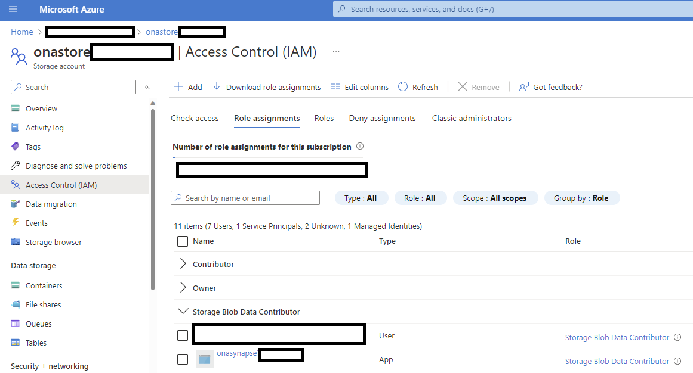

## Synapse Pipeline Template

1.  Download the ONA pipeline template .zip from [here](https://github.com/microsoftgraph/dataconnect-solutions/tree/main/solutions/ona/SynapsePipelineTemplate)

2.  In the Synapse Studio, select the fourth icon on the left to go to the Integrate page. Click on the "+" icon to Add new resource -> Import from pipeline template, and select the downloaded template

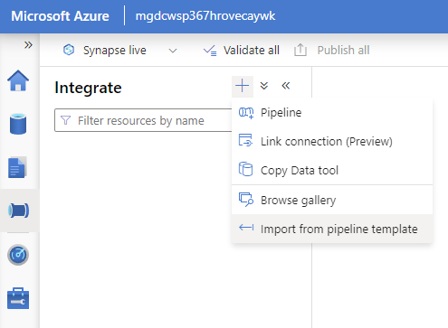

3.  Create the new linked services required by this pipeline

4.  Provide the parameters of the Linked Service 
        a. Select Authentication Type = Service Principal 
        b. Use the storage account name (starting with "onastore"), SPN id (application id from Step 3 in pre-req steps) and secret (SPN key or client secret value Step 10 in pre-req steps) from the pre-req steps above
        c. Test Connection and then click on Create

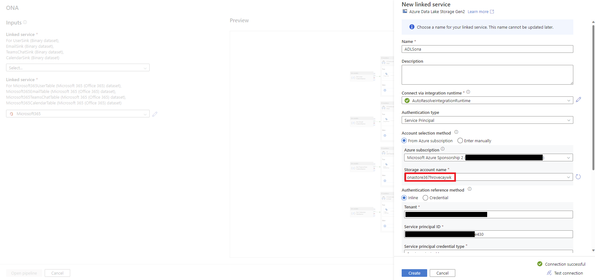

5.  Repeat the linked Service creation steps for the source linked service and select "Open Pipeline"

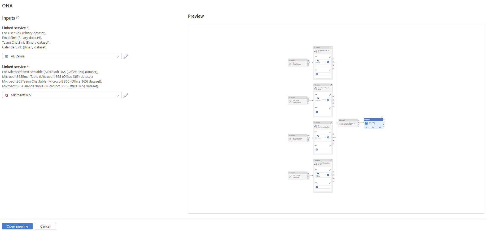

6.  Navigate to the Develop page (third icon on the left) -> ONA and ensure the notebook is attached to the onasynapsepool

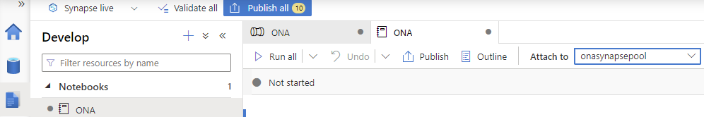

7.  Click on "Publish All" to validate and publish the pipeline

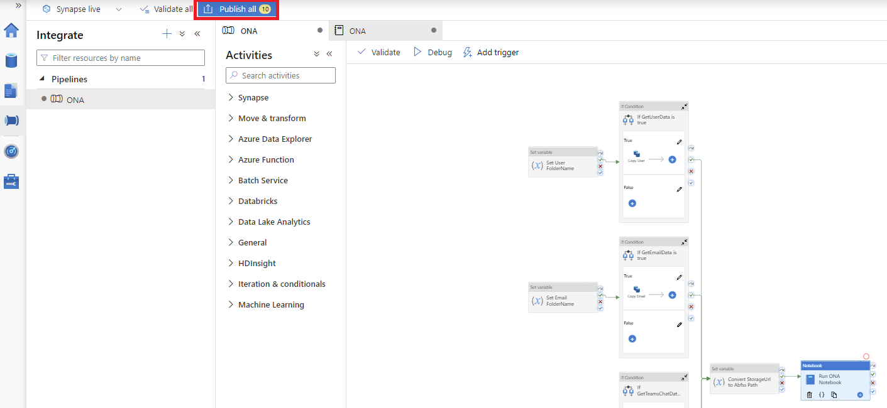

8. Review the changes and click Publish

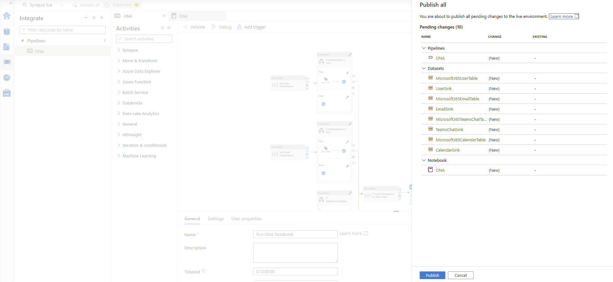

9. Verify that the pipeline has been successfully published

10. Trigger the pipeline

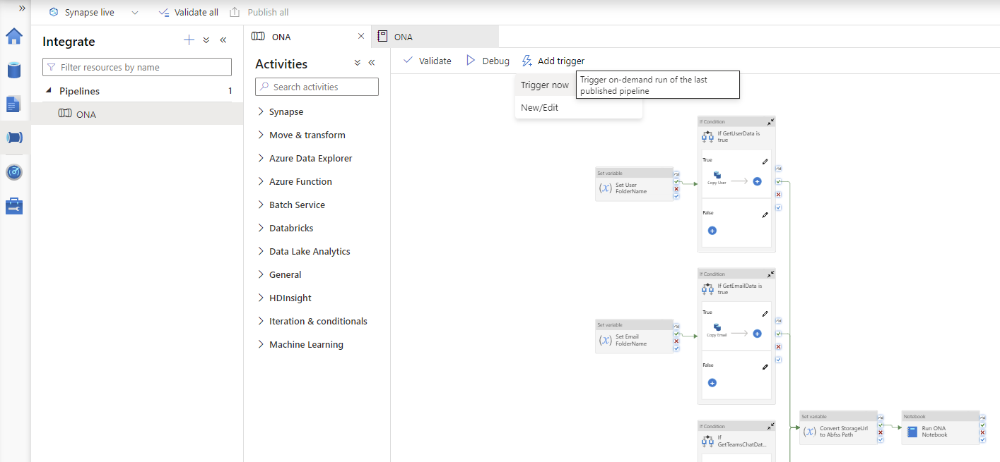

11. Provide the required parameters. Use one month per pipeline run. Use date format 'YYYY-MM-DD'.
Use the Storage Account created in the resource group (simply replace with the storage account name created in the resource group or to get the URL, navigate to the resource group -> storage account -> Endpoints -> Data Lake Storage -> Primary endpoint)
If required, change the flags if only certain datasets should run

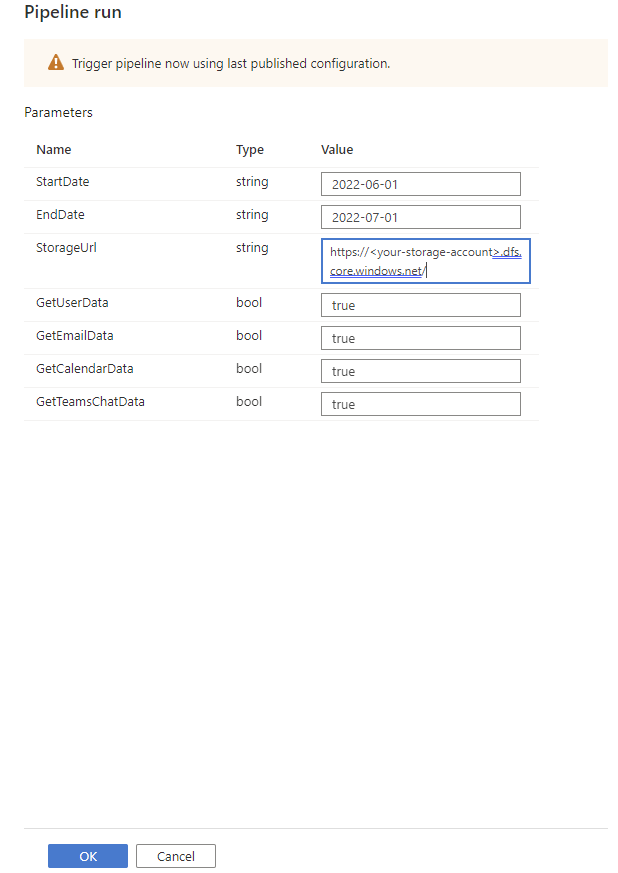
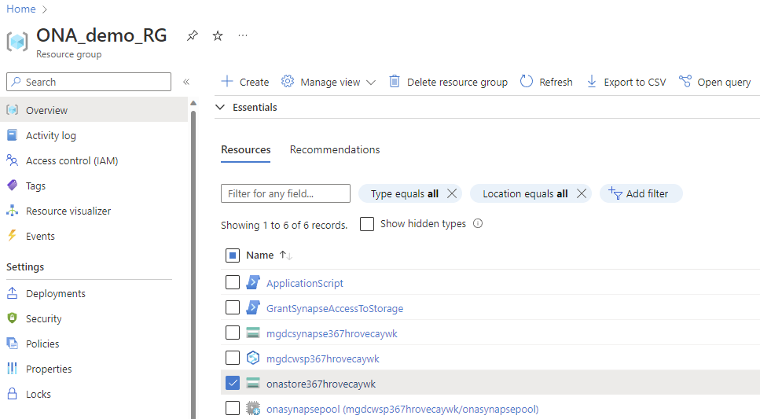
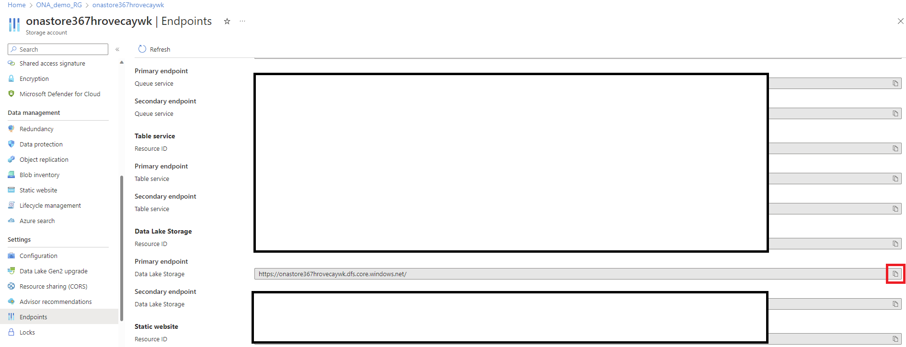

12. Congratulations! You just triggered the MGDC pipeline! Once the admin consents to the request the data will be processed and delivered to your storage account

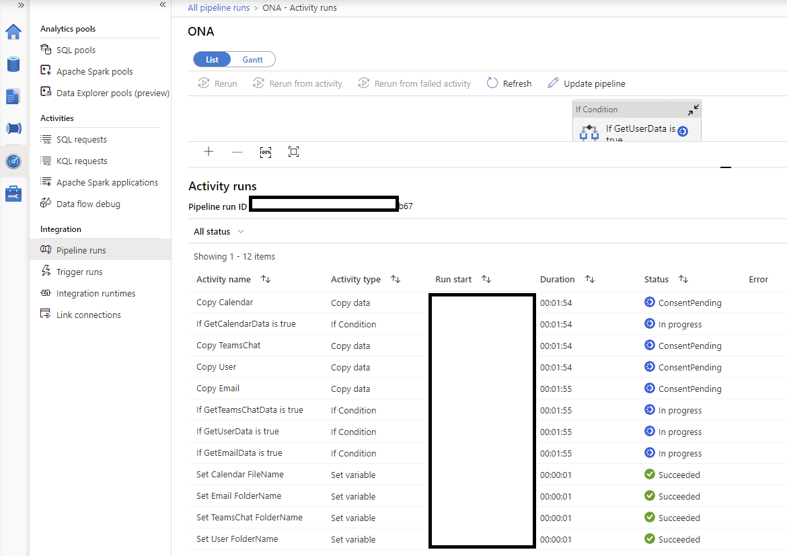

13. You will see the data in the storage account

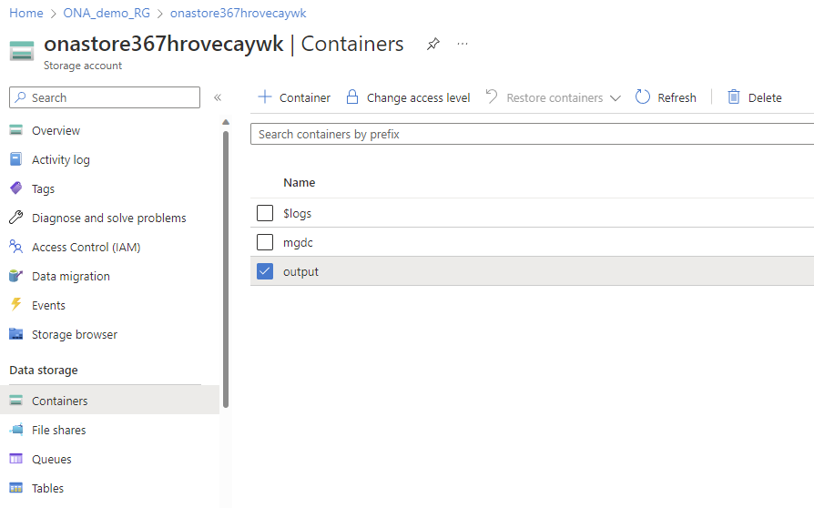

## **PBI Report Template**

For setup instructions and usage, please refer to the documentation [here](https://github.com/microsoftgraph/dataconnect-solutions/tree/main/solutions/ona/PBItemplate) 

Download the pre-created PowerBI security report that can generate insights from data that is produced using Synapse pipeline in azure storage locations. 

Link to download PowerBI template [here](http://aka.ms/ona-m365-pbi)

## **Preview Considerations**
This template is in PREVIEW stage at this time. The following considerations apply:
- There may be updates performed regularly to fit for adjustments and fixes 
- The network graph visualizations in the Power BI template are limited to 1500 nodes