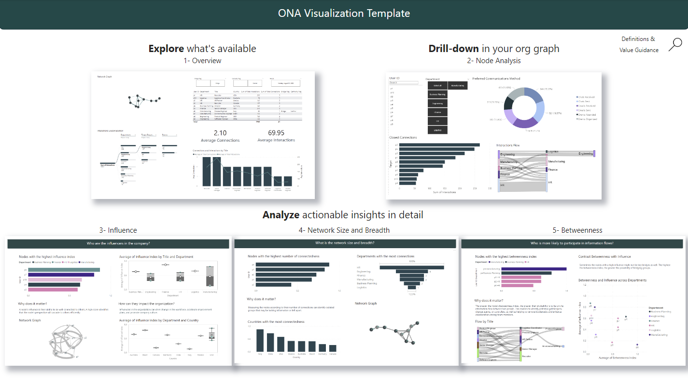
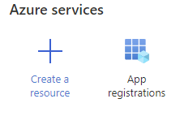
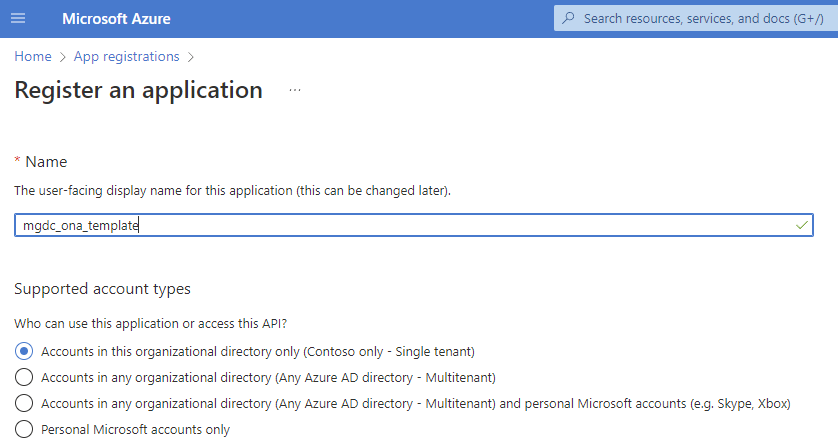
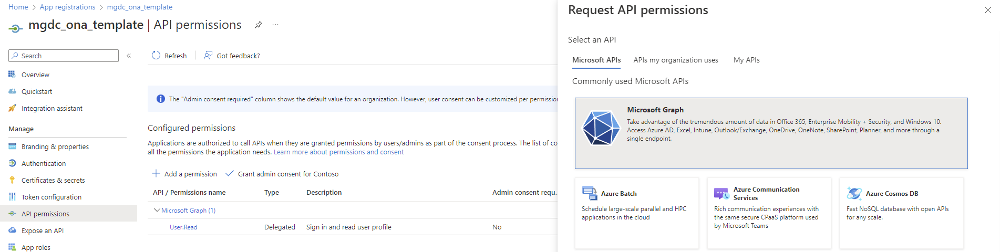
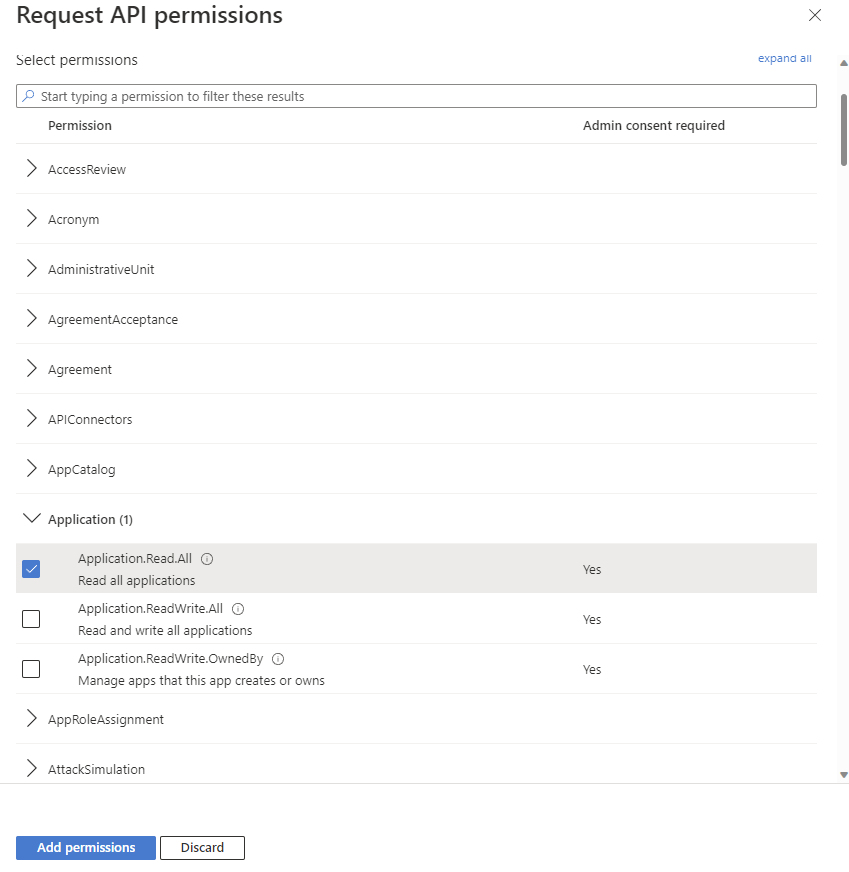
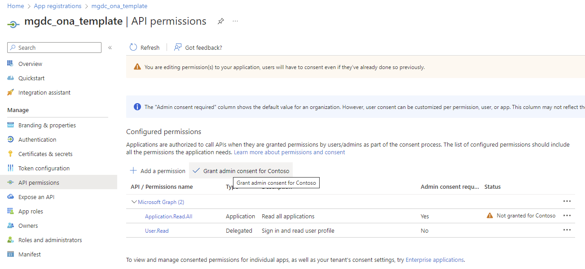
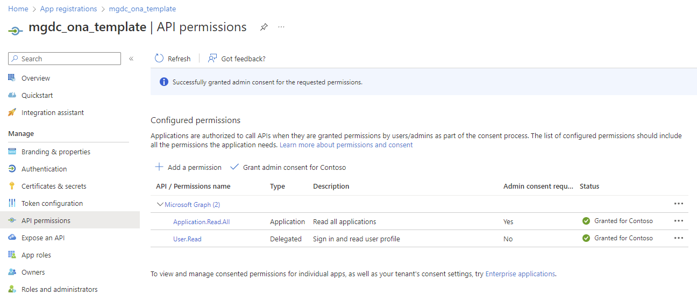
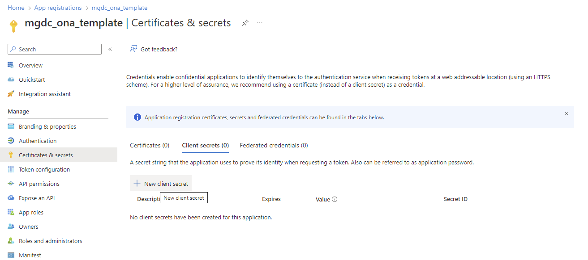
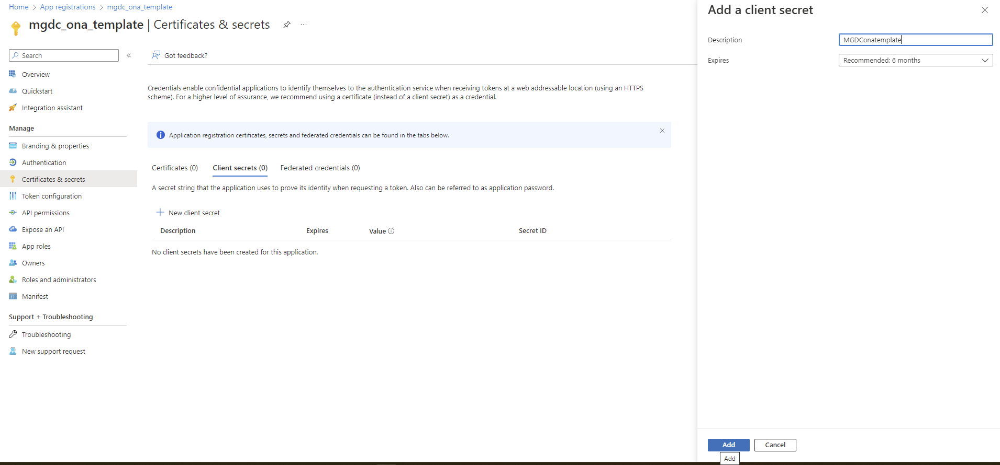
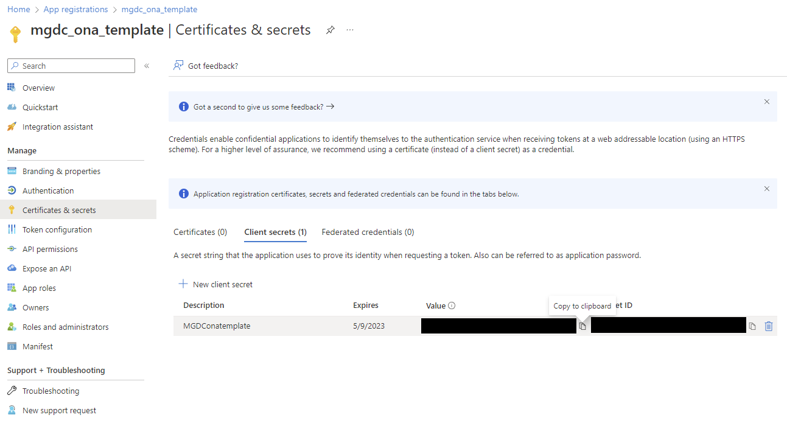

# PREVIEW Organizational Network Analysis template

- [Overview](#Overview)
- [Installing Pre-reqs](#Installing-Pre-reqs)
- [Synapse pipeline template](#Synapse-pipeline-template)
- [PBI report template](#PBI-report-template)
- [Preview Considerations](#Preview-Considerations)

## Overview

**Disclaimer: This template is in PREVIEW stage at this time. See [Preview Considerations](#Preview-Considerations) for more information. Feedback is welcome [here](https://aka.ms/ona-m365-feedback)**

The purpose of ONA is to harness information flows and team connectivity to unlock productivity, innovation, employee engagement and organizational change. This solution template enables customers to leverage ONA metrics from M365 data and analyze the networks within.

**After you follow these steps, you will have a Power BI dashboard related to Organizational Network Analysis, like the one shown below.**

 

## Installing Pre-reqs
The first step to running this template would be to create an application in the tenant and use that appId 
and secret to setup the other required resources.

1. Navigate to app registrations in your subscription.

2. Register a new application

3. Save the application id (In the screenshot, the one ending in e430). Navigate to API permissions in the Manage menu on the left

4. Select "Microsoft Graph" from the Add permission flyout

5. Select "Application permissions -> Applications -> Application.Read.All"

6. Explicitly Grant consent for the new permissions

7. Verify that that the status shows as granted for the new Application.Read.All permission

8. Navigate to "Certificates and secrets" in the left pane and click on "New client secret"

9. Provide a description and add a secret

10. Copy the value of this new secret and save it securely before navigating away from this page

11. Use this link to initiate the setup of the pre-requisites. Use the appid and secret created in the 
previous steps. Custom deployment - Microsoft Azure [here](https://portal.azure.com/#create/Microsoft.Template/uri/https%3A%2F%2Fraw.githubusercontent.com%2Fmicrosoftgraph%2Fdataconnect-solutions%2Fmain%2Fsolutions%2Fona%2FARMTemplate%2Fazuredeploy.json?token=AATN3TJ6UQWU7TFMZ2R6ZW3ASL5JQ)

The link above sets up the pre-requisites to using the information oversharing template, which are:

- Create a Synapse Workspace
- Create a Spark Pool for the Synapse workspace
- Create a storage account for the extracted data
- Grant permission to the Synapse workspace & the MGDC Service Principal to the storage account as Blob Data Contributor

By clicking on the above button (or navigating to the linked URL), users will be brought to the Azure portal on the Custom deployment page.

On that screen, on top of providing information about the resource group and region to deploy the components into, they will need to provide the following information:

- Application Id to be used by MGDC (from step #3, ending in e430)
- Application secret for that app

Once all required information has been provided, click on the Review + create button at the bottom of the page:

WIP

## Synapse pipeline template

WIP

## **PBI report template**
Below steps will help to link datasets that are generated using Synapse pipeline above to link to PowerBI 
Template. 
1. Download and install Microsoft Power BI Desktop if you don’t have it installed already on your machine. 
    - Link to download Download Microsoft Power BI Desktop from Official Microsoft Download Center. [here](https://www.microsoft.com/en-us/download/details.aspx?id=58494)
2. Download the pre-created PowerBI security report that can generate insights from data that is produced using Synapse pipeline in azure storage locations. Link to download PowerBI Report. [here](http://aka.ms/ona-m365-pbi)

WIP

8. Congratulations, you are all set and will see that the report will be refreshed with the latest data

     

9. If you see any error or data is not being refreshed then please make sure your entered right storage account details, path and folder information along with credentials in data source settings

## **Preview Considerations**
This template is in PREVIEW stage at this time. The following considerations apply:
- The network graph visualizations in the Power BI template are limited to 1500 nodes
- The template has been tested in tenant sizes of <500 users
- The Betweenness index provides an approximation via sampling to avoid excesive compute effort and calculation time. This index might be replaced in the upcoming months