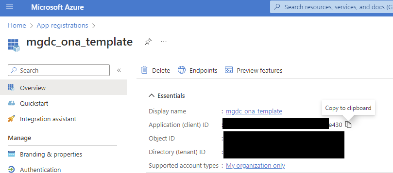

# PREVIEW Organizational Network Analysis template

- [Overview](#Overview)
- [Installing Pre-reqs](#Installing-Pre-reqs)
- [Synapse Pipeline Packages](#Synapse-Pipeline-Packages)
- [Synapse Pipeline Template](#Synapse-Pipeline-Template)
- [PBI Report Template](#PBI-Report-Template)
- [Preview Considerations](#Preview-Considerations)

## Overview

**Disclaimer: This template is in PREVIEW stage at this time. See [Preview Considerations](#Preview-Considerations) for more information. Feedback is welcome [here](https://aka.ms/ona-m365-feedback)**

The purpose of ONA is to harness information flows and team connectivity to unlock productivity, innovation, employee engagement and organizational change. This solution template enables customers to leverage ONA metrics from M365 data and analyze the networks within.

**After you follow these steps, you will have a Power BI dashboard related to Organizational Network Analysis, like the one shown below.**

 

## Installing Pre-reqs
The first step to running this template would be to create an application in the tenant and use that appId 
and secret to setup the other required resources.

1. Navigate to app registrations in your subscription.

2. Register a new application

3. Save the application id (In the screenshot, the one ending in e430). Navigate to API permissions in the Manage menu on the left

4. Select "Microsoft Graph" from the Add permission flyout

5. Select "Application permissions -> Applications -> Application.Read.All"

6. Explicitly Grant consent for the new permissions

7. Verify that that the status shows as granted for the new Application.Read.All permission

8. Navigate to "Certificates and secrets" in the left pane and click on "New client secret"

9. Provide a description and add a secret

10. Copy the value of this new secret and save it securely before navigating away from this page

11. Use this link to initiate the setup of the pre-requisites. Use the appid and secret created in the 
previous steps. Custom deployment - Microsoft Azure [here](https://portal.azure.com/#create/Microsoft.Template/uri/https%3A%2F%2Fraw.githubusercontent.com%2Fmicrosoftgraph%2Fdataconnect-solutions%2Fmain%2Fsolutions%2Fona%2FARMTemplate%2Fazuredeploy.json?token=AATN3TJ6UQWU7TFMZ2R6ZW3ASL5JQ)

The link above sets up the pre-requisites to using the information oversharing template, which are:

- Create a Synapse Workspace
- Create a Spark Pool for the Synapse workspace
- Create a storage account for the extracted data
- Grant permission to the Synapse workspace & the MGDC Service Principal to the storage account as Blob Data Contributor

By clicking on the above button (or navigating to the linked URL), users will be brought to the Azure portal on the Custom deployment page.

On that screen, on top of providing information about the resource group and region to deploy the components into, they will need to provide the following information:

- Application Id to be used by MGDC (from step #3, ending in e430)
- Application secret for that app

Once all required information has been provided, click on the Review + create button at the bottom of the page:

This will validate that the information provided to the template is correct. Once the information has been validated, click on the Create button at the bottom of the page.

This will initiate the deployment. It should normally take about 5 minutes for the whole deployment to complete.

## Synapse Pipeline Packages

1.  After the pre-reqs are complete, navigate to the Synapse workspace just created

2.  Open the Synapse Studio

3.  In the Synapse Studio, select the sixth icon on the left to go to the Manage page. Click on Workspace packages and then upload the following two required packages:
- [Graphframes.whl](https://github.com/microsoft/adb2spark/blob/main/graphframes-0.8.2-py3-none-any.whl)
- [GraphframesSpark.jar](https://spark-packages.org/package/graphframes/graphframes)
Confirm the Scala version of the pool matches to the packages

4.  Click on the Apache Spark pools and then in the three dots for more options -> Packages

5.  Select the workspace packages to enable use and click Apply. It will take some minutes to complete

## Synapse Pipeline Template

1.  Download the ONA pipeline template .zip from [here](https://portal.azure.com/#create/Microsoft.Template/uri/https%3A%2F%2Fraw.githubusercontent.com%2Fmicrosoftgraph%2Fdataconnect-solutions%2Fmain%2Fsolutions%2Fona%2FSynapsePipelineTemplate%2FONA.zip)

2.  In the Synapse Studio, select the fourth icon on the left to go to the Integrate page. Click on the "+" icon to Add new resource -> Import from pipeline template, and select the downloaded template

3.  Create the new linked services required by this pipeline

4.  Provide the parameters of the Linked Service 
        a. Select Authentication Type = Service Principal 
        b. Use the storage account name (starting with "onastore"), SPN id and secret (SPN key) from the pre-req steps above
        c. Test Connection and then click on Create

5.  Repeat the linked Service creation steps for the source linked service and select "Open Pipeline"

6.  Navigate to the Develop page (third icon on the left) -> ONA and ensure the notebook is attached to the onasynapsepool

7.  Click on "Publish All" to validate and publish the pipeline

8. Review the changes and click Publish

9. Verify that the pipeline has been successfully published

10. Trigger the pipeline

11. Provide the required parameters. Use one month per pipeline run. Use date format 'YYYY-MM-DD'. 
Use the Storage Account created in the resource group (to get the URL, navigate to the resource group -> storage account -> Endpoints -> Data Lake Storage -> Primary endpoint)
If required, change the flags if only certain datasets should run.

12. Congratulations! You just triggered the MGDC pipeline! Once the admin consents to the request the data will be processed and delivered to your storage account.

13. You will see the data in the storage account.

## **PBI Report Template**
Below steps will help to link datasets that are generated using Synapse pipeline above to link to PowerBI 
Template. 
1. Download and install Microsoft Power BI Desktop if you don’t have it installed already on your machine. 
    - Link to download Download Microsoft Power BI Desktop from Official Microsoft Download Center. [here](https://www.microsoft.com/en-us/download/details.aspx?id=58494)
2. Download the pre-created PowerBI security report that can generate insights from data that is produced using Synapse pipeline in azure storage locations. Link to download PowerBI Report. [here](http://aka.ms/ona-m365-pbi)

WIP

8. Congratulations, you are all set and will see that the report will be refreshed with the latest data

     

9. If you see any error or data is not being refreshed then please make sure your entered right storage account details, path and folder information along with credentials in data source settings

## **Preview Considerations**
This template is in PREVIEW stage at this time. The following considerations apply:
- The network graph visualizations in the Power BI template are limited to 1500 nodes
- The template has been tested in tenant sizes of <500 users
- The Betweenness index provides an approximation via sampling to avoid excesive compute effort and calculation time. This index might be replaced in the upcoming months