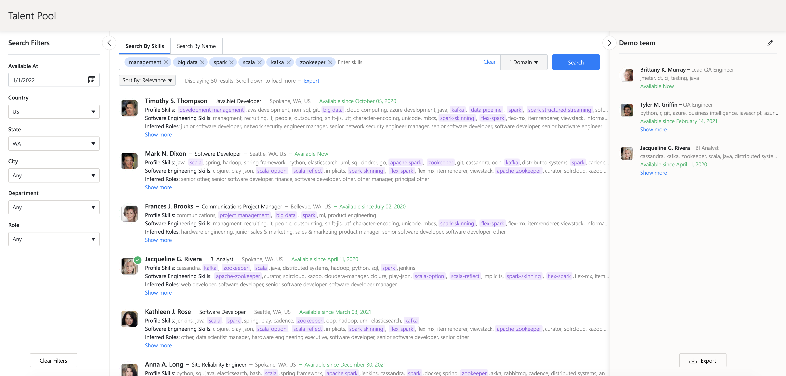
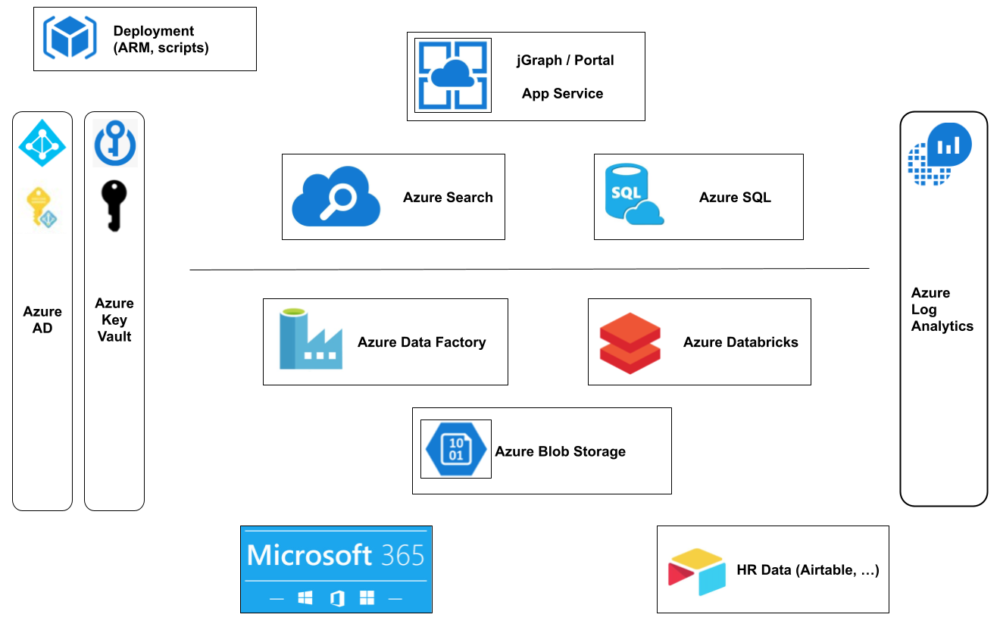

## ProjectStaffing application

The Project Staffing application is a Microsoft Graph Data Connect based solution which allows engagement managers
to build the best suited teams for projects, by finding employees that are available and have the best set of skills
for the project, as well as the most relevant set of potential skills.  
The application processes employee profile and email data from Microsoft Graph Data Connect and complementary data sources, 
using Azure Data Factory (ADF). It uses this data to build a model based on which, given queries containing desired skills
or topics of interest, the most relevant employees are recommended. For each of these employees, the information from
their profile is provided, together with inferred information about their potential skills, topics of interest or roles.  
The application's search rules are also highly customizable, allowing users to tailor configurations regarding data sources, 
filters and search criteria, to best suit their needs.

In a nutshell, the application provides the following functionalities to users:
- searching by skills & availability
- searching by availability alone
- searching by name
- provide information about each recommended employee (profile data & inferred data)
- results filtering & sorting
- search term autocompletion
- using search domains for skills inference and search results matching
- exporting search results
- creating teams
- adding/removing members to teams
- exporting team members
- search customization (data sources, filter settings, search criteria, emails search settings)
- admin only functionalities (ingestion mode switch, HR data upload)

For more details please read the full [User Guide](docs/user_guide.md)

### Architectural components

- The [ADF pipelines](docs/AzureDataFactory.MD) process the data from several sources using mainly Azure Databricks (ADB)
  jobs written either in scala or spark. The pipelines are orchestrated by [ADF triggers](docs/ADF_trigger_creation_policy.md).

- The resulting data is written in Azure SQL database and/or in Azure Cognitive Search. Intermediate data is also written in AZBS.

- Sensitive data is stored in Azure KeyVault.

- Application logs and ADB jobs logs are also sent to Azure Log Analytics.

- The application itself is an Azure App Service.

To [recommend relevant employees](./docs/searching_for_relevant_employees.md), the App Service combines results of queries
sent to Azure Search, and it enhances and filters this information using queries sent to Azure SQL database.

It also uses the Azure SQL database to store and retrieve information about configurations, user settings, user teams,
state of long-running operations, etc.

### Setting up the application

The ProjectStaffing application can be run locally for development purposes, but it needs to make use of some
services/resources from an existing full development deployment from Azure.

> Warning: If you are using Windows to build the project, please make sure to use a code editor which does not
> automatically alter the line endings from files, especially the bash scripts used for the project deployment

Here is an overview of the steps required to build the application locally, perform a full development deployment in
Azure and then run the application locally while using the resources from the Azure development deployment:

1. make sure all prerequisites for building the project are fulfilled, by following [these steps](./deployment/README.MD#prerequisites)
2. build the ProjectStaffing App Service jar and all the ADB jars, by following [these steps](./deployment/README.MD#building-all-the-projects-jars-at-once)
3. build the pygraph utils wheel, by following [these steps](./pygraph/azure_processing/pygraph_utils/README.md)
4. prepare the zip with all the resulting artifacts (required for deployment), by following [these steps](./deployment/README.MD#building-the-deployment-artifacts-zip)
5. to perform a fresh full deployment in Azure, please follow the steps described in the deployment script's [readme file](./deployment/arm/README.md)
   and in the [deployment overview document](docs/ProjectStaffingDeploymentOverview.MD)
6. to run the application in Azure, please follow [these steps](./jgraph/core/README.MD#running-the-application-in-azure)
7. to run the application locally, please follow [these steps](./jgraph/core/README.MD#running-the-application-locally)

#### Development

Please follow the following links to learn more details about the project [architecture](#architectural-components),
[components](./deployment/README.MD#project-components) and [deliverables](./deployment/README.MD#project-deliverables).

In case changes are done to individual project components (the ProjectStaffing App Service, ADF pipelines, ADB libraries etc),
these components can can either be:
- built individually, as described in the subsections of the [local build documentation](./deployment/README.MD#building-from-source-using-the-local-development-environment),
  and [deployed individually](./deployment/README.MD#deploying-individual-components)
- built together with the entire project (either locally as described above or via a [build pipeline](./docs/build_pipeline.md))
  and deployed as part of a [full application update](./deployment/README.MD#updating-app-release-version-over-existing-deployment)

After the deployment, changes to the App Service usually only require restarting the service.  
Changes to ADF pipelines or ADB libraries require running the impacted ADF pipelines for the changes to take effect in the ProjectStaffing app service.  
If running the ADF pipelines resulted in changes in Azure SQL database, and you want to see the latest changes in the ProjectStaffing
running locally, then the latest version of the data from Azure SQL database needs to be exported and written to the local database.

> Note: For developing the application, only macOS/Linux based systems were used.  
> Bash (and Python 3) was used for scripting and deployment.  
> There has been no testing on Windows, nor deployments from PowerShell.

### Data sources

The following data sources are used:

1. Microsoft 365 User profiles
    - data about employees retrieved using Microsoft Graph Data Connect
2. Microsoft 365 Managers
    - data about managers retrieved using Microsoft Graph Data Connect
3. Microsoft 365 Emails
    - sent and received emails retrieved using Microsoft Graph Data Connect
4. HR Data employee profiles
    - custom data format which can be derived from the systems used by the HR department to store data about the company's employees
    - it is meant to be complementary to the data obtained from Microsoft 365 (Microsoft Graph Data Connect)
    - more details can be found in the [HR Data documentation](./docs/HR_Data.md)

The data from the above sources is retrieved and processed in batch by the ADF pipelines. Besides these sources, the
profile picture of each individual employee is retrieved using Microsoft Graph API by the employee profiles ADF pipeline.

### Data ingestion modes

Due to security and privacy concerns, using an organization's real Microsoft 365 data requires the involvement and
approval of the IT department. This can take a long time. Therefore, the application comes with three data ingestion 
modes, out of which two modes rely on example datasets:

- Production mode
    - retrieves real production data from the three data sources mentioned above
    - the data is retrieved only for the members of the "GDC Employees" group, required during deployment
    - requires IT approval
    - all the preconditions are described in detail [here](./docs/AdminPermissions.MD)

- Simulated mode
    - relies on a set of artificially generated employee profiles and emails
    - meant for presentation and demonstration purposes
    - the files in this dataset can be manually downloaded using `wget <link>` from any one of 4 geographically  
      replicated storage accounts. Please use the one that is most convenient for you. 
        - `prjstfartifacts` -> West US 2
        - `prjstfartifacts` -> Southeast Asia
        - `prjstfartifactseu` -> Germany West Central
        - `prjstfartifactssouth` -> Brazil South
    - for each storage account, the dataset consists of 4 files, which can be accessed at the following links:
        - `https://<storage_account>.blob.core.windows.net/public-artifacts/simulated-data/m365_users/generated_user_profiles.json`
        - `https://<storage_account>.blob.core.windows.net/public-artifacts/simulated-data/m365_managers/generated_managers.json`
        - `https://<storage_account>.blob.core.windows.net/public-artifacts/simulated-data/m365_emails/generated_emails.json`
        - `https://<storage_account>.blob.core.windows.net/public-artifacts/simulated-data/hr_data/generated_hr_data.csv`
    - this data automatically gets copied by the deployment script to the `demodata<deploymentHash>` storage account
      of the deployment resource group, in the `simulated-data` container, in the following respective folders:
      `m365_users`, `m365_managers`, `m365_emails`, `hr_data`
        - any manual changes to the simulated data require uploading it to these locations
        - in simulated mode, the ADF pipelines retrieve the data from these locations, instead of the production data sources described above

- Sample mode
    - relies on a subset of real internal data obtained from employees who explicitly provided some of their emails and profile data
    - this approach can be used as a shortcut to validate how the product works with known internal people, until approval is obtained from IT to use full production data
    - the required schema of the sample data and the AZBS location where it needs to be placed is described in detail [here](./docs/InputSampleData.MD)
    - in sample mode, the ADF pipelines retrieve the data from the AZBS sample data locations, instead of the production data sources described above

The initial ingestion mode can be chosen during deployment via the deployment script,
by typing `production_mode`/`simulated_mode`/`sample_mode` when prompted for the ingestion mode.

The switch from one ingestion mode to another can be performed by application admins from the ProjectStaffing UI via
the `Settings -> Ingestion Mode` menu.

### Documentation index

[ADB python scripts/PySpark jobs](./pygraph/azure_processing/README.md)  
[ADB scala spark jobs](./docs/ADBScalaJobsParameters.MD)  
[ADF pipelines](./docs/AzureDataFactory.MD)  
[ADF triggers](./docs/ADF_trigger_creation_policy.md)  
[Admin permissions](./docs/AdminPermissions.MD)  
[Building the project locally](./deployment/README.MD#building-from-source-using-the-local-development-environment)  
[Building the project via the build pipeline](./docs/build_pipeline.md)  
[CI track](./docs/build_pipeline.md)  
[Components](./deployment/README.MD#project-components)  
[Data enrichment](./docs/enrichment_pipelines.md)  
[Deliverables](./deployment/README.MD#project-deliverables)  
[Deployment](./deployment/README.MD#deployment)  
[Deployment process details](docs/ProjectStaffingDeploymentOverview.MD)  
[Deployment script](./deployment/arm/README.md)  
[Employee profile Azure Search schema](./docs/Employee_profile_schema_example.md)  
[Full deployment](docs/ProjectStaffingDeploymentOverview.MD)  
[HR Data](./docs/HR_Data.md)  
[Ingestion modes](#data-ingestion-modes)  
[Production mode preconditions](./docs/AdminPermissions.MD)  
[Python utils wheel](./pygraph/azure_processing/pygraph_utils/README.md)  
[Releasing a new version](./jgraph/README.md)  
[Running the application](./jgraph/core/README.MD)  
[Sample data schema and location](./docs/InputSampleData.MD)  
[Searching for relevant employees](./docs/searching_for_relevant_employees.md)  
[Search results sorting and paging](./docs/SearchResultsSortingAndPaging.MD)  
[Test track](./docs/test_track.md)  
[Testing locally](./jgraph/core/README.MD#running-the-tests-locally)  
[UI](./jgraph/ui/README.md)  
[User Guide](./docs/user_guide.md)  