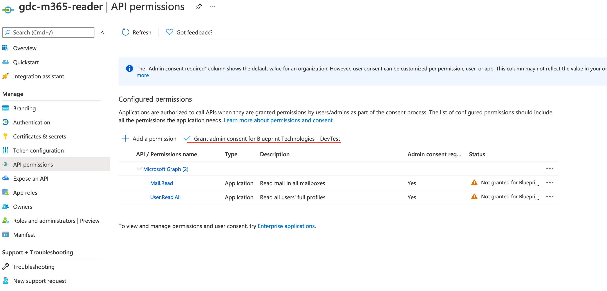
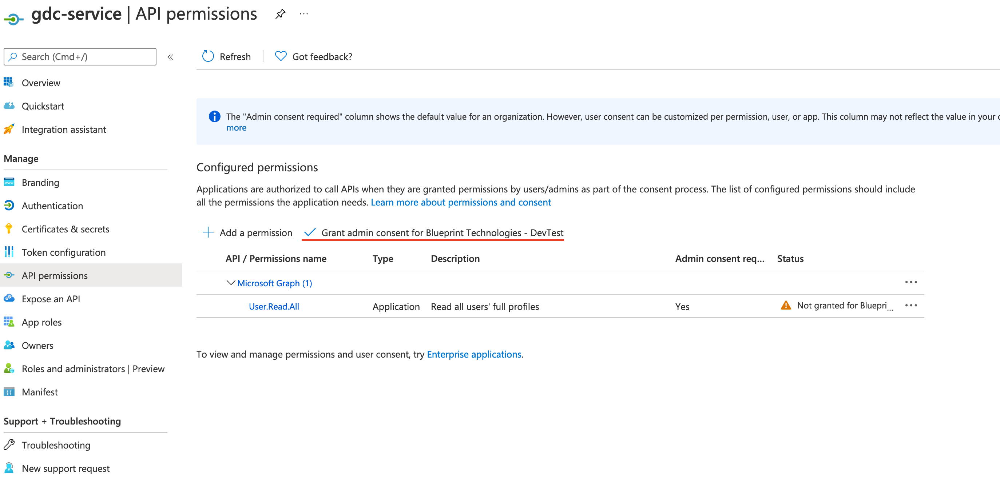
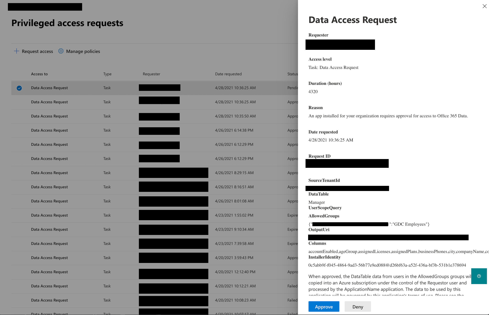

###Running Skills Finder in production mode

In order to run the application in production mode there are 4 steps that have to be made:
1. The ingestion mode of the application has to be set to `production_mode`, there are two ways to do this. The first one is at deployment time. 
The deployment script prompts the user to select an ingestion mode, if production mode is selected, the application will start in production mode. 
If the application didn't start in production mode, then an ingestion switch operation has to be performed.

2. The "gdc-m365-reader" and "gdc-service" app registrations (service principals)  need admin consent from a user with "Global administrator" role.
The "gdc-m365-reader" service principal is used for copying the emails, user profiles and manager information that is beeing processed. And "gdc-service" service principal 
is used to extract the profile pictures for the users.
The following images show exactly how this can be done form the Azure portal.

    
    

3. Make sure that you are a owner of the "gdc-m365-reader" service principal. You won't be able to perform the next step if you are not an owner of the
"gdc-m365-reader" service principal. This can be checked from the Azure Portal: App Registrations -> gdc-m365-reader -> Owners.

4. After the ingestion mode is set to production mode (either at deployment time or through ingestion switch), Azure Data Factory (ADF) will start pipelines that 
will copy the information regarding user emails, user profiles, and managers to Azure Blob Storage. For each one of these types of pipelines, a Data Access Request will be
generated in the [Azure Admin Portal](https://portal.office.com/adminportal/home?#/Settings/PrivilegedAccess). The Data Access Requests have to be approved by a user with "Global administrator" role, and that is also an owner
of the "gdc-m365-reader" service principal. Until this is done, the ADF pipelines will be in a waiting state, that is, no data will be copied from Office365 
until the Data Access Requests are approved. 
    
    The following images shows how a Data Access Request can be approved.
    

