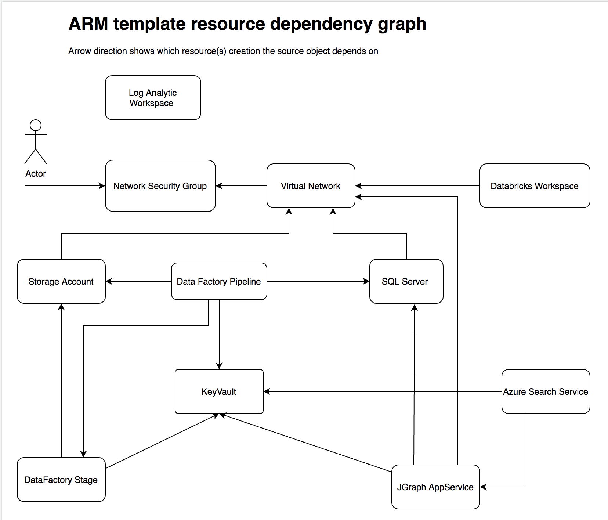

## Project Staffing deployment overview

### Project Staffing deployment architecture

### Deployment tools and dependencies

- Python 3.7+
- Azure CLI 
- sqlcmd (if SQL Server database schema initialization is set to auto mode)
- Azure Subscription owned by the deployer

> Note: It’s recommended to deploy from Azure CloudShell Bash. It comes with all required dependencies.

### Deployment Stages

- Requirements validation: python, sqlcmd, Azure CLI, Azure Quotes, etc.
- Prompt the user for critical parameters 
- Active Directory records initialization (service principals, app registration, etc.) 
- mainTemplate.json ARM template deployment
- SQL Server schema initialization (including schema and  contained users with permission grants for Service Principals)
- Post-deployment step (Databricks cluster provisioning, sampled/simulated data ingestion, Data Factory triggers activation)

### Key Concepts

- install.sh orchestrates python scripts and runs them in the right order
- Python scripts (install.py, run_db_stage.py, post-deployment.py) use Azure CLI python-binding to execute 
  [az commands](https://docs.microsoft.com/en-us/cli/azure/reference-index?view=azure-cli-latest) to perform changes in Azure
- Deployment scripts persist the deployment state in the `~/.gdc` folder, in order to be able to continue deployment after a failure or interruption (depending on the failed stage)

### ARM template resource dependency graph

-the resource group with all its resources gets created first
    - this is done solely based on the ARM template from mainTemplate.json
    - none of the python deployment code is used up to this point
    
