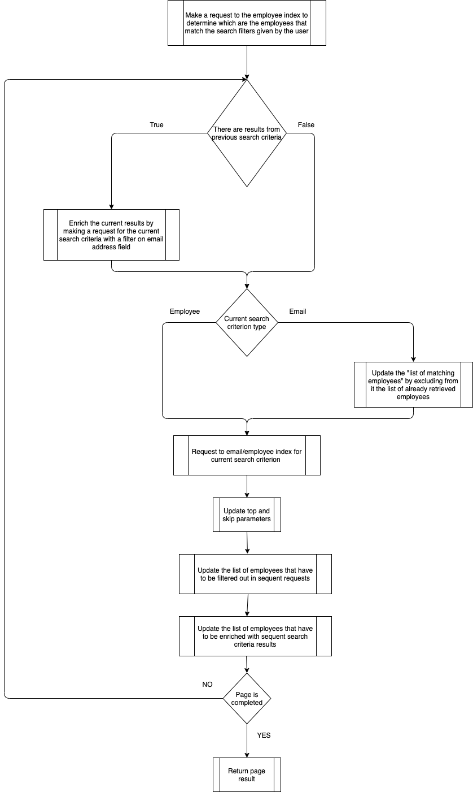
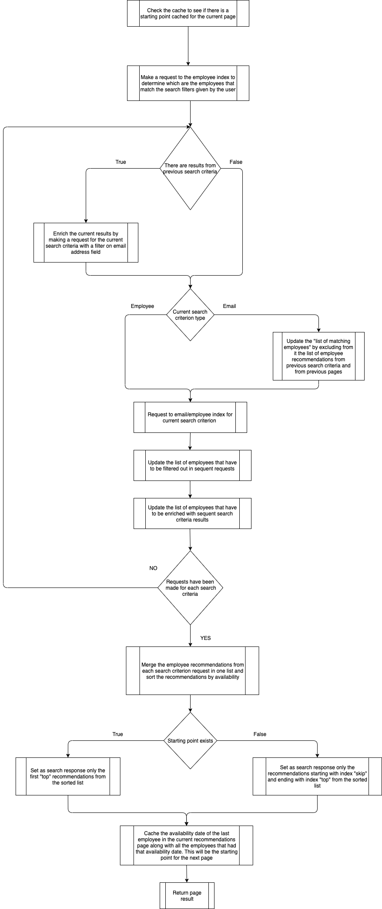

## Search results Sorting & Pagination

The number of search results depends on the number of search criteria enabled by the users. 
Every search criterion queries different fields from the Azure Search indexes (emails, employee-profiles).

There are two types of search criteria, depending on which Azure Search index gets queried.

The email-type search criteria are:

```
EMAIL_CONTENT,
DE_EMAIL_CONTENT,
RECEIVED_EMAIL_CONTENT,
DE_RECEIVED_EMAIL_CONTENT
```    

The employee-type search criteria are:

```
PROFILE_SKILLS
PROFILE_ABOUT_ME,
PROFILE_TOPICS,
DE_PROFILE
```

The pagination algorithm differs based on which sorting option is selected.

## Sorting by relevance

The order of the search criteria enabled by the user determines the order of the retrieved employee recommendations.

For example, if the order of the search criteria enabled by the user is: `PROFILE_SKILLS`, `PROFILE_ABOUT_ME`
, `PROFILE_TOPICS`, then the first employee recommendations will be the ones that arrive from querying `PROFILE_SKILLS`
search criterion, following `PROFILE_ABOUT_ME` and `PROFILE_TOPICS`.

No pagination queries are made to the (n+1)th search criterion until all the recommendations from the nth search
criterion are exhausted. 
The results got from the nth search criterion will be **enriched** with information from all
the sequent search criteria. 
So a single request will be made for every sequent search criteria, and a filter will be set
to *only query* the employees resulted from the query to the nth search criterion.

E.g., if the page size is 5, and we receive information regarding 5 employees from the first request to
the `PROFILE_SKILLS` search criterion. Let's say the email addresses of the employees are: `adchavez@workerbees.com`
, `ajtucker@somewhere.com`, `amrodriguez@somewhere.com`, `apford@workerbees.com` and `acgarza@somewhere.com`. 

The queries for the sequent search criteria `PROFILE_ABOUT_ME`, `PROFILE_TOPICS` will be made adding a filter 
on the `mail` field of the employee index, so that only the documents that belong to those employees 
will be queried:

```
search.in(mail, 'adchavez@workerbees.com,ajtucker@somewhere.com,amrodriguez@somewhere.com,apford@workerbees.com', ',')
```  

### Pagination for employee-type search criteria

When requesting employee recommendations using employee-type search criteria, we rely on Azure Search pagination
mechanism (`skip` and `top` parameters)
to paginate the results, because each document in the Azure Search employee index represents an employee.

When a page isn't completed (filled) from the request made for one search criterion, the `skip` and `top` parameter are updated.
The request for the next search criterion will be made with the updated values of `skip` and `top` parameters.

For example if the page size is 50, and we receive from the UI the request for the second page then the following steps
are executed:
- The first request to Azure Search will be with `skip=50` and `top=50`. Let's assume the request for `PROFILE_SKILLS`
  search criterion only returns 30 employee recommendations.
- The parameters will be updated to `skip=20`, `top=50`. A request will be made for `PROFILE_ABOUT_ME` search criterion.
  Let's assume this request will return 40 results.
- The parameters will be updated to `skip=0`, `top=30`. The remaining 30 employees will be retrieved
  from `PROFILE_TOPICS` search criterion

The previous example only contained employee-type search criteria. For email type search criteria the pagination
mechanism is different, each document received in the request response does not represent an employee but an email, for
which the employee is either the sender or the receiver.

### Pagination for email-type search criteria

Search filtering (on availability/country/city/department/... or other fields) is not possible when making requests to
the _emails_ index because the email documents do not contain information regarding the employees (except for the email
address). In order to be able to apply the filters to email-type search criteria a request is made to the _employee_ index
beforehand, to determine which are the employees that match the filters.

Because we can't relay on the `skip` and `top` parameters for paging, the `skip` parameter value will be set to 0 and
the `top` parameter will have the value set to a maximum number of emails, currently it's set to 2000. The set of emails
obtained in the request result will be grouped by email address so that we have for each employee the set of emails that
belong to him. Using these sets of emails, the profile information will be built for each employee.

We consider an example in which the order of the activated search criteria is as follows: `PROFILE_SKILLS`
, `EMAIL_CONTENT`, `RECEIVED_EMAIL_CONTENT`.

- Let's assume that the first page is completed by the request for the first employee-type search
  criterion `PROFILE_SKILLS`
- For the second page the following steps will be made
    - There will be a request made beforehand to the _employee_ index, to determine the list of employees that match the
      given filters, we will call this the **list of matching employees**
    - The paging parameters received from the UI will be `skip=50` & `top=50`.
    - A request will be made for the `PROFILE_SKILLS` search criterion, as a result the pagination parameters will be
      updated to: `skip=0` & `top=50`
    - A request will be made to the _emails_ index for `EMAIL_CONTENT` search criterion, with a filter set on the `From`
      field so that only the emails that have as sender one of the employees from the **list of matching employees**,
      will be queried. The pagination parameters will be set to `skip=0` and `top=2000`.
    - The emails received in the response will be grouped on the `From` email address field, and the profiles will be
      constructed from the content of the email sets. The number of distinct email addresses in the `From` field
      determines the number of employee recommendations received for the `EMAIL_CONTENT` search criterion.
    - If the second page is completed by the request for `EMAIL_CONTENT` search criterion then the pagination parameters
      are updated to `skip=0` & `top=0`
    - A second request will be made for `RECEIVED_EMAIL_CONTENT` search criterion, but this will be only an enrichment
      request. The filter on the `ToRecipients` field will be set only for the 50 employees resulted from
      the `EMAIL_CONTENT` request, not the whole **list of matching employees**
- For the third page the following steps will be made
    - The **list of matching employees** will be updated, so it does not include the employees already retrieved. This
      is done by repeating the requests for `PROFILE_SKILLS`, `EMAIL_CONTENT`.
    - If the search for `EMAIL_CONTENT` search criterion does not yield any more results, then in order to complete the
      third page a request will be made for
      `RECEIVED_EMAIL_CONTENT` search criterion with a filter on `ToRecipients` index field, so only the emails that
      have as recipients one of the employees from the **list of matching employees**, will be queried

The following diagram presents the paging algorithm in the case of sorting by relevance:



## Sorting by availability

When performing result sorting by _availability_ , the order of the _search criteria_
does not determine the order of the retrieved employee recommendations. The _order_ of the employee recommendations will
be determined by the availability date of the employees.

For each page request the paging algorithm will have the following steps:

- make a beforehand request to the _employees_ index, to retrieve the employees that match the filters given by the user (
  on availability/country/city/department/... or other fields). The email addresses of these employees will be used as a
  filter, when making requests for email-type search criteria (as we did when sorting by relevance), because we can't
  rely on the `top` and `skip` arguments for pagination when performing search in the emails _index_
- a request will be made for each enabled search criterion, requesting a full page size from each search criterion
  request
- the results of all the requests will be merged into one list and sorted by the availability date
- for each search criterion there will be a request made, as result, the total number of employee recommendations can
  exceed the requested size, the retrieved set of recommendations will contain only the first `top` employee
  recommendations
- from the retrieved list of employee recommendations, the availability of the last employee along with the employees
  that had this specific availability will be cached as **starting point** for the
  (n+1)th page

In order to _avoid_ requesting _all_ the previous pages before page **n** (n-1, n-2, ...) in order to get page **n**, we
chose to cache the availability date of the last employee in page **n** along with the employees that had that specific
availability date and use this information as **starting point** for page **n+1**.

For page **n+1** in the request made to determine the employees that match the user given filters, there will also be
two filters used specifically for pagination reasons:

- a filter on `hr_data_available_starting_from` field to only retrieve employees that have the availability date after
  the starting point set in page n
- a filter on `mail` to exclude the employees that have the availability date equal to the starting point availability,
  but were already retrieved in previous pages

In case the cache is invalidated and there is a request for a page **n** but there is no starting point cached, then all
the pages until page **n** will have to be retrieved. 
For example if page size is 50, and the 3rd page is requested (i.e. `skip=100` and `top=50`), 
then the pagination parameters will become `skip=0` and `top=150`. 

For each search criterion we will:
- request the maximum number of recommendations (150)
- all the results will be merged and sorted in one list 
- the final resulting employees list will be made of the members of the merged list from index 100 to 150

The enrichment of the results remains the same.

The following diagram presents the paging algorithm in the case of sorting by availability:




