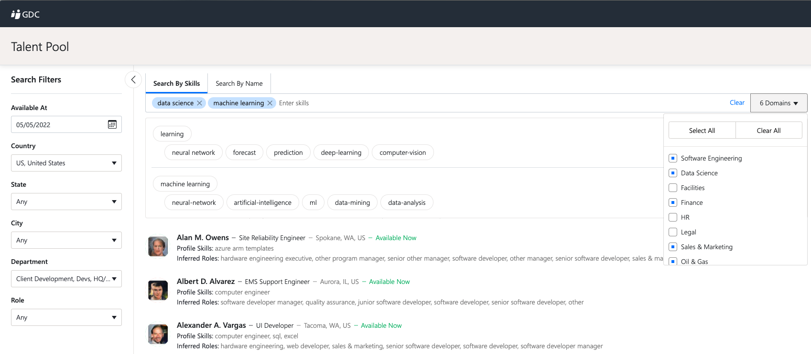
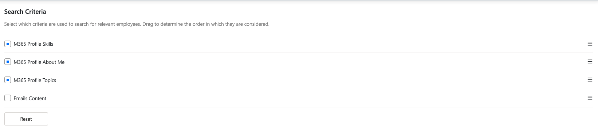
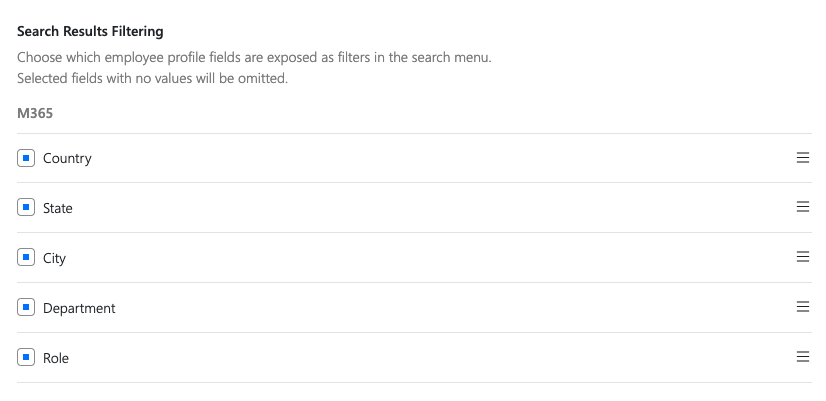
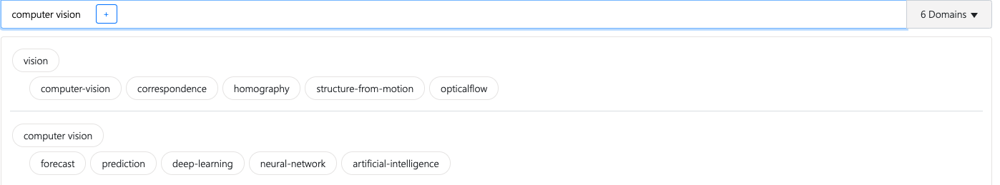
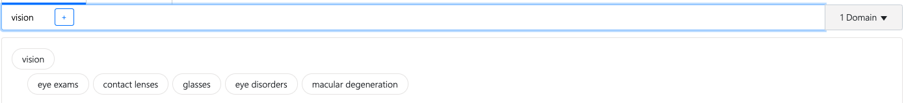
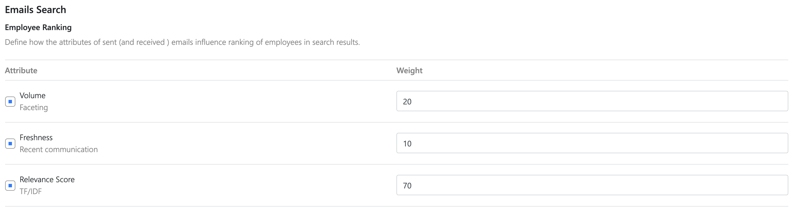
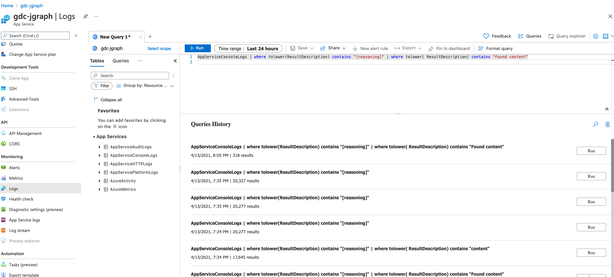

**The goal of the 'Skills Finder' app is to facilitate precision and flexible searches for employees with certain
skills**

------------

**Skills Finder Functionality**:

- search by skills + inferring possible skills
- search by name
- filtering by different criteria (location, department,state)
- sorting by relevance or availability
- user input query assistance by providing term suggestion for input query

The UI looks like the following:



The search configuration offers the user the possibility to select only specific fields for searches and also to
consider different search results ordering for send/received mail search (volume/relevance/freshness)

*Search criteria selection.*



*Search results filtering(faceting)*




------------

**Data representation in Azure Search**

We have 2 indexes that contain the searchable information. The ``employee_profiles`` index and the ``mails`` index.

The ``employee_profiles`` index has all the fields retrievable and searchable. The ``mails`` index has all the fields
searchable but not all _retrievable_ (the content field is not retrievable)

Please check the following link: [Employee_profile_schema_example.md](Employee_profile_schema_example.md)


------------
**Search functionality components**

- UI
- Search and skill inference engine
- Azure Search indexes

Skill search:

Once the user enters a list of search terms, app will automatically provide related terms to the query terms.


The related terms are dependent of the ``domains`` list entries that were selected. So if the user
selected ``software engineer,data science`` the related terms are related to those domains as it can be seen above.

If the user selects ``healthcare`` it will obtain the following terms



------------

**Query execution workflow (searches based on the _relevance_ of the information)**

When user presses search, the following information is being sent to the backend

```
searchTerms: List[String],
searchCriteria: EmployeeSearchCriteria = EmployeeSearchCriteria.SKILLS,
requiredAvailability: RequiredAvailability,
opportunityId: Long,
taxonomiesList: List[String],
sortBy: OrderingType,
filterValues: Map[FilterType, List[String]] 
```

This is necessary for orchestrating and selecting the fields for the search.

Assuming the following search criteria are being sent from ui: SKILLS,ABOUT ME, TOPICS,MAILS SENT,MAILS RECEIVED.

Since we have 5 criteria, 5*2 different searches will be sent to the azure indexes:
3*2 for the SKILLS,ABOUT_ME,TOPICS and the associated mapping fields in the azure employees index. That implies 3
searches being executed:

- 1 search on skills,skills_v2 fields
- 1 search on about_me,about_me_v2 fields
- 1 search on responsibilities,responsibilities_v2 fields

Plus another 3 searches:

- 1 search on the de_skills field
- 1 search on the de_about_me field
- 1 search on the de_responsibilities field

In total 6 searches on the employee index.

4 other searches are being sent on the mails index.

- 1 search on the content field
- 1 search on the de_content field
  (Observation: the user will be identified with information from the From field)

- 1 search on the content field
- 1 search on the de_content field
  (Observation: the user will be identified with the information from the ToRecipients field)

Explanation:

- with the first queries on From,Content fields basically we are interested in retrieving the users that sent the mails
  containing the searched word
- with the last queries on To,Content fields basically we are interested in all the users that received the mails
  containing the searched word

The ordering of the search results in the _mails_ index can be configured with respect to the following ordering rules:
relevance(information retrieved from the search score), freshness of the mails and the volume of the mails.

The business context that was considered for offering this type of ordering options is the following:
Assume that you search for the following keyword: "data science", and the only datasource of information is in the mail.
When searching for the keyword you can assume that the person that is present in the mail content can know something
about data science. However, that person can be the sender or the receiver of the mail. Also, that person can talk a lot
about data science (hence the volume option was provided), or it could recently start up sending mails about data
science (hence the freshness option)



------------

Further details about how search results sorting and paging works can be found in [SearchResultsSortingAndPaging.MD](./SearchResultsSortingAndPaging.MD)  
Details about the data enrichment process (which prepares the data upon which searches are performed) can be found in [enrichment_pipelines.md](./enrichment_pipelines.md)

------------

**Monitoring**

In order to understand the search mechanism a specific type of logs (streamed through Microsoft Analytics Service)
is provided.
In order to inspect the logs you have to perform the following steps:
- in Azure Portal navigate to your jgraph-service
- in the left panel there's a Monitoring/Logs icon (select it)
  

The ui should look like the following:



- run query:
```
 AppServiceConsoleLogs | where tolower(ResultDescription) contains "[reasoning]" 
```

You can also grep the search results:
```
AppServiceConsoleLogs | where tolower(ResultDescription) contains "[reasoning]" | where tolower( ResultDescription) contains "data"
```

