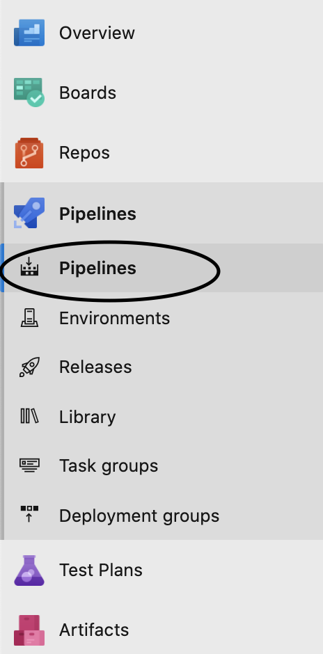
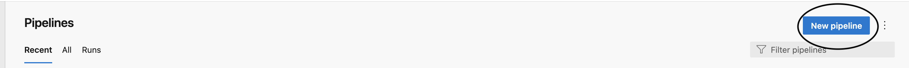
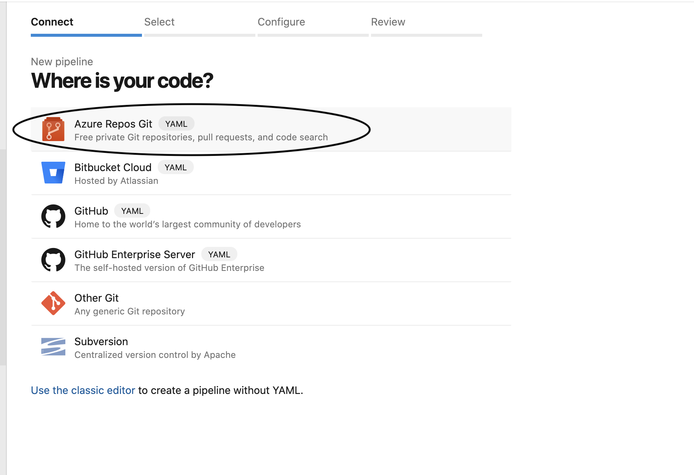
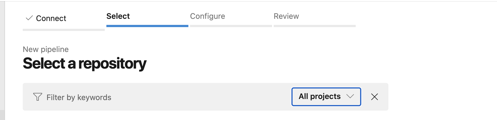
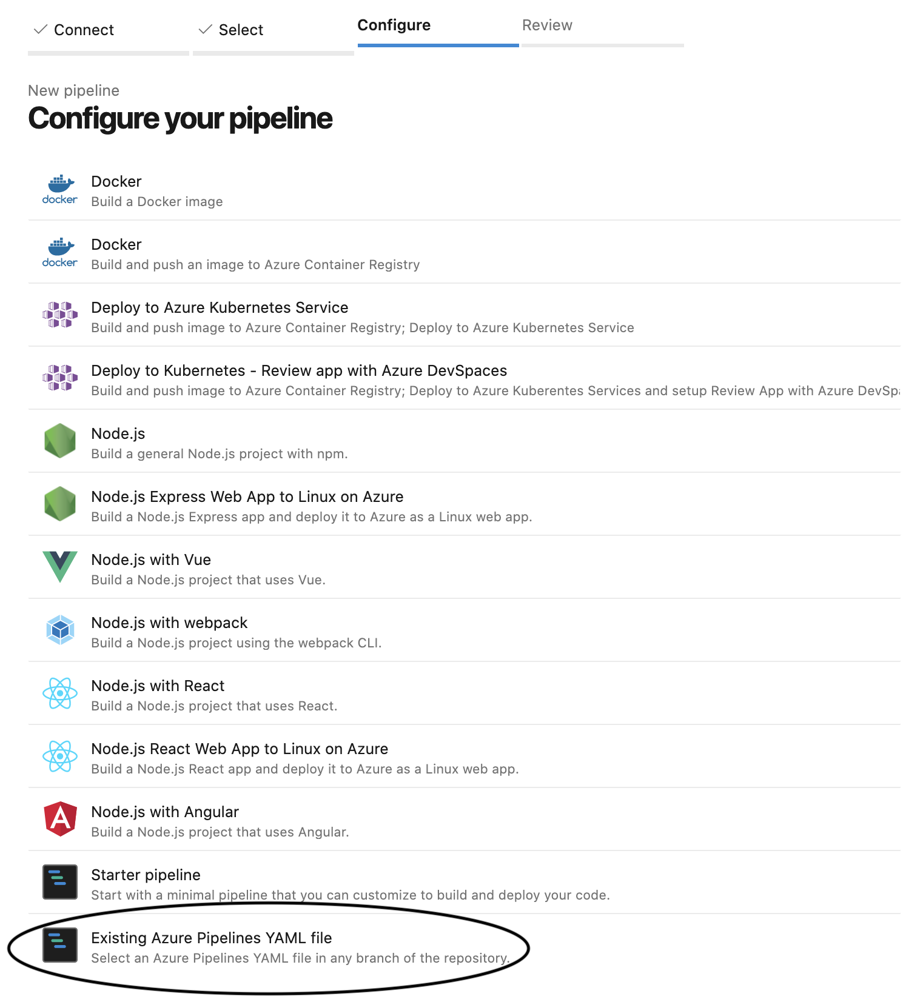
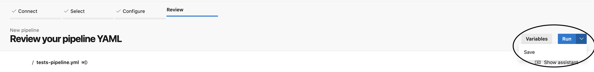
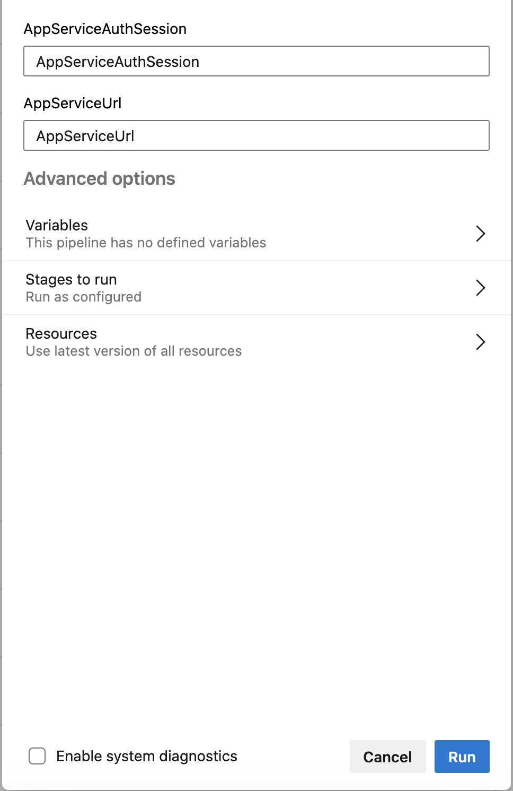
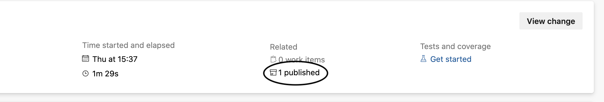
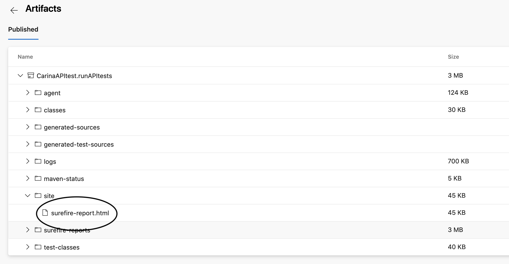

# Project Staffing test track

## About

The Project Staffing test track uses Carina Selenium to run a suite of API tests against an existing Project Staffing deployment.

### Relevant files:

- `api-tests/run_tests.sh`

Top-level script for the test track. This script runs the tests. Used in `tests-pipeline.yml` definition.

- `tests-pipeline.yml`

Test track pipeline definition.

 
## Defining the Azure DevOps tests pipeline

The file `tests-pipeline.yml` defines an Azure DevOps pipeline used to run the tests as part of a CI-track.

To create a new pipeline in Azure DevOps, you have to follow the next steps:

- in Azure DevOps menu, click on the `Pipeline` option

- select the `New pipeline` option

- connect to Azure Repository Git

- select the project you want the pipeline to run

- select the option to use an existing `.yaml` file that you want to run

- review and save the new created pipeline

## Running the pipeline

Before running the API tests, the authentication should be modified to allow anonymous authentication.
For this, please read the steps in the [API tests prerequisites](../api-tests/README.md#pre-requisites)

To run the pipeline, select it from the list of available pipelines in Azure DevOps, provide required arguments and hit `Run`

### Pipeline parameters

- `AppServiceUrl`

This is the URL you used to access the Project Staffing app in browser.

### Test results
At the end of a pipeline run, the report folder will be available as a *published artifact*

You can download the artifact to your local machine and open up the `surefire-report.html` report file, from the `target/suite` folder, in your favorite browser to access the report.

