# User Guide

The Project Staffing application provides users with the following features:

- [Searching for relevant employees](#searching-for-relevant-employees)
    - [By availability only](#searching-by-availability-only)
    - [By skills & availability](#searching-by-skills-and-availability)
    - [By name](#searching-by-name)
- [Getting relevant information about recommended employees](#getting-relevant-information-about-recommended-employees)
    - [Employee profile information](#employee-profile-information)
    - [Inferred information](#inferred-information)
- [Search results filtering and sorting](#search-results-filtering-and-sorting)
- [Search term autocomplete and related terms suggestions](#search-term-autocomplete-and-related-terms-suggestions)
- [Using search domains for skills inference and search results matching](#using-search-domains-for-skills-inference-and-search-results-matching)
- [Exporting search results](#exporting-search-results)
- [Defining teams](#defining-teams)
    - [Creating a team](#creating-a-team)
    - [Adding members to the team](#adding-members-to-the-team)
    - [Removing members from the team](#removing-members-from-the-team)
    - [Exporting team members](#exporting-team-members)
- [Application configuration](#application-configuration)
    - [Fine-tuning the search and search settings](#fine-tuning-the-search-and-search-settings)
        - [Data sources](#data-sources)
        - [Search filter settings](#search-filter-settings)
        - [Search criteria](#search-criteria)
        - [Email search settings](#email-search-settings)
- [Admin-only features](#admin-only-features)
    - [Ingestion mode switch](#ingestion-mode-switch)
    - [HR Data upload](#hr-data-upload)

## Searching for relevant employees

Users can search for employees best matching a provided list of search terms. The terms represent skills,
responsibilities, technologies, etc. that have been matched or inferred for each employee, based on the provided data 
sources.  
Besides the search terms, the users can also provide search filters to narrow down the results list (more details
about filters [below](#search-results-filtering-and-sorting)). Out of all the available filters, the employee availability 
(the date from which they are available to join a new project) is the only one that is always mandatory.  
Since multiple search terms and filters can be provided, for efficiency reasons, a search is not triggered whenever a 
term or filter is changed. Instead, to trigger a search, the user has to either press the "Search" button, or press
the "Enter" key while there aren't any pending search terms (if a new search term is currently being edited, the first
key press would simply add it to the terms list, while a second key press would be required to trigger the search).

An example of how a search is performed from the application UI is shown in the image below:

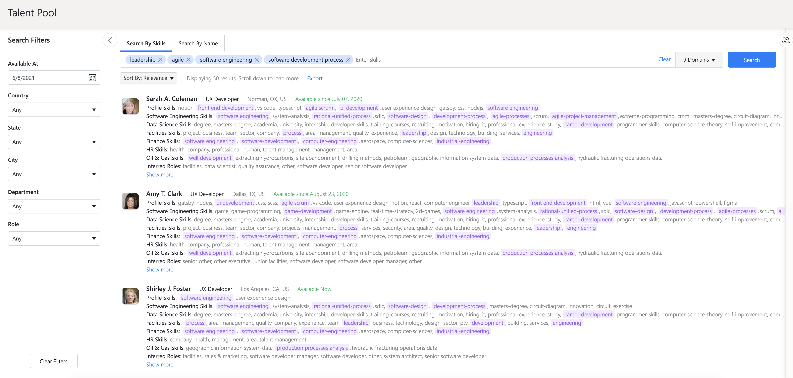

More details about how the search process works can be found [here](./searching_for_relevant_employees.md).

### Searching by availability only

The user can search for employees without providing any search terms, while setting only the availability filter. When 
clicking the "Available At" field in the filters section, a calendar view will appear. The user can select from there
the date starting from which recommended employees must be available.  
The employee availability is extracted from the [HR Data](./HR_Data.md). If this information is not explicitly defined
for a person, that employee is regarded as available effective immediately. Therefore, they are never filtered out
by the availability filter, regardless of its value.  
In the search results list it can be seen that all the employees have the availability date before or at the date set 
in the availability filter. 
Since no search terms are provided, the relevance of the search results is given by the availability. The results are 
sorted by availability in ascending order (the ones available effective immediately first), and for identical dates,
the results are also sorted alphabetically by name.

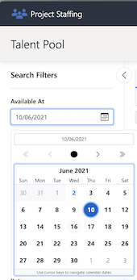

### Searching by skills and availability

The user can search for relevant employees and also use the availability filter at the same time. In the recommendations
list it can be seen that all the employees have the availability date before or at the date set in the availability 
filter. This is easier to see when sorting the recommendations by availability.

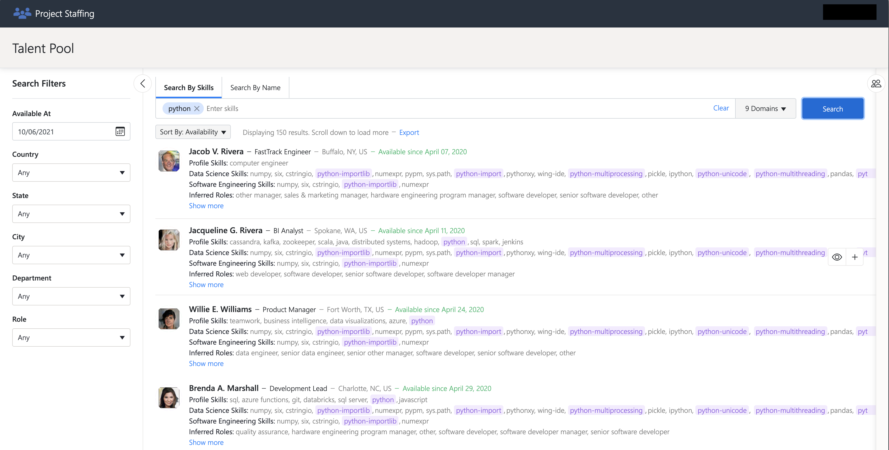

### Searching by name

Aside from searching for employees that have a specific skill set, the application also has the option of searching by
name. The name doesn't have to be complete. The user can search by first name, middle name, last name, full name etc.

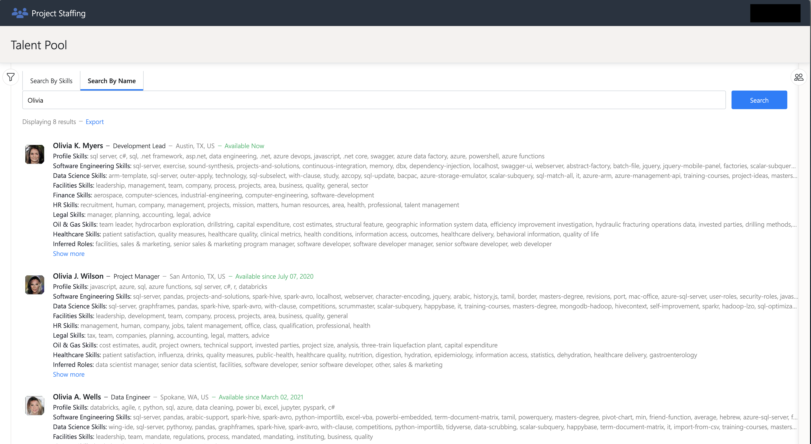

## Getting relevant information about recommended employees

### Employee profile information

To see more information about an employee from the employee recommendation list or from the team list: 
- hover over a specific employee in one of these lists
- a button with an eye symbol on it will appear on the right side of the employee record
- click the button

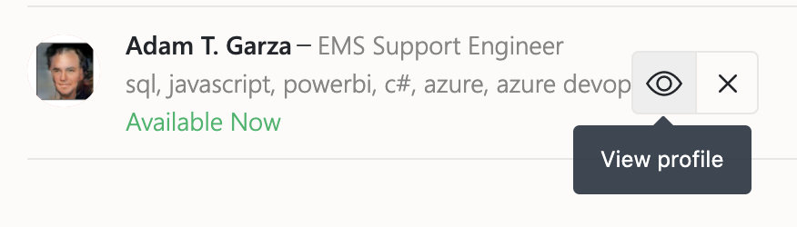

A pop-up containing the employee profile will appear, as shown in the image below:

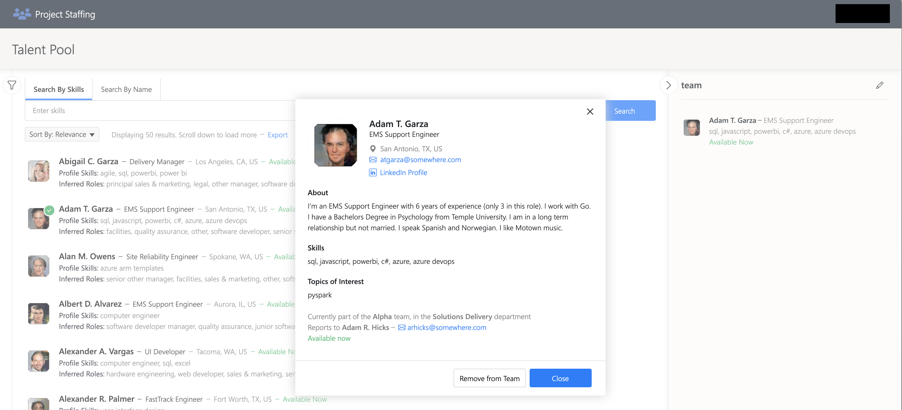

### Inferred information

By processing the employee profile and email data together with known term correlations from various supported domains, 
the employee profiles are [enriched](./enrichment_pipelines.md) with inferred data.  
This allows users of the application to find not only employees which explicitly posses a set of skills or interests, 
but also the ones which are likely to possess them, or the ones that have the potential to easily learn the desired 
skills, because they already have a wide range of related abilities.   
The inferred skills and interests are derived from specific domains (taxonomies) and are grouped and displayed as such.  
Aside from this, the application also infers which roles are well suited for a recommended person.  
Below is an example of a list with 3 employees where the inferred roles are underlined. 

## Search results filtering and sorting

According to the [search filter settings](#search-filter-settings) the user can use filters in order to narrow down the
search to the employees that match best the wanted characteristics. The search filters can be seen after clicking the 
icon to the left of the search bar, as shown in the image below.

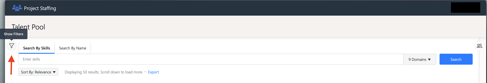

For each filter the application will present the total list of value options, as shown in the example below.

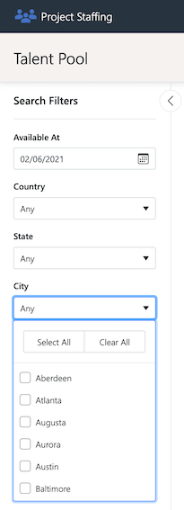 

The search results can be sorted by relevance, in this case the [search criteria](#search-criteria) and
[email search settings](#email-search-settings) dictate the exact order of the recommendations.  
The other sorting option is by availability. This means that not the employees that match the query best are shown first, 
but in ascending order of the dates from which they are available to join a new project. The ones that don't have an
explicit availability date defined (regarded as available effective immediately) are displayed first.  
The sorting option is located right below the search bar, as shown in the image below.
 
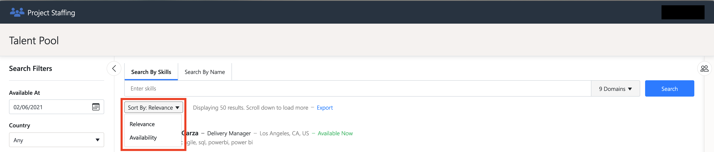 

## Search term autocomplete and related terms suggestions

As the user begins writing search terms in the search bar, the application displays multiple suggestions of known
search terms, prefixed with the string the user wrote so far.  
This happens after a short delay from the last keystroke, until the current term is submitted by pressing "Enter".
For certain suggested words, the application can also display a list of related term suggestions, as shown in 
the image below.

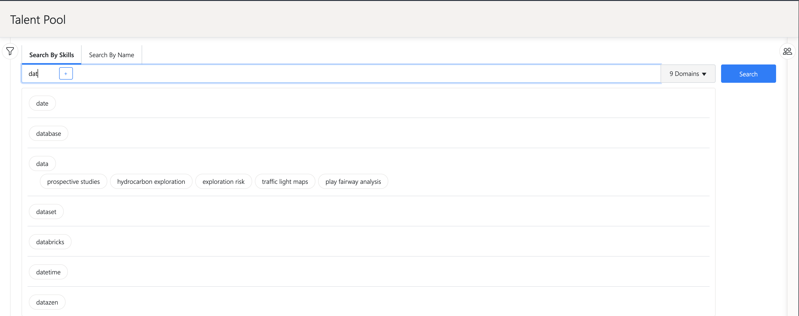

## Using search domains for skills inference and search results matching

The application supports searching by multiple domains e.g., Software Engineering, Data Science, Healthcare, Oil & Gas etc.
The search operation has the option of enabling only the domains that are of interest for the user. The inferred skills
differ depending on which domains are enabled.

For example if a search is made using the term `sensor` and having the 'Healthcare' domain enabled the recommendations
are as follows:

 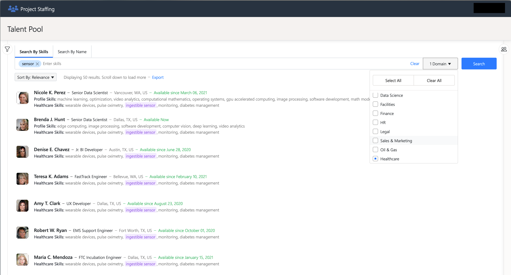
 
If we make the same search but this time with the 'Software Engineering' domain enabled, we will see that the inferred 
skills will differ.

 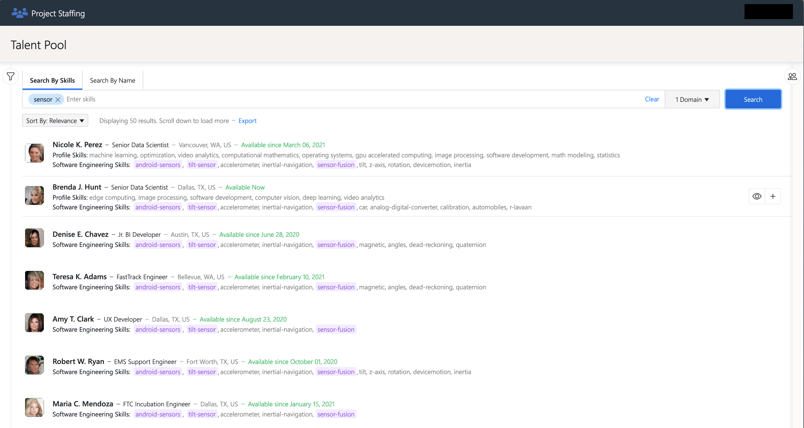

## Exporting search results

The results of a search operation can be exported into a file with excel or cvs format. In order to do this, 
the user has to click on the highlighted `Export` word right under the search bar, as presented in the image below.
After that a pop-up will appear where the user can configure the file name, format and number of results to export.
Only the results pages retrieved so far will be exported.

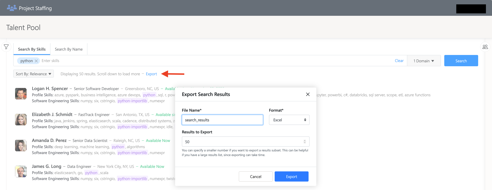

## Defining teams

In order to view the team features click the icon to the right of the Search button, as shown in the image below.

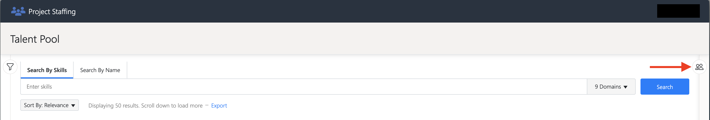

### Creating a team

To create a new team, click the 'Create team' button, a pop-up will appear where the user can add the name
and description of the team, as shown in the image below.

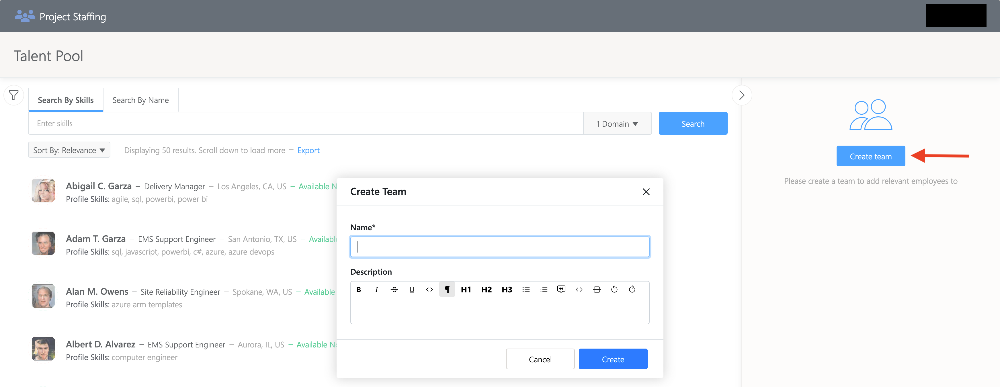

### Adding members to the team

To add an employee to the team, hover over the wanted employee from the list of employees. A plus button will appear
on the right side of the employee record. Click the plus button.

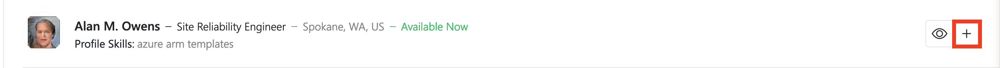

### Removing members from the team

To remove an employee from the team, hover over the wanted employee from the list of team members. A button marked 
with `x` will appear on the right side of the employee description. Click the button.

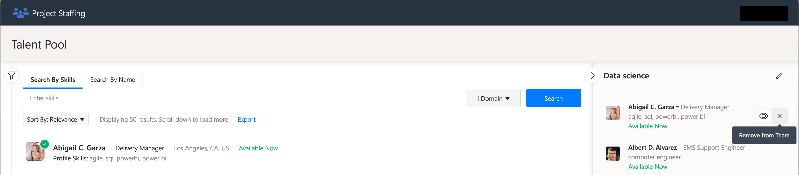

### Exporting team members

The team members can be exported into an excel or csv file. In order to do this, the user has to click the Export button
at the bottom of the team members list. A pop-up will appear from where the name and format of the file can be 
configured, as shown in the image below.

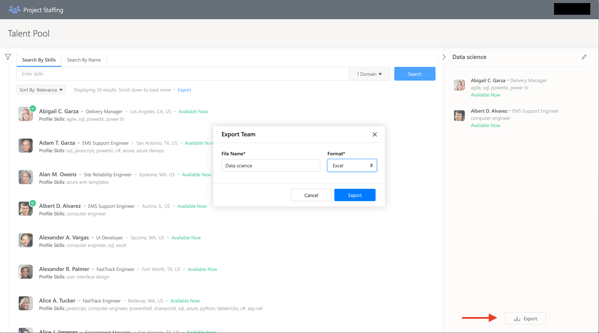

## Application configuration

### Fine-tuning the search and search settings

The search results can be tuned using the following configurations from the Settings screen.

#### Data sources

The data processed and used by the application comes from two main sources, Microsoft Office 365 (M365) and HR Data. The
latter represents relevant employee data that doesn't reside in Microsoft M365 and usually is owned by the HR department
of a company.

Microsoft M365 is mandatory for the application to function, but HR Data is optional.

The application has the option of making the HR Data mandatory. In that case, employees that only appear in the
Microsoft M365 and don't appear in the HR Data, will be ignored.

Also, there is an option to set the priority of the data sources, by changing their order.  
This setting impacts two aspects of the application:

- which data source is used to populate a field of the employee profile (as shown to the end user of the application),
  when that type of information is available in both data sources. Specifically, the field is populated using the value
  from the primary data source. Only if, for a given employee, this information is missing in the primary source, then
  the value is retrieved from the secondary source
- which fields are available _by default_ for search results filtering. Specifically, the filtering fields from the
  primary data source are enabled by default, while the ones from the secondary source are disabled. These defaults can
  then be changed based on the user's needs.

The image below presents this feature in the application UI.

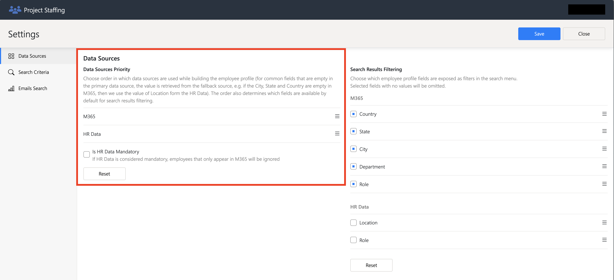

#### Search filter settings

The search filtering settings are used to select which filters are going to be activated for each data source.  
For example if the user is interested only in filtering using Microsoft M365 fields, then the HR Data filters can be
deactivated, as presented in the image below. However, the user may mix filters from both sources if desired.  
If two filter fields from the two sources have the same name, then the one from the HR Data source will be named
"HR Data <field name>" when shown in the search filtering menu, to avoid confusions.

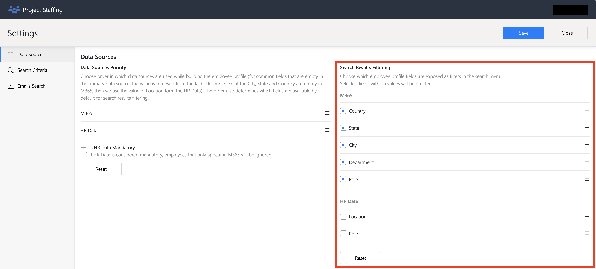

#### Search criteria

The search criteria determines which parts of the processed data will be queried, when performing search operations.
Also, the order of the criteria determines the order in which the employee recommendations will show up in the search
results.

For example, if we take the configuration from the image below, the search operation will query only the employees
skills data and emails data. The data extracted from profiles' "About Me" description and from topics of interest will
be ignored. Also, the results that are found by querying the "Skills" data will be the first shown to the user, after 
which the results found from querying the emails content will be shown.

In the Search Settings section there is an option to also use the content of the received mails, in the search
operation. Otherwise, only the content of the sent emails is used.

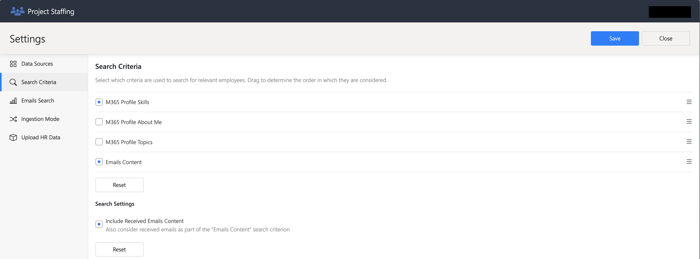

#### Email search settings

There are two types of email search settings: __employee ranking__ and __email filters__.

__Employee ranking__ settings offer 3 attributes for configuring the order in which the employee recommendations will be 
shown in the search results. Each attribute has a weight attached, which determines its importance in the recommended 
employees order. Let's take the example from the image below.  
The attribute with the highest weight is the 'Relevance Score'. That means that the employees that have the email 
documents in which the search terms are most relevant, will be shown higher in the list of recommended employees.  
The second most important attribute is the 'Volume'. That means that the employees that have the most emails that are 
relevant to the search, will be shown next in the list of recommended employees.  
The least important attribute is the 'Freshness'. This means that it doesn't count that much if the email messages that
are relevant to the search where sent recently or not. 

__Email filters__ settings are used to determine which emails are excluded/included in the dataset of emails that are
queried when a search is performed. The 3 options are:
- 'Process emails newer than' - the user has to set a date and only the emails messages sent starting from that date, will
be queried when a search is performed
- 'Include emails from domains' - the user will give a list of domains, and only the emails that are from addresses in 
that specific domain, will be queried when a search is performed
- 'Exclude emails from domains' - the user will give a list of domains, and the emails that are from addresses in 
that specific domain, will be ignored when a search is performed

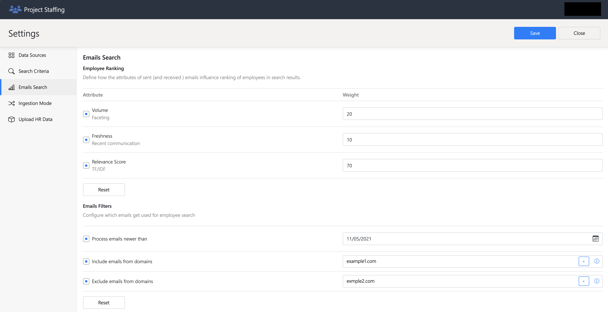

## Admin-only features

There are application features that are restricted only to administrators of the application. Administrators are the
users of the application that are members of a security group set as the administrators group at installation time.

### Ingestion mode switch

The ingestion mode of the application determines the source of the data that is processed and shown to the user.  
In simulate-mode, the data processed and shown in the UI is data generated for the sole purpose of demonstrating how the
application works.  
In sample-mode, the application can be tested with a sample of production data. The administrator can provide a limited
amount of company data, for the purpose of testing how the application works.  
In production-mode the application will extract all the necessary company data (emails, employee profiles) from
Microsoft M365, process it and use it for employee search. All raw email data is considered private and 
sensitive, and is therefore never made accessible to the app service (and implicitly to users).  
The ingestion mode can be changed from the Settings screen as shown in the image below.

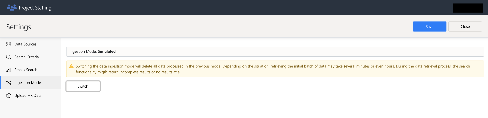

### HR Data upload

HR Data is a data source which is meant to be complementary to the data obtained from M365 (Graph Data Connect).  
It is a custom data format which can be derived from the systems used by the HR department to store data about the 
company's employees. Since this information is usually owned by the HR department, it is called "HR Data".  
The application allows admins to upload a `.csv` file containing the latest version of such data, via the Settings
screen, in the 'Upload HRData' section, as shown in the image below.  
More details about the HR Data schema and usage can be found in the [HR Data documentation](./HR_Data.md)

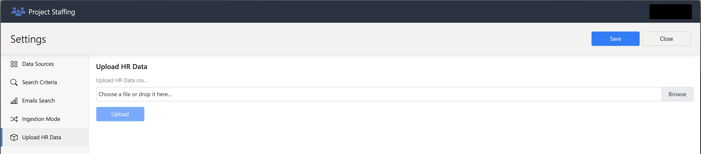

