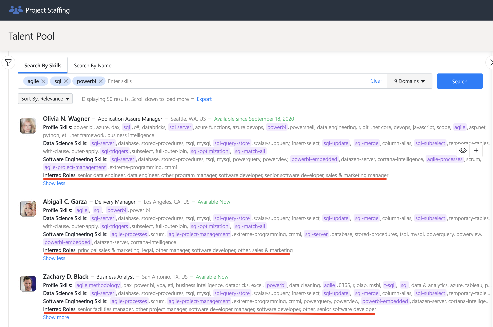

# User Guide

The Project Staffing application provides users with the following features:

- [Searching for relevant employees](#searching-for-relevant-employees)
    - [Searching by availability only](#searching-by-availability-only)
    - [Searching by skills & availability](#searching-by-skills-and-availability)
    - [Searching by name](#searching by name)
- [Getting relevant information about recommended employees](#getting-relevant-information-about-recommended-employees)
    - [Employee profile information](#employee-profile-information)
    - [Inferred information](#inferred-information)
- [Search results filtering and sorting](#search-results-filtering-and-sorting)
- [Search term autocomplete and related terms suggestions](#search-term-autocomplete-and-related-terms-suggestions)
- [Using search domains for skills inference and search results matching](#using-search-domains-for-skills-inference-and-search-results-matching)
- [Exporting search results](#exporting-search-results)
- [Defining teams](#defining-teams)
    - [Creating a team](#creating-a-team)
    - [Adding members to the team](#adding-members-to-the-team)
    - [Removing members from the team](#removing-members-from-the-team)
    - [Exporting team members](#exporting-team-members)
- [Application configuration](#application-configuration)
    - [Fine-tuning the search and search settings](#fine-tuning-the-search-and-search-settings)
        - [Data sources](#data-sources)
        - [Search filter settings](#search-filter-settings)
        - [Search criteria](#search-criteria)
        - [Email search settings](#email-search-settings)
- [Admin-only features](#admin-only-features)
    - [Ingestion mode switch](#ingestion-mode-switch)
    - [HR Data upload](#hr-data-upload)

## Searching for relevant employees

Users can search for employees best matching the provided list of search terms. The terms represent skills,
responsibilities, technologies, etc. which the employees are familiar with. An example of such a search is shown in the
image below.

### Searching by availability only

The user can search for employees only using the availability filter, without giving any search terms. When clicking 
the availability date in the filters section a calendar view will appear, the user can select from there which is the
start availability date. In the recommendations list it can be seen that all the employees have the availability date 
before or at the date set in the availability filter.

### Searching by skills and availability

The user can search for relevant employees and also use the availability filter at the same time. In the recomendations
list  it can be seen that all the employees have the availability date before or at the date set in the availability 
filter. This is easier to see when sorting the recommendations by availability.

### Searching by name

Besides searching for employees that have a specific skill set, the application also has the option of searching by
name. The name doesn't have to be complete, the user can search only by first/last name and a list of employees that have the 
given first/last name, will be shown, as presented in the example below.

## Getting relevant information about recommended employees

### Employee profile information

In order to see more information regarding an employee from the employee recommendation list or from the team list, 
hover over a specific employee, a plus button with an eye sign on it will appear in the right side of the employee 
description, click the button. 

A pop-up with all the user info will appear, as shown in the image below.

### Inferred information

As a result of processing the email messages of every employee the application generates a list of inferred roles for 
each employee, these are roles/skills that the employee might not display openly in their profile but from the content 
of the emails the application was able to find out that he/she possesses them. Below is an example of a list with 3 
employees where the inferred roles are underlined. 

## Search results filtering and sorting

According to the [search filter settings](#search-filter-settings) the user can use filters in order to narrow down the
search to the employees that match best the wanted characteristics. The search filters can be seen after clicking the 
icon to the left of the search bar, as shown in the image below.

For each filter the application will present the total list of value options, as shown in the example below.

 

The search results can be sorted by relevance, in this case the [search criteria](#search-criteria) and
[email search settings](#email-search-settings) dictate the exact order of the recommendations. The other sorting option
is by availability, this means that not the employees that match the query best are shown first, but the employees
that are available the first. The sorting option is located right below the search bar, as shown in the image below.
 
 

## Search term autocomplete and related terms suggestions

When the user writes search terms in the search bar, the application shows multiple options of what the user might want
to write and for some autocomplete variants the application can show a list of related terms suggestions, as shown in 
the image below.

## Using search domains for skills inference and search results matching

The application supports searching for multiple domains e.g., Software Engineering, Healthcare, Oil & Gas etc.
The search operation has the option of enabling only the domains that are of interest for the user. The inferred skills
differ depending on which domains are enabled.

For example if a search is made using the term `sensor` and having the 'Healthcare' domain enabled the recommendations
are as follows:

 
 
If we make the same search but this time with the 'Software Engineering' domain enabled we will see that the inferred 
skills will differ.

 

## Exporting search results

The results of a search operation can be exported into a file with excel or cvs format. In order to do this, 
the user has to click on the highlighted `Export` word right under the search bar, as presented in the image below.
After that a pop-up will appear where the user can configure the file name, format and number of results to export.

## Defining teams

In order to view the team features click the icon to the right of the Search button, as shown in the image below.

### Creating a team

To create a new team, click the 'Create team' button, a pop-up will appear where the user can add the name
and description of the team, as shown in the image below.

### Adding members to the team

To add an employee to the team hover over the wanted employee from the list of employees, a plus button will appear
in the right side of the employee description, click the plus button.

### Removing members from the team

To remove an employee from the team hover over the wanted employee from the list of team members, a button maked with `x`
will appear in the right side of the employee description, click the button.

### Exporting team members

The team members can be exported into an excel or csv file. In order to do this, the user has to click the Export button
at the bottom of the team mebers list, a pop-up will appear from where the name and format of the file can be 
configured, as shown in the image below.

## Application configuration

### Fine-tuning the search and search settings

The search results can be tuned using the following configurations from the Settings screen.

#### Data sources

The data processed and used by the application comes from two main sources, Microsoft Office 365 (M365) and HR Data. The
latter represents relevant employee data that doesn't reside in Microsoft M365 and usually is owned by the HR department
of a company.

Microsoft M365 is mandatory in order for the application to function, but HR Data is optional.

The application has the option of making the HR Data mandatory. In that case, employees that only appear in the
Microsoft M365 and don't appear in the HR Data, will be ignored.

Also, there is an option to set the priority of the data sources, by changing their order.  
This setting impacts two aspects of the application:

- which data source is used to populate a field of the employee profile (as shown to the end user of the application),
  when that type of information is available in both data sources. Specifically, the field is populated using the value
  from the primary data source. Only if, for a given employee, this information is missing in the primary source, then
  the value is retrieved from the secondary source
- which fields are available by default for search results filtering. Specifically, the filtering fields from the
  primary data source are enabled by default, while the ones from the secondary source are disabled.

The image below presents this feature in the application UI.

#### Search filter settings

The search filtering settings are used to select which filters are going to be activated for each data source.  
For example if the user is interested only in filtering using Microsoft M365 fields, then the HR Data filters can be
deactivated, as presented in the image below. However, the user may mix filters from both sources if desired.  
If two filter fields from the two sources have the same name, then the one from the HR Data source will be named
"HR Data <field name>" when shown in the search filtering menu, to avoid confusions.

#### Search criteria

The search criteria determines which parts of the processed data will be queried, when performing search operations.
Also, the order of the criteria determines the order in which the employee recommendations will show up in the search
results.

For example, if we take the configuration from the image below, the search operation will query only the employees
skills data and emails data. The data extracted from "About Me" descriptions and from profile topics will be ignored.
Also, the results that are found by querying the "Skills" data will be the first shown the user, after them the results
found from querying the emails content will be shown.

In the Search Settings section there is an option to also use the content of the received mails, in the search
operation. Otherwise, only the content of the sent emails is used.

#### Email search settings

There are two types of email search settings: __employee ranking__ and __email filters__.

__Employee ranking__ settings offer 3 attributes for configuring the order in which the employee recommendations will be 
shown in the search results. Each attribute has a weight attached, which determines its importance in the recommended 
employees order. Let's take the example from the image below. The attribute with the highest weight
is the 'Relevance Score', that means that the employees that have the email documents in which the search terms are
most relevant, will be shown higher in the list of recommended employees. The second most important attribute is the 
'Volume', that means that the employees that have the most emails that are relevant to the search, will be shown next in
the list of recommended employees. The least important attribute is the 'Freshness', this means that it doesn't count
that much if the email messages that are relevant to the search where sent recently or not. 

__Email filters__ settings are used to determine which emails are excluded/included in the dataset of emails that are
queried when a search is performed. The 3 options are:
- 'Process emails newer than', the user has to set a date and only the emails messeges sent starting from that date, will
be queried when a search is performed
- 'Include emails from domains', the user will give a list of domains, and only the emails that are from employees in 
that specific domain, will be queried when a search is performed
- 'Exclude emails from domains', the user will give a list of domains, and the emails that are from employees in 
that specific domain, will be ignored when a search is performed

## Admin-only features

There are application features that are restricted only to administrators of the application. Administrators are the
users of the application that are members of a security group set as the administrators group at installation time.

### Ingestion mode switch

The ingestion mode of the application determines the source of the data that is processed and shown to the user.  
In simulate-mode, the data processed and shown in the UI is data generated for the sole purpose of demonstrating how the
application works.  
In sample-mode, the application can be tested with a sample of production data. The administrator can provide a limited
amount of company data, for the purpose of testing how the application works.  
In production-mode the application will extract all the necessary company data (emails, employee profiles) from
Microsoft M365, process it and show it to the user in the application. The ingestion mode can be changed from the
Settings screen as shown in the image below.

### HR Data upload

If relevant information regarding company employees can't be found in the Microsoft M365, that data can be provided in
a `.csv` file (with a certain format) and uploaded in the application portal. It's called 'HR Data' because usually this
kind of data is stored/owned by the HR department of a company. This feature resides in the Settings screen, 'Upload HR
Data' section as shown in the image below.

