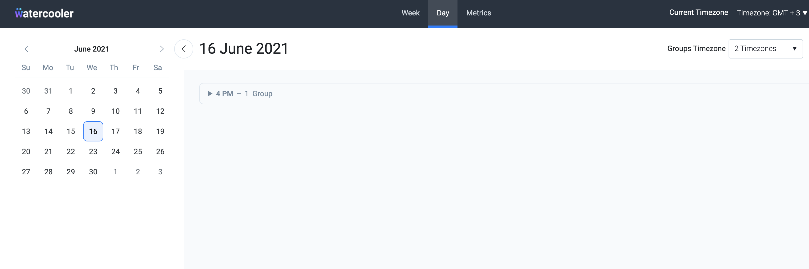

## Watercooler application

The Watercooler application is a Microsoft Graph Data Connect based solution which allows organizations to schedule
online meeting groups with the intention of helping employees connect better. The application ingests data from
Microsoft Graph Data Connect using Azure Data Factory (ADF)
pipelines.




### Deployment and installation from source
In order to deploy from source please follow the steps from the [./deployment/README.MD](./deployment/README.MD)

### Setting up the application

The Watercooler application can be run locally for development purposes, but it needs to make use of some
services/resources from an existing full development deployment from Azure.

> Warning: If you are using Windows to build the project, please make sure to use a code editor which does not
> automatically alter the line endings from files, especially the bash scripts used for the project deployment

Here is an overview of the steps required to build the application locally, perform a full development deployment in
Azure and then run the application locally while using the resources from the Azure development deployment:

1. make sure all prerequisites for building the project are fulfilled, by
   following [Prerequisites section](#prerequisites)
   
2. build the Watercooler App Service jar and all the ADB jars, by
   following [Building all the project jars at once section](#building-all-the-project-jars-at-once)
   
3. setting up the python scripts and environment [./pywc/README.md](./pywc/README.md)
   
4. prepare the zip with all the resulting artifacts (required for deployment), by
   following [./deployment/README.MD#building-the-artifacts-zip section](./deployment/README.MD#building-the-artifacts-zip)
   
5. to perform a fresh full deployment in Azure, please follow the steps described in the deployment
   script's [readme file (./deployment/azure/README.md)](./deployment/azure/README.md)
   and in the [deployment overview document (docs/WatercoolerDeploymentOverview.MD)](docs/WatercoolerDeploymentOverview.MD)
6. to run the application in Azure, please follow [./jwc/core/README.MD#running-the-application-in-azure](./jwc/core/README.MD#running-the-application-in-azure)
7. to run the application locally, please follow [./jwc/core/README.MD#running-the-application-locally](./jwc/core/README.MD#running-the-application-locally)

#### Prerequisites

1. Install JDK 1.8
    - for example, to install the OpenJDK, follow the appropriate installation steps
      from https://openjdk.java.net/install/
      or https://github.com/AdoptOpenJDK/openjdk8-upstream-binaries/releases/tag/jdk8u292-b10 (take the latest zip build), or search online for a more detailed installation guide, matching your
      OS
        - for Oracle jdk more help can be found here: https://java.com/en/download/help/download_options.html
        - for Open jdk more help can be found here: https://openjdk.java.net/install/
    - required to build, develop and run the project's JVM based components (the AppService code and ADB scala spark
      jobs)
    - set $JAVA_HOME variable with the location of the JDK installation path (Observation: for windows set JAVA_HOME in the System Environment Variables; also add %JAVA_HOME%\bin to PATH)

2. Install latest Maven 3 version
    - download the latest maven 3 binary distribution archive from https://maven.apache.org/download.cgi
    - installation steps: https://maven.apache.org/install.html
    - required to build, develop and run the project's JVM based components (the AppService code and ADB scala spark
      jobs)
3. Install docker
    - follow the installation steps specific to your OS from https://docs.docker.com/get-docker/
    - required for building and publishing the AppService docker image, and for running tests locally (the tests use
      database docker containers)
4. Install nodejs 14.x, npm and yarn 1.22
    - required to build and run the application's UI
    - for details please follow the [UI setup steps](./jwc/ui/README.md)
5. Install Python 3 and related environment
    - the python environment setup will differ if you plan to simply build the pygraph utils wheel locally or to do
      development and run pyspark jobs locally
    - please follow the appropriate [python environment setup steps](./pywc/README.md#setup-guide)

#### Building all the project jars at once

To build the Watercooler App Service jar and all the ADB jars in one go, run the following commands:

```shell script
cd ./jwc
mvn clean install --DskipTests
```

This approach also runs the unit tests. To build the jars without running the tests,
run `mvn clean install --DskipTests`  
The resulting jars can be found in the `target` folder of the corresponding module

### Setting up the python scripts

There is no need to build any wheel,however for setting up the local dev environment please
check [readme file](./pywc/README.md)

### Building the artifacts zip

After all the project artifacts were build as described above, from the Watercooler root folder
run ` cd ./bin` and after that `./prepare_artifacts.sh`  
After this is complete, there will be a `build.tar.gz` file that you'll have to rename to
 `watercooler-<release_version>.tar.gz` (e.g. watercooler-x.y.z)  
Compress this folder into a zip archive (e.g. watercooler-x.y.z.tar.gz).  
If desired, upload the archive to the project deliverables AZBS storage account, to make it available for download and
deployment

#### Development

Please follow the following links to learn more details about the project [architecture](#architectural-components),
[components](./deployment/README.MD#project-components)

In case changes are done to individual project components (the Watercooler App Service, ADF pipelines, ADB libraries
etc), these components can can either be:

- built individually, as described in the subsections of
  the [local build documentation](./deployment/README.MD#building-from-source-using-the-local-development-environment),
  and [deployed individually](./deployment/README.MD#deploying-individual-components)
- built together with the entire project (either locally as described above or via
  a [build pipeline](./docs/build_pipeline.md))
  and deployed as part of
  a [full application update](./deployment/README.MD#updating-app-release-version-over-existing-deployment)

After the deployment, changes to the App Service usually only require restarting the service.  
Changes to ADF pipelines or ADB libraries require running the impacted ADF pipelines for the changes to take effect in
the Watercooler app service.  
If running the ADF pipelines resulted in changes in Azure SQL database, and you want to see the latest changes in the
Watercooler running locally, then the latest version of the data from Azure SQL database needs to be exported and
written to the local database. (TODO does this make sense?)

> Note: For developing the application, only macOS/Linux based systems were used.  
> Bash (and Python 3) was used for scripting and deployment.  
> There has been no testing on Windows, nor deployments from PowerShell.

### Architectural components

- The [ADF pipelines](docs/AzureDataFactory.MD) process the data from several sources using mainly Azure Databricks (
  ADB)
  jobs written either in scala or python. The pipelines are orchestrated
  by [ADF triggers](docs/ADF_trigger_creation_policy.md).

- The resulting data is written in Azure SQL database. Intermediate data is also written in AZBS.

- Sensitive data is stored in Azure KeyVault.

- Application logs and ADB jobs logs are also sent to Azure Log Analytics.

- The application itself is an Azure App Service.

### Data sources

The following data sources are used:

1. Microsoft 365 User profiles
    - data about employees retrieved using Microsoft Graph Data Connect
2. Microsoft 365 Mailbox
    - data about users mailbox Microsoft Graph Data Connect (in order to retrieve the user timezone)
3. Microsoft 365 Events
    - calendar events Microsoft Graph Data Connect

The data from the above sources is retrieved and processed in batch by the ADF pipelines. Besides these sources, the
profile picture of each individual employee is retrieved using Microsoft Graph API by the employee profiles ADF
pipeline.

### Alphabetic Documentation index

[ADB python scripts/PySpark jobs](./pywc/README.md)  
[ADB scala spark jobs](docs/ADBScalaPythonJobsParameters.MD)  
[ADF pipelines](./docs/AzureDataFactory.MD)  
[ADF triggers](./docs/ADF_trigger_creation_policy.md)  
[Admin permissions](./docs/AdminPermissions.MD)  
[Building the project locally](./deployment/README.MD#building-from-source-using-the-local-development-environment)  
[Building the project via the build pipeline](./docs/build_pipeline.md)  
[CI track](./docs/build_pipeline.md)  
[Components](./deployment/README.MD#project-components)   
[Deployment](./deployment/README.MD#deployment)  
[Deployment process details](docs/WatercoolerDeploymentOverview.MD)  
[Deployment script](./deployment/azure/README.md)  
[Employee profile Azure Search schema](./docs/Employee_profile_schema_example.md)  
[Full deployment](docs/WatercoolerDeploymentOverview.MD)  
[Production mode preconditions](./docs/AdminPermissions.MD)   
[Releasing a new version](./jwc/README.md)  
[Running the application](./jwc/core/README.MD)   
[Test track](./docs/test_track.md)  
[Testing locally](./jwc/core/README.MD#running-the-tests-locally)  
[UI](./jwc/ui/README.md)  