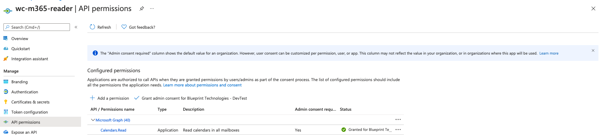
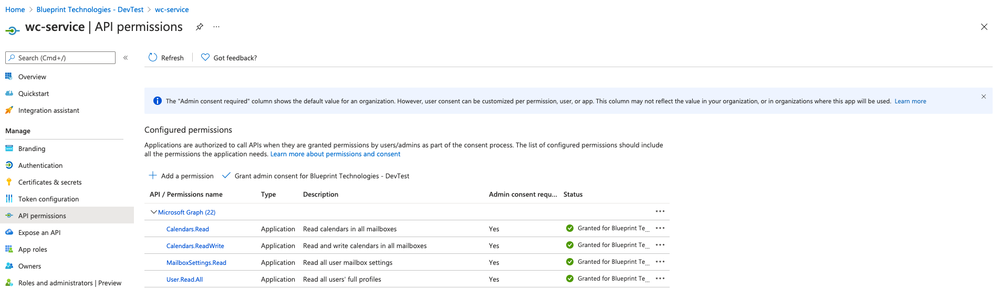
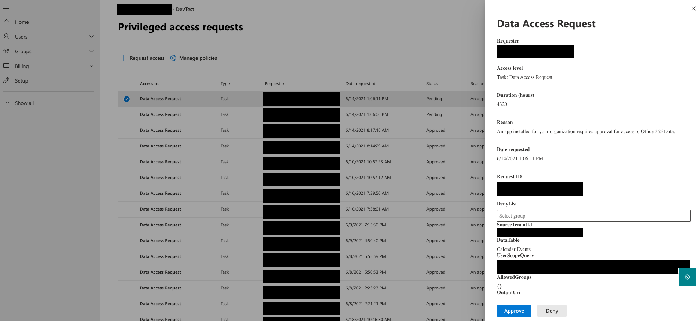
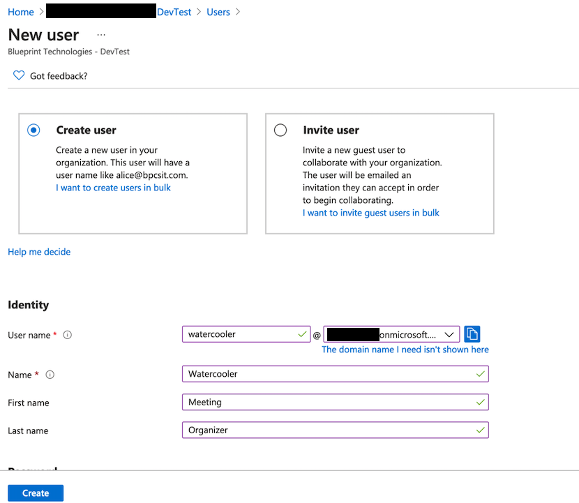
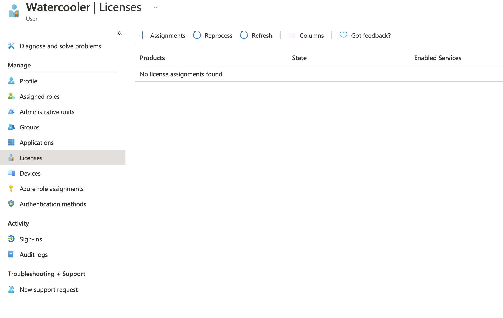
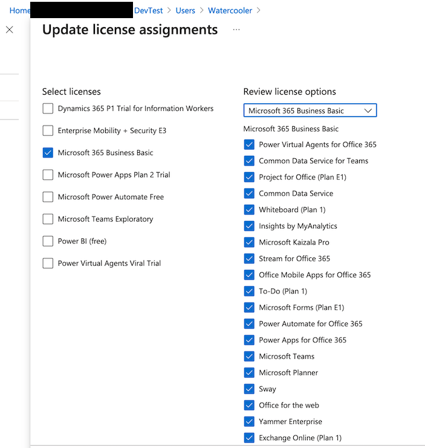

###Running Watercooler in production mode

In order to run the application in production mode there are 4 steps that have to be made:
1. The `wc-service` app registrations (service principals) need admin consent from a user with `Global administrator` role.  
   The `wc-m365-reader` service principal is used by the ADF pipelines for copying the emails, user profiles and manager information that is being processed.  
   These steps need to be performed before the ADF pipelines get started ,
   preferably, right after the deployment script created these app registrations.  
   The following images show exactly how this can be done from the Azure portal.

    
    

2. Make sure that you are an owner of the "wc-m365-reader" service principal.  
   You won't be able to perform the next step if you are not an owner of the `wc-m365-reader` service principal.  
   This can be checked from the Azure Portal: `App Registrations` -> `wc-m365-reader` -> `Owners`.

3. When the Azure Data Factory (ADF) pipelines  will be started (pipelines that will copy the information regarding user calendar dara,mailbox settings and  user profiles to Azure Blob Storage),  
   a Data Access Request will be generated in the [Azure Admin Portal](https://portal.office.com/adminportal/home?#/Settings/PrivilegedAccess).  
   The Data Access Requests have to be approved by a user with `Global administrator` role, and that is also an owner of the "wc-m365-reader" service principal.  
   Until this is done, the ADF pipelines will be in a waiting state, that is, no data will be copied from Office365 until the Data Access Requests are approved.  
   The following image shows how a Data Access Request can be approved.
    

4. Make sure you create the "watercooler@youdomain.com" user in Active Directory and make sure
you assigned the office 365 license to it. (this is necessary in order for the mailer to create mail with calendar events )
   How to create "watercooler@youdomain.com" user in Active Directory:
   
   
   