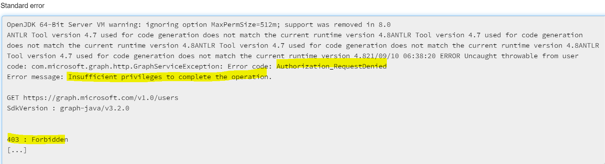

## Azure Data Factory

As part of the Watercooler application, Azure Data Factory (ADF) is used to perform ETL work, namely to ingest raw information
related to employees (M365 user profiles, events, mailbox data), filter out irrelevant information,
join data from several sources, perform clustering ,
transform its schema and push it to the target systems (AzureSql) from where it's consumed by the AppService.

### Triggers

Azure Data Factory uses triggers for orchestrating which part of the data should be processed at what point in time. 
More information regarding triggers can be found [here](ADF_trigger_creation_policy.md). 

### Pipelines

There are 5 pipelines that are started either by triggers or by the Waterciiker application.
The definition of each one of these pipelines is stored in a separate folder in the Azure Data Factory Pipelines section.  
Some of these pipelines are structured as a main orchestrating pipeline, which in turn starts and coordinates other
child pipelines. These child pipelines can be found in a subfolder named "Components".  
This approach was chosen as it allows the child pipelines to be run independently, making development and testing easier.

#### exportMailboxFromM365
The `exportMailboxFromM365` is responsible for
- reading the user mailbox settings in order to retrieve that person timezone

#### exportCalendarEventsFromM365
The `exportCalendarEventsFromM365` is responsible for
- reading the user calendar events

#### ProfilesExporter
The `ProfilesExporter` is responsible for
- exporting the profiles with the profile pictures in order to use profile information for clustering

**Observation**: you might encounter the following error when running the profile exporter pipeline.

In this case, please verify that the right permissions are granted as specified in [./AdminPermissions.MD](./AdminPermissions.MD#running-watercooler-in-production-mode)

#### End2EndUserGroupGeneration Piplines

This pipeline is run at the end of every week in order to delete all the data from the previous pipelines. 
This pipeline is composed from the following steps:
- table truncation
- calendar events field processor
- profiles fields extractor
- profiles+events+mailboxsetting assember
- clustering
- csv files export
- sql export

    
#### UpdateUserEventsAttendance
The `UpdateUserEventsAttendance` is responsible for 
- reading the new calendar events
- update the watercooler attendance status in the databases

The pipeline is composed of the following components:
- calendar events field processor
- csv files export
- sql export
