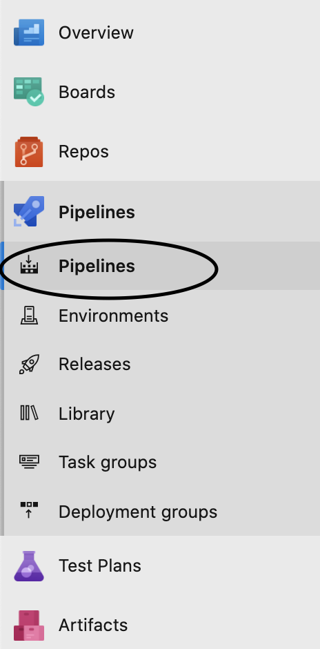
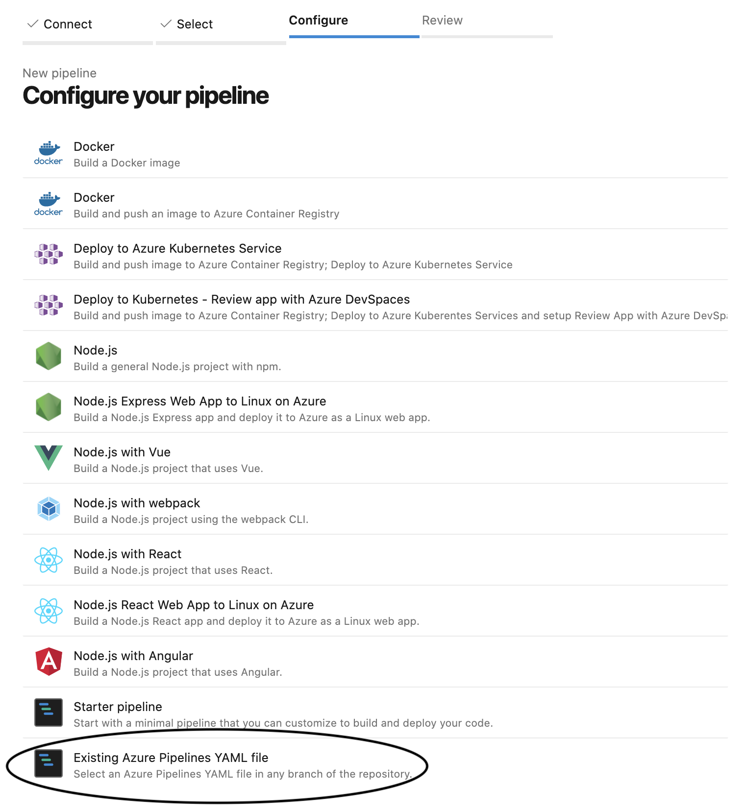
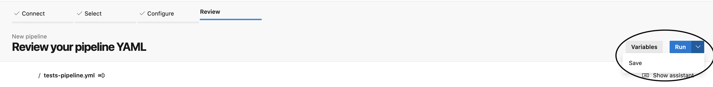
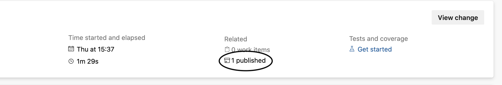
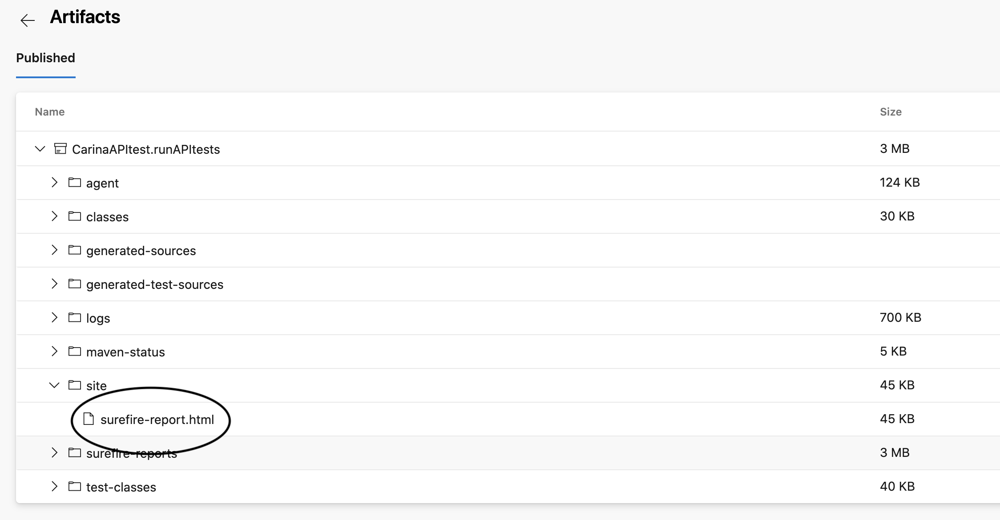
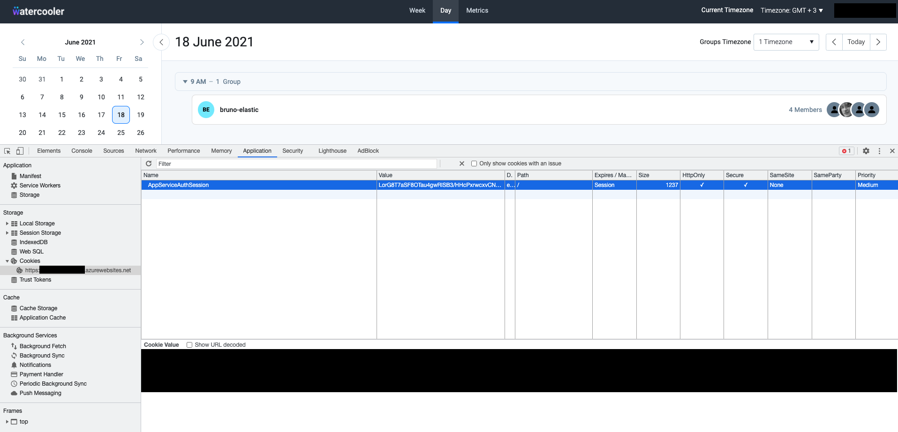

# Watercooler test track

## About

The Watercooler test track uses Carina Selenium to run a suite of API tests against an existing Watercooler deployment.

### Relevant files:

- `api-tests/run_tests.sh`

Top-level script for the test track. This script runs the tests. Used in `tests-pipeline.yml` definition.

- `tests-pipeline.yml`

Test track pipeline definition.

 
## Defining the Azure DevOps tests pipeline

The file `tests-pipeline.yml` defines an Azure DevOps pipeline used to run the tests as part of a CI-track.

To create a new pipeline in Azure DevOps, you have to follow the next steps:

- in Azure DevOps menu, click on the `Pipeline` option

- select the `New pipeline` option

- connect to Azure Repository Git

- select the project you want the pipeline to run

- select the option to use an existing `.yaml` file that you want to run

- review and save the new created pipeline

## Running the pipeline
To run the pipeline, select it from the list of available pipelines in Azure DevOps, provide required arguments and hit `Run`

### Pipeline parameters

- `AppServiceAuthSession`

This is the token issued to your browser once you successfully log in. Can be found in browser (steps outlined below).

- `AppServiceUrl`

This is the URL you used to access the Watercooler app in browser.

### Test results
At the end of a pipeline run, the report folder will be available as a *published artifact*

You can download the artifact to your local machine and open up the `surefire-report.html` report file, from the `target/suite` folder, in your favorite browser to access the report.

### Retrieving the app service auth cookie
In order for the tests to work we need the authentication token from the App Service.

> *Note:* this token expires, make sure you're using a fresh one everytime you run the pipeline.

To obtain the token from a logged-in session in the browser do the following:

- open the ProjectStaffing UI of the development App Service in the browser and log in

- right-click on the page and go to `Inspect` -> `Application` -> `Storage` -> `Cookies`

- locate the cookie titled `AppServiceAuthSession` and copy its value

- the obtained token needs to be set in Azure DevOps when kicking off a new pipeline execution

