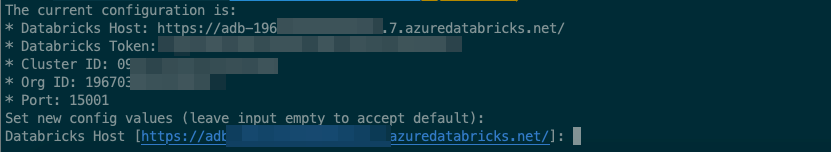

# Azure Processing
The `pywc` module contains pyspark jobs and scripts which are meant to be run on an Azure Databricks (ADB) cluster:


| Job                                             | Description |
| ----------------------------------------------- | ----------- |
| [000_cleanup](./src/000_cleanup.py) | truncates the watercooler database tables. |
| [01_1_calendar_events_attendance](./src/01_1_calendar_events_attendance.py) | Retrieve the user calendar events attendance status. |
| [01_2_update_group_members_invitation_status](./src/01_2_update_group_members_invitation_status.py) | Updates the group member attendance status in db |
| [01_calendar_spark_processor](./src/01_calendar_spark_processor.py) | Retrieves the specific fields from the calendar json. |
| [02_profiles_spark_processor](./src/02_profiles_spark_processor.py) | Retrieves the profiles from m365. |
| [03_persons_to_events_dill_assembler](./src/03_persons_to_events_dill_assembler.py) | processes M365 profiles and joins them with the user calendar information |
| [04_generate_timetable_kmeans](./src/04_generate_timetable_kmeans.py) | generates the clustering based on kmeans |
| [05_export_to_csv](./src/05_export_to_csv.py) | Script that writes watercooler groups as json on azbfs |
| [06_spark_export_to_sql](./src/06_spark_export_to_sql.py) | Script that exports the watercooler jsons to db |

In production, these jobs are orchestrated by Azure DataFactory (ADF) pipelines.


Jobs like [`01_calendar_spark_processor.py`](./parametrized_scripts/01_calendar_spark_processor.py) or [`02_profiles_spark_processor.py`](./parametrized_scripts/02_profiles_spark_processor.py)
will run on the Databricks cluster, and can be monitored in the cluster's SparkUI.

During development, the pyspark jobs can be run either:
+ locally - run using sample data locally:
+ directly on the ADB cluster, or
+ remotely, from the local environment to a target ADB cluster using `databricks-connect`.

---

# Setup Guide

## Setting up environment for Development
Steps:
+ [I. Java Setup](#i-java-setup)
+ [II. Python Setup](#ii-python-setup)
+ [III. Configure local python scripts to run with databricsk](#iii-configure-local-python-scripts-to-run-with-databricks)
+ [IV. Development and debugging](#iv-development-and-debugging)
+ [V. Development tips](#v-development-tips)
+ [VI. Setup Sanity Checks](#finishing-setup)

Additionally, you can consider the following steps:
+ [Java Multiple Environment Setup (jenv)](#jenv-setup) - if you intend to have separate versions of Java in the same environment (eg: having both jgraph and a local Spark for pygraph development & debugging),
+ [Python Multiple Environment Setup (pyenv)](#pyenv-setup) - in case you need multiple Python versions and/or databricks-connect might require a virtualenv or other version of python for compatibility.


---
# Detailed setup steps

## I. Java Setup
<span id="java-setup"></span>
Please install a JDK 8 appropriate to your OS, if you haven't done so already. License terms differ from one JDK supplier
to another (e.g. Oracle vs OpenJDK), so please read license conditions carefully when choosing supplier.  
For example, to install the OpenJDK, follow the appropriate installation steps from https://openjdk.java.net/install/
or https://jdk.java.net/java-se-ri/8-MR3, or search online for a more detailed installation guide, matching your OS.
This is necessary for pyspark connectivity

---

## II. Python Setup
<span id="python-setup"></span>

### 1. Install Python bundled with Anaconda
#### Linux and MacOS
Install the reference Python:
+ `wget https://repo.anaconda.com/archive/Anaconda3-2021.05-Linux-x86_64.sh`
  or
+ `curl -o Anaconda3-2021.05-Linux-x86_64.sh https://repo.anaconda.com/archive/Anaconda3-2021.05-Linux-x86_64.sh`
+ `chmod 700 Anaconda3-2021.05-Linux-x86_64.sh`
+ `./Anaconda3-2021.05-Linux-x86_64.sh`
  + you can do a silent install by adding the `-b` parameter, but PATH will remain unmodified, so you'll need to run `eval "$(~/anaconda3/bin/conda shell.bash hook)"`

#### Windows
Install using the install instruction from here https://docs.anaconda.com/anaconda/install/windows/

When installing the necessary libraries use only the *Anaconda Powershell Prompt* that gets installed with Anaconda.


### 2. Conda Environment setup (linux/mac/windows)
Set up your environment, and activate it both in your shell and in your IDE:
+ `conda create --name jwc python=3.8`
+ `conda activate jwc`
+ `pip install -r requirements.txt`
+ `pip install databricks-connect==8.1.0`


If any changes to the setup are needed, remember to document changes in requirements:
+ preferably with conda: `conda list --export > requirements_conda.txt` (rather than `pip freeze > requirements.txt`)

Any subsequent installs have to be made in the:
+ activated conda environment - `conda install package-name=2.3.4`
+ outside conda environment - `conda install package-name=2.3.4 -n jwc`


### 3. Spark / Databricks Setup 

#### MacOS/Linux
<span id="spark-setup"></span>

+ install - `brew install apache-spark`
  + usually located in `/usr/local/Cellar/apache-spark/3.0.1/libexec/`

+ install - `pip3  install databricks-connect==8.1` - this version is needed for our current Databricks configuration (Runtime version: 8.1 (includes Apache Spark 3.1.1, Scala 2.12))
+ sanity check - `python3 -c 'import pyspark'`

+ sanity check - `spark-shell` (use `:quit`)
+ sanity check - `pyspark` (use `quit()`)
+ configure according to the below specs - `databricks-connect configure`
+ check - `databricks-connect test`
  + may error if pyspark wasn't uninstalled / left garbage folders (for some reason) -> `rm -rf /Library/Frameworks/Python.framework/Versions/3.8/lib/python3.8/site-packages/pyspark`


#### Windows

After creating the `jwc` environment and installing `databrics-connect==8.1.0" the only 
steps remaining are configuration and the sanity check.

+ configure according to the below specs - `databricks-connect configure`
+ check - `databricks-connect test`


If there are any problems with the databricks-connect setup please consult
the troubleshooting section here: https://docs.databricks.com/dev-tools/databricks-connect.html#troubleshooting

Installation sanity checks are provided by the windows specific documentation for the above mentioned libraries.

*Observation*: when running `databricks-connect test` you might encounter the following error:

```commandline
ERROR Shell: Failed to locate the winutils binary in the hadoop binary path
java.io.IOException: Could not locate executable null\bin\winutils.exe in the Hadoop binaries.
```

In this scenario: [official databricks documentation](https://docs.databricks.com/dev-tools/databricks-connect.html#cannot-find-winutilsexe-on-windows) 
points you to hadoop installation instructions.
However there might be a shortcut by  performing this steps:
- clone https://github.com/cdarlint/winutils
- in environment variables set:
  - HADOOP_HOME=c:\Users\admin\work\winutils\hadoop-2.9.2
  - extend PATH with the following entry %HADOOP_HOME%\bin

After you completed this step, close the anaconda power shell terminal, reopen it, activate the `jwc` environment,
and only after that you can re-run `databricks-connect test`.

#### Databricks-connect local configuration (windows/mac/linux).
In order to run/debug from your local machine you have to have `databricks-connect` (version 8.1.0) tool functionally installed.
After that you'll have to configure it by running the `databricks-connect configure` and introduce the necessary
values for the host/token/cluster_id/port.


In order to obtain the token, navigate to 
and in the Settings/User Settings you can generate a new token that you'll use in the `databricks-connect configure` step.


You can obtain more information about this step in the official support documentation [here](https://docs.databricks.com/dev-tools/databricks-connect.html#step-2-configure-connection-properties). 

At the end of the databricks-connect configuration the command `databricks-connect test` should work successfully.


---


## III. Configure local python scripts to run with Databricks
<span id="local-development-config"></span>
The environment specific configuration for each job can be provided via a configurations file.

For local debugging and execution of the scripts, the following configuration file templates are provided: `config_default.json` and a list of 
specific script params.
`config_default.json` should be cloned to : `config_test.json`

Script specific parameters can be found here: [./dev_config](./dev_config/)

The config file `config_default.json` has the following structure and is being used by all the spark job python scripts:
```
{
  "SERVICE_PRINCIPAL_SECRET": "J65H1[...]"
}
```

The following fields need to be filled:
- `SERVICE_PRINCIPAL_SECRET` - the secret for the `jwc-service` service principal, that is used by all spark jobs to connect to Azure services (AZBS, AzureSql, KeyVault etc)


> **Make sure not to commit this file** since it will contain sensitive information! Check if the rules from the `.gitignore` file cover your file name.  
> Only store locally information for non-critical environments, which don't contain sensitive data and which can be easily decommissioned!


Be mindful if cluster is active/inactive, in order to:
+ minimize load - if cluster is used for upgrade / demo
+ Total Cost of Ownership (abbrev. TCO) - cluster doesn't have to be spun up needlessly, costs should be limited.


## IV. Development and debugging.

In order to run `01_calendar_spark_processor.py` on spark, you need the following prerequisites

### Run end-to-end `End2EndDataCollectorPipeline` in Azure Data Factory.
Navigate to Azure Data Factory studio in your resource group.
And run the End2EndDataCollectorPipeline.
This is necessary because the End2EndDataCollectorPipeline will first retrieve the calendar, mailbox and profile data
from gdc. And the collected data will serve as input data to this scripts.

The output of this pipeline run will be found in the `data` container in the events folder.


### config_test.json
Necessary configuration files:
copy `config_default.json` to `config_test.json` in the `pywc/src` folder and fill in the 
missing value of the `SERVICE_PRINCIPAL_SECRET` with the value retrieved from the keyvault.

In order to retrieve the  `SERVICE_PRINCIPAL_SECRET` from keyvaul you have to perform the following stes:
- navigate to the deployment resource group
  

- select the keyvault that has a name that begins with `WCBackend`

  
- select the `wc-service-principal-secret` and click the version label and the following view will open

  
- copy the principal secret value and paste it in the `config_test.json`

### script parameter files. eg: 01_calendar_spark_processor_params.json

The `01_calendar_spark_processor.py` script uses for debugging in local mode  
a file called `01_calendar_spark_processor_params.json` which is placed in the home folder
of the user called `.watercooler`. 
The path can be changed from the code.

In order to fill the values of the parameters in the `01_calendar_spark_processor_params.json` file 
you have to provide the following **mandatory** parameter **values**: `['--storage-account-name', '--input-container-name', '--input-folder-path', '--output-container-name', '--output-folder-path', '--application-id', '--directory-id', '--key-vault-url']`
as in the following example:

However, you'll still need to have the rest of the parameters filled with default values: `['--log-analytics-workspace-key-name','--log-analytics-workspace-id','--adb-secret-scope-name','--adb-sp-client-key-secret-name']`

Some of the values can be filled from the ADF pipeline global parameters page from Azure DataFactory Studio.


Run the script. The output of the script will be found in the `watercooler_out_events` folder from the `data` blob.

### Possible errors encountered on Windows 
Problem:
  - You might encounter `ImportError: DLL load failed while importing win32file: The specified module could not be found.`

Solution:
  - `conda install pywin32` (taken from [here](https://stackoverflow.com/questions/58612306/how-to-fix-importerror-dll-load-failed-while-importing-win32api) )


## V. Development tips

If a custom container+folder needs to be mounted to a specific location in adbfs, the user will
have to run the following snippet of code in a azure databricks notebook.
```
dbutils.fs.mount(
 source = "wasbs://watercooler-test@teststorage.blob.core.windows.net",
 mount_point = "/mnt/watercooler",
 extra_configs = {"fs.azure.account.key.teststorage.blob.core.windows.net":"AccessKey" })
```

More information about the databricks file system can be found [here](https:./imgs.databricks.com/data/databricks-file-system.html)

Uploading the scripts to the ADB cluster:
During development, modified scripts can be upload to the following location on Azure Databricks File System:  `dbfs ls dbfs:/mnt/watercooler/watercooler_scripts/parameterized`
The command for upload the scripts is the following and has to be executed from the [./pywc/parametrized_scripts](./pywc/parametrized_scripts) folder.
The following command will have to be executed from command line.
```
dbfs cp --overwrite *.py dbfs:/mnt/watercooler/watercooler_scripts/parameterized
```


---
---
# Additional development information
In case there's a need for a different environments (example: watercooler uses a newer java version different than java needed for spark)
then follow the steps below:

## Java Multiple Environment Setup (jenv)(linux/mac only)
<span id="jenv-setup"></span>
In order to allow for multiple versions of java on the same system, we use `jenv`:
+ install - `brew install jenv`
+ append the following to config file (`~/.bashrc` or `~/.zshrc`) and run `source` or restart/open new shell:
```shell script
export PATH="$HOME/.jenv/bin:$PATH"
eval "$(jenv init -)"
```
+ check if jenv works - `jenv doctor`

After installing needed JDKs:
+ check installed Java VMs - `/usr/libexec/java_home -V`
+ add installed Java VMs to jenv:
  + `jenv add /Library/Java/JavaVirtualMachines/jdk-15.0.1.jdk/Contents/Home`
  + `jenv add /Library/Java/JavaVirtualMachines/jdk1.8.0_271.jdk/Contents/Home`
+ check - `jenv versions`

Optional, but recommended:
+ `jenv enable-plugin export`
+ `jenv enable-plugin maven`

Set JDK needed for Spark:
+ set java 1.8 as system-level java - `jenv global 1.8`
+ sanity check - `jenv doctor`
+ sanity check - `java -version`


## Python Multiple Environment Setup (pyenv) (linux/mac only)
<span id="pyenv-setup"></span>
Similar to what we did for Java, in this case for Python.  
Please see the [installation section](https://github.com/pyenv/pyenv#installation) of the project's [github page](https://github.com/pyenv/pyenv)  
For an installation guide covering several systems, please read https://wilsonmar.github.io/pyenv/  
The steps below describe the installation process for mac:
+ install - `brew install pyenv pyenv-virtualenv` ; for linux you can follow the instructions from [here](https://realpython.com/intro-to-pyenv/) 
+ append the following to config file (`~/.bashrc` or `~/.zshrc`) and run `source` or restart/open new shell:
```shell script
export PATH="$HOME/.pyenv/bin:$PATH"
eval "$(pyenv init -)"
eval "$(pyenv virtualenv-init -)"
```
+ check - `pyenv versions`
+ install - `pyenv install -v 3.7.8` => why `<3.8` ([source](https://stackoverflow.com/questions/58700384/how-to-fix-typeerror-an-integer-is-required-got-type-bytes-error-when-tryin))
+ set installed version globally - `pyenv global 3.7.8`
+ sanity check - `pyenv versions`


For windows you can consult the documentation for pyenv here: https://github.com/pyenv-win/pyenv-win

---
# Sources

## More links:
+ https:./imgs.oracle.com/javase/./imgs/technotes/guides/install/mac_jdk.html
+ https://medium.com/@chamikakasun/how-to-manage-multiple-java-version-in-macos-e5421345f6d0
+ https://github.com/jenv/jenv/issues/212
+ https://stackoverflow.com/questions/41129504/pycharm-with-pyenv
+ https:./imgs.databricks.com/dev-tools/databricks-connect.html

